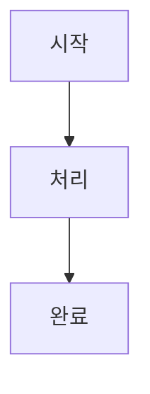

# Chapter 작성 스킬

## 역할
이 스킬은 《Zero Trust AI — MCP 기반 기업용 AI 플랫폼 설계》의
챕터 마크다운 파일을 일관된 품질로 생성한다.

---

## 작성 전 필수 확인

1. `CLAUDE.md` 의 페르소나/환경/규칙 숙지 (이미 로드됨)
2. 이전 챕터 파일 확인 → 중복 내용 파악
3. 해당 챕터의 목차 섹션 확인

---

## 챕터 파일 구조 템플릿

```markdown
# Chapter N. 제목

> 한 줄 요약 — 이 챕터에서 무엇을 배우는지

## 이 챕터에서 배우는 것
- 포인트 1
- 포인트 2
- 포인트 3

## 사전 지식
> Chapter X를 먼저 읽었다면 바로 시작할 수 있다.

---

## N-1. 소제목

### 개념 설명
[설명 — 왜 필요한지부터 시작]

### 🔥 핵심 포인트
[가장 중요한 내용 강조]

### 💻 실습
[코드 또는 명령어]

```언어
# 코드 예시
```

### ⚠️ 주의사항
[흔히 실수하는 부분]

---

## N-2. 소제목

[동일 패턴 반복]

---

## 정리

| 항목 | 핵심 내용 |
|---|---|
| 개념 | ... |
| 구현 | ... |
| 주의 | ... |

## 다음 챕터 예고
> Chapter N+1에서는 [다음 내용]을 다룬다.
```

---

## 분량 기준

| 섹션 수 | 목표 분량 |
|---|---|
| 소제목 4~6개 | 15~25페이지 (A4 기준) |
| 코드 블록 | 챕터당 최소 3개 이상 |
| 다이어그램 | Mermaid로 최소 1개 |

---

## 코드 블록 규칙

- 언어 항상 명시: ` ```python `, ` ```yaml `, ` ```bash `
- 파일 경로 주석 포함:
  ```python
  # src/gateway/app/main.py
  ```
- 실행 가능한 코드만 (의사코드 금지, 단 개념 설명용은 명시)
- Windows 환경 호환 확인 (경로 구분자 등)

---

## Mermaid 다이어그램 규칙

챕터당 최소 1개 포함. 아키텍처/흐름 설명 필수.



flowchart, sequenceDiagram, classDiagram 중 상황에 맞게 선택.

---

## 챕터별 핵심 포커스

| Chapter | 집중 포인트 |
|:---:|---|
| 0 | 독자 공감 + 동기부여. 코드 없음. |
| 1~2 | 개념 + 다이어그램 중심 |
| 3~4 | API 스펙 + MSA 설계 |
| 5 | 단계별 환경 세팅 (스크린샷 대신 명령어) |
| 6~7 | 코드 + 배포 실습 중심 |
| 8 | CI/CD YAML 중심 |
| 9~10 | 보안 설계 + 정책 코드 |
| 11~13 | 운영 전략 + 설정 파일 |
| 14 | DB/Redis 스키마 + 비용 계산 |
| 15 | End-to-End 흐름 + 트러블슈팅 |

---

## 출력 파일 경로

```
docs/chapter-{NN}-{slug}.md
```

예: `docs/chapter-05-env.md`

---

## 작성 후 체크리스트

- [ ] 파일명 형식 맞음 (`chapter-NN-slug.md`)
- [ ] 챕터 도입부에 "이 챕터에서 배우는 것" 포함
- [ ] 코드 블록에 파일 경로 주석 포함
- [ ] Mermaid 다이어그램 최소 1개
- [ ] 챕터 말미에 다음 챕터 연결 문장
- [ ] Windows 11 / Podman / Minikube 환경 기준 확인
