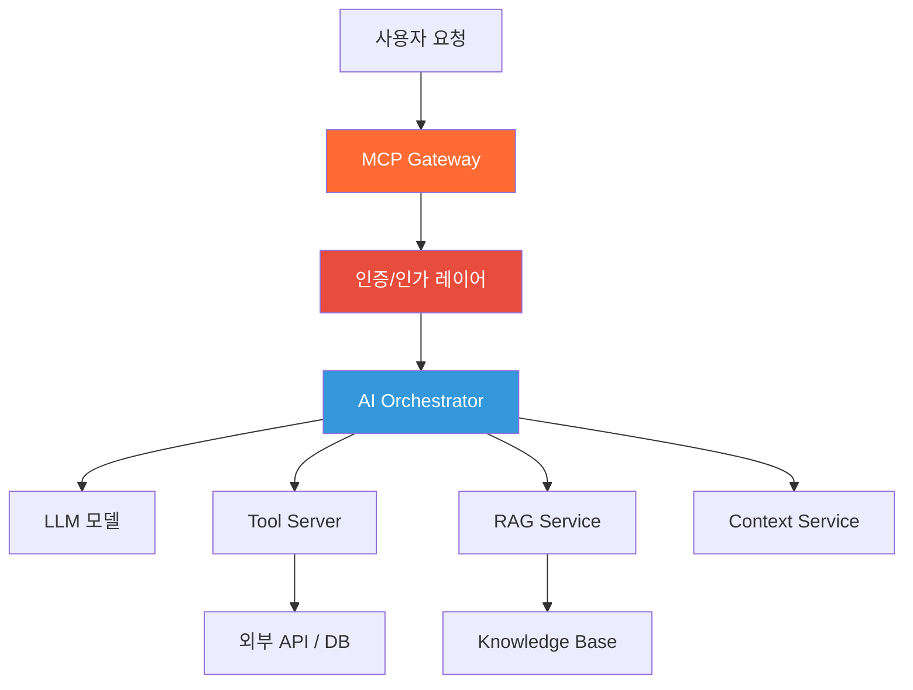
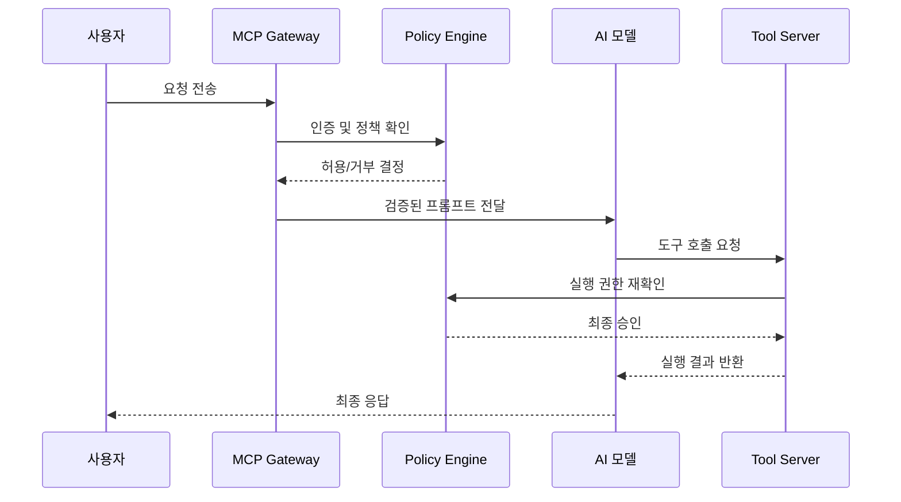

# Chapter 0. 들어가며 — 왜 MCP인가

> AI를 도입했는데 왜 아직도 불안한가? 그 이유가 바로 MCP가 필요한 이유다.

## 이 챕터에서 배우는 것

- 기업 AI 도입의 현실적인 문제점이 무엇인지
- MCP(Model Context Protocol)가 등장한 배경과 해결하려는 문제
- Zero Trust 철학이 AI 플랫폼 설계에 왜 적용되어야 하는지
- 이 책 전체의 구조와 학습 흐름

## 사전 지식

> 특별한 사전 지식 없이 읽을 수 있다. 백엔드 개발 경험이 있다면 더 빠르게 공감할 것이다.

---

## 0-1. 지금 기업 AI의 민낯

2024년, 수많은 기업이 "우리도 AI 도입했어요"라고 말한다.  
GPT API 붙이고, 챗봇 하나 만들고, 내부 문서 검색 붙이고.  
그런데 막상 실무에서 쓰다 보면 이런 얘기가 나온다.

> "고객 데이터가 GPT한테 넘어가는 거 아닌가요?"  
> "이 AI가 어떤 정보를 근거로 답한 건지 알 수가 없어요."  
> "다음 달에 모델 버전 바뀌면 또 다 갈아엎어야 하나요?"

### 🔥 핵심 포인트

세 가지 불안의 정체는 사실 하나다.  
**"AI를 신뢰할 수 있는 구조로 만들지 않았기 때문"이다.**

단순히 LLM API를 연결한 것과, 엔터프라이즈 수준으로 설계된 AI 플랫폼은 근본적으로 다르다.  
그 차이를 만드는 핵심 요소가 바로 **MCP(Model Context Protocol)** 와 **Zero Trust 아키텍처**다.

---

## 0-2. MCP란 무엇인가 — 한 문장으로

MCP를 한 문장으로 정의하면 이렇다.

> **AI 모델이 외부 시스템(도구, 데이터, API)과 표준화된 방식으로 상호작용하기 위한 프로토콜.**

HTTP가 웹 클라이언트와 서버 사이의 통신을 표준화했듯,  
MCP는 LLM과 외부 세계 사이의 인터페이스를 표준화한다.

이게 왜 중요하냐면, 지금까지는 이 인터페이스가 전부 제각각이었기 때문이다.

- A 회사는 Function Calling으로 구현
- B 회사는 LangChain Agent로 구현
- C 회사는 자체 Tool Router로 구현

서로 호환되지 않고, 모델이 바뀌면 다 다시 써야 하고, 보안 정책은 각자 알아서.

### 🔥 핵심 포인트

MCP는 **표준화(Standardization)** 와 **격리(Isolation)** 를 동시에 해결한다.  
LLM이 어떤 도구를 쓸 수 있는지, 어떤 데이터에 접근할 수 있는지를 **선언적으로 제어**할 수 있게 된다.

> 위 다이어그램이 이 책 전체의 아키텍처다.  
> 지금은 전체 그림만 눈에 담아두자. Chapter 1에서 각 컴포넌트를 하나씩 해부한다.

---

## 0-3. 왜 "Zero Trust"인가

Zero Trust는 네트워크 보안에서 시작된 개념이다.  
핵심 원칙은 단순하다.

> **"절대 신뢰하지 마라. 항상 검증하라. (Never Trust, Always Verify)"**

기존 보안 모델은 "내부 네트워크는 안전하다"는 가정에서 출발했다.  
Zero Trust는 그 가정 자체를 버린다.  
내부든 외부든, 사람이든 AI든, 모든 요청은 매번 인증/인가를 받아야 한다.

### AI에 Zero Trust가 필요한 이유

AI는 기존 소프트웨어보다 훨씬 예측이 어렵다.  
같은 입력에도 다른 출력이 나올 수 있고, 프롬프트 인젝션 같은 공격에도 취약하다.

⚠️ **주의사항**: AI 모델 자체를 신뢰하는 설계는 위험하다.  
모델이 "이 파일을 삭제해도 돼요?"라고 결정하게 두면 안 된다.  
모델은 의도를 추론하고, **실제 실행 권한은 별도의 정책 엔진이 결정**해야 한다.

Zero Trust를 AI에 적용한다는 것은,  
**모든 AI 행동을 정책으로 제어하고 감사(Audit) 가능한 상태로 만드는 것**이다.

---

## 0-4. 이 책이 다루는 범위

이 책은 "개념 책"이 아니다.  
읽고 나면 실제로 **기업용 MCP 기반 AI 플랫폼을 처음부터 배포까지** 만들 수 있어야 한다.

| 파트 | 챕터 | 내용 |
|:---:|:---:|---|
| 기초 | 1~2 | MCP 개념, 핵심 기능 8가지 |
| 설계 | 3~4 | API 설계, MSA 구조 |
| 구현 | 5~6 | 환경 구성, FastAPI 구현 |
| 배포 | 7~8 | 인프라, CI/CD |
| 보안 | 9~11 | 보안 아키텍처, DLP, Prompt 거버넌스 |
| 운영 | 12~14 | LLM 운영, Observability, 운영 설계 |
| 실전 | 15 | ERP 연동 End-to-End PoC |

### 🔥 핵심 포인트

각 챕터는 독립적이지 않다.  
앞 챕터에서 만든 컴포넌트를 다음 챕터에서 확장하는 **누적 구조**로 설계되어 있다.  
중간에 건너뛰면 실습 코드가 동작하지 않는 경우가 생긴다.

---

## 0-5. 실습 환경 미리 보기

이 책의 모든 실습은 아래 환경을 기준으로 작성되었다.

| 구분 | 환경 |
|---|---|
| 로컬 OS | Windows 11 |
| IDE | VSCode |
| 컨테이너 (로컬) | Docker Desktop |
| Gateway 배포 | Podman |
| 오케스트레이션 | Minikube |
| 서버 OS | Linux (Ubuntu 22.04) |
| CI/CD | GitLab + GitLab Actions |
| GitOps | ArgoCD |

⚠️ **주의사항**: Linux 전용 명령어나 Mac 기준 경로가 가끔 인터넷에 돌아다닌다.  
이 책은 **Windows 11 기준**이다. 다른 OS 사용자라면 Chapter 5에서 별도로 안내한다.

---

## 정리

| 항목 | 핵심 내용 |
|---|---|
| 문제 | 기업 AI 도입 후에도 신뢰/제어/호환성 문제가 남는다 |
| MCP | LLM과 외부 세계의 표준화된 인터페이스 프로토콜 |
| Zero Trust | 모든 AI 행동을 정책으로 제어하고 감사 가능하게 만드는 설계 철학 |
| 이 책 | 개념~배포~운영까지 실습 중심으로 완결 |

---

## 다음 챕터 예고

> Chapter 1에서는 MCP의 내부 구조를 해부한다.  
> Gateway, Orchestrator, Tool Server, Context Service가 각각 무엇을 하는지,  
> 왜 이렇게 분리해야 하는지를 다이어그램과 함께 설명한다.
