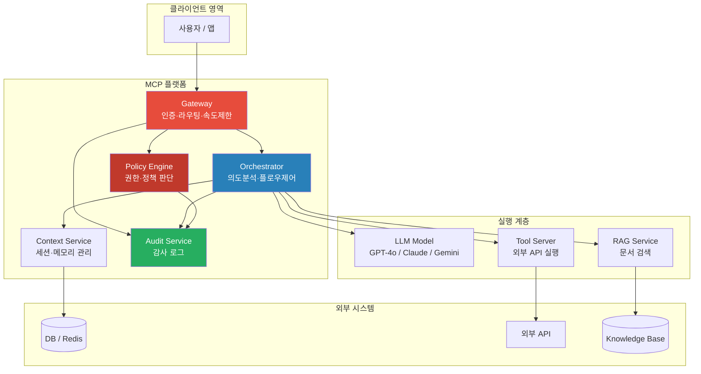
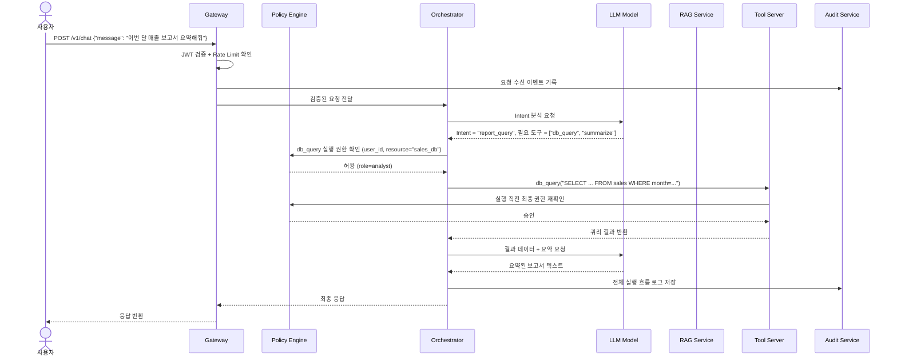
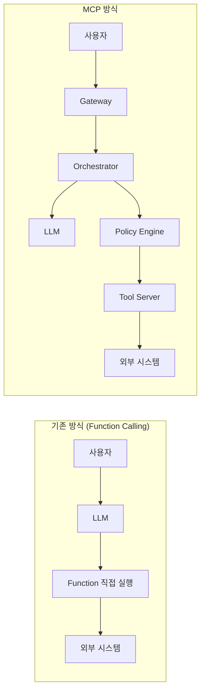

# Chapter 1. MCP 개념과 아키텍처

> MCP는 단순한 라이브러리가 아니다. LLM과 기업 시스템을 잇는 표준 인터페이스 계층이다.

## 이 챕터에서 배우는 것

- MCP가 왜 등장했는지, 기존 방식의 어떤 문제를 해결하는지
- MCP를 구성하는 핵심 컴포넌트 6가지와 각각의 역할
- 실제 요청이 들어왔을 때 MCP 내부에서 어떤 흐름으로 처리되는지
- 기존 LangChain/Function Calling 방식과의 구조적 차이

## 사전 지식

> Chapter 0을 읽었다면 바로 시작할 수 있다.  
> HTTP 통신, REST API, JWT 개념을 알고 있으면 이해가 훨씬 빠르다.

---

## 1-1. 기존 방식의 문제 — 왜 MCP가 필요한가

LLM을 기업 시스템에 연결하는 방법은 이미 여러 가지가 있었다.

- **OpenAI Function Calling**: 모델이 호출할 함수 스펙을 JSON으로 정의하고, 모델이 함수 호출을 트리거하면 애플리케이션이 실행
- **LangChain Agent**: Tool이라는 추상화 위에서 LLM이 도구를 선택하고 순서를 결정
- **직접 프롬프트 엔지니어링**: 프롬프트 안에 컨텍스트를 우겨넣고 LLM이 알아서 판단하게

이 방식들이 나쁜 건 아니다. 하지만 기업 환경에 올리면 반드시 다음 문제가 터진다.

| 문제 | 원인 |
|---|---|
| 모델 교체 시 전체 코드 수정 | Tool 인터페이스가 모델 종속적 |
| 접근 제어 로직이 코드에 산재 | 중앙화된 정책 관리 불가 |
| AI가 뭘 했는지 추적 불가 | 감사 로그 구조 없음 |
| 프롬프트 인젝션 방어 불가 | 입력 검증 계층 없음 |
| 팀마다 다른 구현 방식 | 표준 인터페이스 없음 |

### 🔥 핵심 포인트

이 문제들은 LLM 자체의 한계가 아니다.  
**LLM을 감싸는 플랫폼 계층의 부재**가 원인이다.  
MCP는 그 계층을 표준으로 정의한다.

---

## 1-2. MCP 아키텍처 전체 구조

MCP 기반 플랫폼은 크게 6개 컴포넌트로 구성된다.



각 컴포넌트의 역할을 하나씩 보자.

---

## 1-3. 컴포넌트 상세 — 6가지 역할 분리

### Gateway

모든 요청의 단일 진입점(Single Entry Point)이다.

**담당 역할:**
- JWT/API Key 기반 인증 (Authentication)
- Rate Limiting — 사용자/팀 단위 호출 횟수 제한
- 요청 로깅 — 감사 서비스로 이벤트 전달
- 라우팅 — Orchestrator로 전달

```python
# src/gateway/app/main.py
from fastapi import FastAPI, Depends, HTTPException
from app.middleware.auth import verify_token
from app.middleware.rate_limit import rate_limiter

app = FastAPI(title="MCP Gateway")

@app.post("/v1/chat")
async def chat(
    request: ChatRequest,
    token_payload: dict = Depends(verify_token),
    _: None = Depends(rate_limiter),
):
    # 인증과 속도 제한을 통과한 요청만 Orchestrator로 전달
    return await orchestrator_client.forward(request, token_payload)
```

### Orchestrator

MCP의 두뇌다. 사용자 의도를 분석하고 어떤 도구를 어떤 순서로 쓸지 결정한다.

**담당 역할:**
- 사용자 의도 파악 (LLM을 활용한 Intent Classification)
- 실행 플로우 결정 (단순 응답 vs RAG 검색 vs Tool 실행)
- Policy Engine에 실행 권한 확인
- 결과 취합 및 최종 응답 생성

### Policy Engine

모든 실행 전에 "이게 허용된 행동인가?"를 판단한다.

⚠️ **주의사항**: 권한 판단을 LLM에게 맡기면 안 된다.  
LLM은 "이 요청이 위험한지"를 맥락에 따라 다르게 판단할 수 있다.  
Policy Engine은 **결정론적(Deterministic) 규칙 기반**으로 동작해야 한다.

### Context Service

사용자별 대화 기록, 세션 상태, 선호 설정을 관리한다.  
LLM에 매번 전체 히스토리를 보내지 않고, 필요한 컨텍스트만 선택적으로 주입한다.

### Audit Service

모든 행동의 기록이다. 누가, 언제, 무엇을 요청했고, AI가 어떤 Tool을 호출했으며, 결과가 무엇이었는지를 불변(Immutable) 로그로 남긴다.

### Tool Server

LLM이 호출 요청을 보내면 실제로 외부 API나 DB를 실행하는 서버다.  
Policy Engine의 승인 없이는 아무것도 실행하지 않는다.

---

## 1-4. 요청 흐름 — 한 번의 질문이 처리되는 과정

"이번 달 매출 보고서 요약해줘"라는 요청이 들어왔을 때 내부에서 무슨 일이 일어나는지 따라가보자.



### 🔥 핵심 포인트

이 흐름에서 중요한 건 두 가지다.

1. **LLM은 의도 분석과 텍스트 생성만 담당한다.** Tool 실행, 권한 판단, 로그 기록은 전부 별도 컴포넌트가 처리한다.
2. **Policy Engine이 두 번 호출된다.** Orchestrator 레벨에서 한 번, Tool Server 레벨에서 한 번 더. 이게 Zero Trust다.

---

## 1-5. 기존 방식과의 비교



| 비교 항목 | 기존 방식 | MCP 방식 |
|---|---|---|
| 인증 | 애플리케이션 레벨 각자 구현 | Gateway에서 중앙 처리 |
| 권한 제어 | 코드에 하드코딩 | Policy Engine에서 선언적 관리 |
| 모델 교체 | 전체 Tool 인터페이스 수정 | Orchestrator만 수정 |
| 감사 로그 | 없거나 각자 구현 | Audit Service에서 표준화 |
| 멀티 모델 | 불가 | Orchestrator가 라우팅 |

⚠️ **주의사항**: MCP 구조는 컴포넌트가 많아서 초기 구축 비용이 든다.  
팀 규모가 작고 AI 기능이 단순하다면 오버엔지니어링일 수 있다.  
하지만 "나중에 MCP 구조로 전환한다"는 계획은 대부분 실패한다. 처음부터 구조를 잡아두는 게 낫다.

---

## 정리

| 항목 | 핵심 내용 |
|---|---|
| 문제 | 기존 방식은 권한·감사·모델 종속 문제를 구조적으로 해결 못 함 |
| 컴포넌트 | Gateway / Orchestrator / Policy Engine / Context / Audit / Tool Server |
| 흐름 | 요청 → Gateway → Orchestrator → LLM(의도) → Tool(실행) → Audit |
| 핵심 원칙 | LLM은 판단, 실행과 권한은 별도 컴포넌트가 담당 |

---

## 다음 챕터 예고

> Chapter 2에서는 MCP가 제공하는 핵심 기능 8가지를 하나씩 해부한다.  
> 개념만이 아니라 각 기능이 실제 코드와 설정에서 어떻게 표현되는지 함께 본다.
