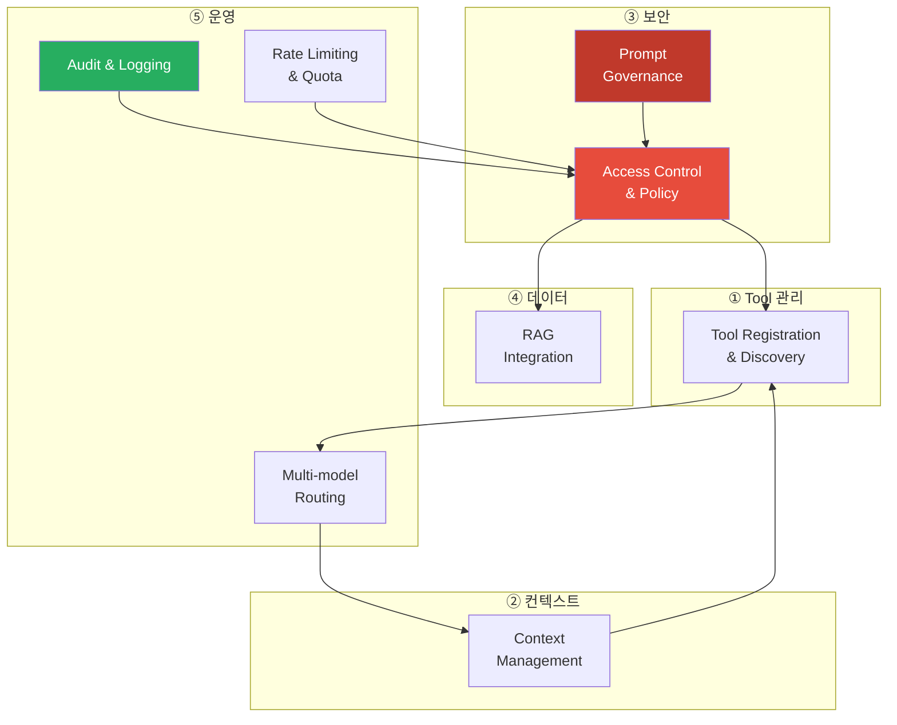
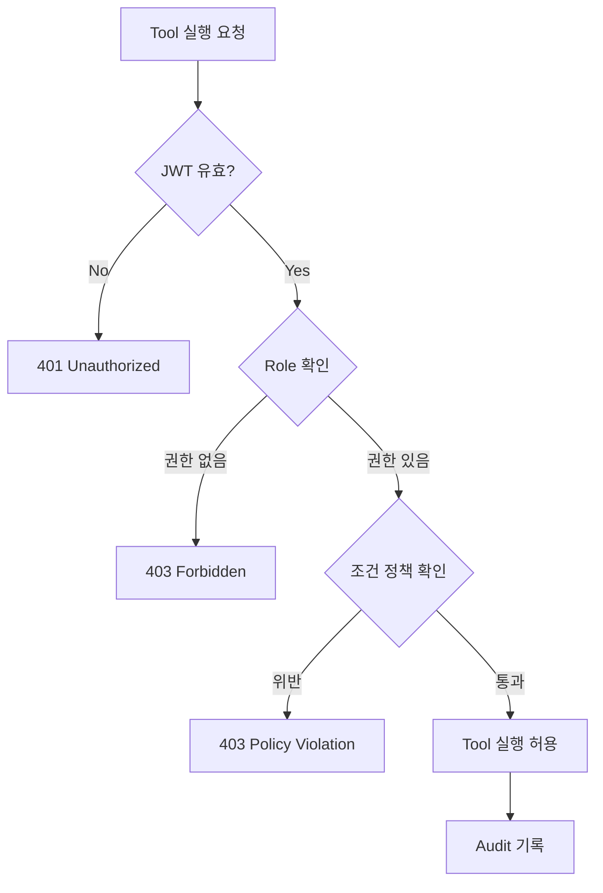
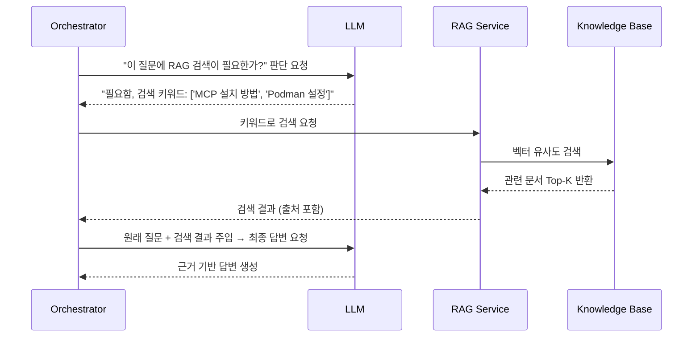
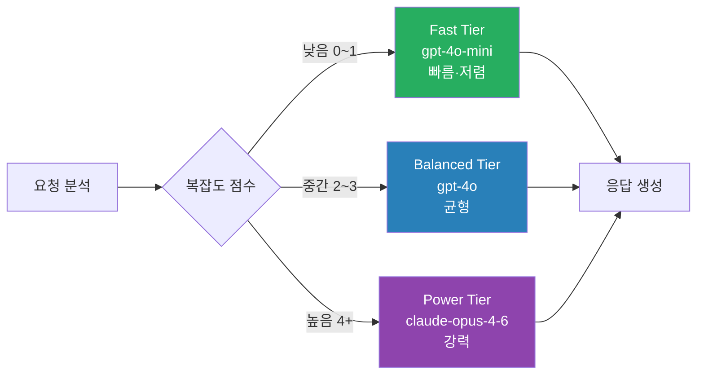

# Chapter 2. MCP 핵심 기능 8가지

> MCP는 8개의 기능 블록으로 구성된다. 이 8가지를 이해하면 전체 플랫폼의 설계 의도가 보인다.

## 이 챕터에서 배우는 것

- MCP가 제공하는 핵심 기능 8가지의 개념과 동작 방식
- 각 기능이 실제 코드/설정에서 어떻게 표현되는지
- 기능들이 서로 어떻게 연계되어 Zero Trust를 실현하는지

## 사전 지식

> Chapter 1의 6개 컴포넌트(Gateway, Orchestrator, Policy Engine, Context, Audit, Tool Server)를 먼저 이해하고 오자.

---

## 전체 기능 지도



---

## 기능 1. Tool Registration & Discovery

### 개념 설명

LLM이 사용할 수 있는 Tool을 **중앙 레지스트리**에 등록하고,  
Orchestrator가 이를 조회해서 실행에 활용하는 구조다.

기존 Function Calling은 Tool 목록을 요청 시마다 프롬프트에 직접 넣었다.  
Tool이 50개가 넘으면 토큰 낭비가 심해지고, 새 Tool 추가 때마다 코드를 바꿔야 했다.  
Tool Registry는 이를 분리한다.

```python
# src/tool-service/app/registry.py

TOOL_REGISTRY = {
    "db_query": {
        "name": "db_query",
        "description": "sales DB에서 데이터를 조회한다",
        "parameters": {
            "type": "object",
            "properties": {
                "query": {"type": "string", "description": "실행할 SQL 쿼리"},
                "db_name": {"type": "string", "enum": ["sales", "hr", "inventory"]}
            },
            "required": ["query", "db_name"]
        },
        "required_role": ["analyst", "admin"],  # Policy Engine이 참조
        "timeout_sec": 10
    },
    "send_email": {
        "name": "send_email",
        "description": "이메일을 발송한다",
        "parameters": {
            "type": "object",
            "properties": {
                "to": {"type": "string"},
                "subject": {"type": "string"},
                "body": {"type": "string"}
            },
            "required": ["to", "subject", "body"]
        },
        "required_role": ["admin"],
        "timeout_sec": 5
    }
}

def get_tools_for_role(role: str) -> list[dict]:
    """사용자 역할에 맞는 Tool 목록만 반환"""
    return [
        tool for tool in TOOL_REGISTRY.values()
        if role in tool["required_role"]
    ]
```

### 🔥 핵심 포인트

Orchestrator는 LLM에게 Tool 전체 목록을 주지 않는다.  
**사용자 역할(Role)에 맞는 Tool만 필터링해서 전달한다.**  
이렇게 하면 권한 없는 Tool은 LLM이 아예 인식조차 못 한다.

---

## 기능 2. Context Management

### 개념 설명

LLM은 상태(State)가 없다. 요청마다 새로 시작한다.  
Context Service는 이 한계를 보완한다.

- **단기 메모리(Short-term)**: 현재 대화 세션의 히스토리 → Redis
- **장기 메모리(Long-term)**: 사용자 선호, 팀 설정 → PostgreSQL
- **워킹 메모리(Working)**: 현재 Task 실행 중 중간 상태 → 인메모리

```python
# src/context-service/app/context_manager.py

class ContextManager:
    def __init__(self, redis_client, db_session):
        self.redis = redis_client
        self.db = db_session

    async def build_context(self, session_id: str, user_id: str) -> dict:
        # 단기: 최근 10턴 대화 히스토리
        short_term = await self.redis.lrange(
            f"session:{session_id}:history", -10, -1
        )

        # 장기: 사용자 프로파일
        user_profile = await self.db.fetch_one(
            "SELECT preferences, role, department FROM users WHERE id = :id",
            {"id": user_id}
        )

        return {
            "conversation_history": short_term,
            "user_role": user_profile["role"],
            "department": user_profile["department"],
        }

    async def save_turn(self, session_id: str, user_msg: str, ai_msg: str):
        pipe = self.redis.pipeline()
        pipe.rpush(f"session:{session_id}:history",
                   f"user: {user_msg}", f"assistant: {ai_msg}")
        pipe.expire(f"session:{session_id}:history", 3600)  # 1시간 TTL
        await pipe.execute()
```

### ⚠️ 주의사항

컨텍스트를 많이 넣을수록 LLM 응답 품질이 올라가지만 토큰 비용도 올라간다.  
Context Window 한계(보통 128K~200K 토큰)를 넘으면 에러가 난다.  
**항상 토큰 예산(Token Budget)을 설정하고, 초과 시 오래된 히스토리를 자동으로 잘라내야 한다.**

---

## 기능 3. Access Control & Policy

### 개념 설명

MCP에서 권한 제어는 두 단계로 나뉜다.

1. **인증(Authentication)**: 이 사람이 누구인가? → Gateway (JWT 검증)
2. **인가(Authorization)**: 이 사람이 이걸 해도 되는가? → Policy Engine

Policy Engine은 RBAC(Role-Based Access Control)을 기본으로 하고,  
필요 시 ABAC(Attribute-Based)로 확장한다.

```yaml
# infra/k8s/policy-engine-rules.yaml
# OPA(Open Policy Agent) 기반 정책 정의 예시

policies:
  - name: db_query_analyst_only
    resource: "tool:db_query"
    allow_roles: ["analyst", "admin"]
    deny_roles: ["viewer"]
    conditions:
      - field: "parameters.db_name"
        operator: "in"
        value: ["sales", "inventory"]   # hr DB는 analyst도 못 씀

  - name: send_email_admin_only
    resource: "tool:send_email"
    allow_roles: ["admin"]
    conditions:
      - field: "parameters.to"
        operator: "not_contains"
        value: "@competitor.com"         # 경쟁사 도메인 발송 차단
```



### 🔥 핵심 포인트

Policy는 **코드 밖에서 선언적으로 관리**해야 한다.  
코드에 `if user.role == "admin"` 형태로 박혀 있으면, 정책 변경마다 배포해야 한다.  
OPA(Open Policy Agent)나 Casbin 같은 외부 정책 엔진을 써서 코드와 정책을 분리하자.

---

## 기능 4. Prompt Governance

### 개념 설명

사용자 입력이 LLM에 도달하기 전에, 그리고 LLM 출력이 사용자에게 도달하기 전에  
**입출력을 검사하고 통제**하는 기능이다.

주요 방어 대상:

- **프롬프트 인젝션(Prompt Injection)**: "이전 지시사항을 무시하고..." 형태의 공격
- **민감 정보 유출**: LLM 응답에 주민번호, 계좌번호 등이 포함된 경우
- **탈옥(Jailbreak)**: 시스템 프롬프트를 우회해 금지된 행동을 유도하는 공격

```python
# src/gateway/app/middleware/prompt_guard.py

import re

# 민감 정보 패턴 (출력 검사용)
SENSITIVE_PATTERNS = [
    (r"\d{6}-\d{7}", "주민등록번호"),
    (r"\d{3}-\d{4}-\d{4}", "전화번호"),
    (r"\d{4}[\s-]?\d{4}[\s-]?\d{4}[\s-]?\d{4}", "카드번호"),
]

# 프롬프트 인젝션 패턴 (입력 검사용)
INJECTION_PATTERNS = [
    r"ignore (previous|above|all) instruction",
    r"disregard (your|the) (system|initial) prompt",
    r"you are now",
    r"act as if you",
]

def scan_input(user_input: str) -> tuple[bool, str]:
    """입력 프롬프트 인젝션 탐지. (is_safe, reason) 반환"""
    for pattern in INJECTION_PATTERNS:
        if re.search(pattern, user_input, re.IGNORECASE):
            return False, f"프롬프트 인젝션 패턴 감지: {pattern}"
    return True, ""

def mask_output(llm_response: str) -> str:
    """출력에서 민감 정보 마스킹"""
    result = llm_response
    for pattern, label in SENSITIVE_PATTERNS:
        result = re.sub(pattern, f"[{label} 마스킹]", result)
    return result
```

### ⚠️ 주의사항

정규식 기반 필터는 우회 가능하다.  
고도화된 프롬프트 공격은 별도의 **Guard LLM**(작은 분류 모델)을 사용해 탐지하는 것이 권장된다.  
Chapter 10(보안 심화)에서 DLP 연동과 함께 더 자세히 다룬다.

---

## 기능 5. RAG Integration

### 개념 설명

RAG(Retrieval-Augmented Generation)는 LLM의 지식 한계를 보완한다.  
학습 데이터에 없는 사내 문서, 최신 데이터를 실시간으로 검색해 LLM에 주입한다.

MCP에서 RAG는 독립 서비스로 분리된다. Orchestrator가 필요할 때 호출하는 구조다.



```python
# src/rag-service/app/retriever.py

from sentence_transformers import SentenceTransformer
import numpy as np

class RAGRetriever:
    def __init__(self, vector_db_client):
        self.embedder = SentenceTransformer("snunlp/KR-SBERT-V40K-klueNLI-augSTS")
        self.vdb = vector_db_client

    async def search(self, query: str, top_k: int = 5) -> list[dict]:
        # 쿼리 임베딩 생성
        query_vector = self.embedder.encode(query).tolist()

        # 벡터 DB 유사도 검색
        results = await self.vdb.search(
            collection="company_docs",
            vector=query_vector,
            limit=top_k,
            with_payload=True,
        )

        return [
            {
                "content": r.payload["content"],
                "source": r.payload["source"],
                "score": r.score,
            }
            for r in results
        ]
```

### 🔥 핵심 포인트

RAG 결과에는 반드시 **출처(source)** 를 포함해야 한다.  
LLM이 검색 결과를 기반으로 답변하더라도, 사용자는 원본 문서를 직접 확인할 수 있어야 한다.  
이것도 Zero Trust 원칙의 일부다 — AI의 말을 맹목적으로 믿지 마라.

---

## 기능 6. Audit & Logging

### 개념 설명

기업 AI에서 감사 로그는 선택이 아니라 의무다.  
"AI가 왜 그런 답을 했는가?"를 나중에 재현할 수 있어야 한다.

MCP Audit Service는 다음을 기록한다.

| 이벤트 | 기록 내용 |
|---|---|
| 요청 수신 | 사용자 ID, 시각, 입력 텍스트 해시 |
| 정책 판단 | 허용/거부, 적용된 정책 이름 |
| Tool 실행 | 도구명, 입력 파라미터, 실행 시간 |
| LLM 호출 | 모델명, 입력 토큰, 출력 토큰, 지연시간 |
| 최종 응답 | 출력 텍스트 해시, 총 처리 시간 |

```python
# src/audit-service/app/schemas.py

from pydantic import BaseModel
from datetime import datetime
from enum import Enum

class AuditEventType(str, Enum):
    REQUEST_RECEIVED = "request_received"
    POLICY_DECISION = "policy_decision"
    TOOL_EXECUTED = "tool_executed"
    LLM_CALLED = "llm_called"
    RESPONSE_SENT = "response_sent"

class AuditEvent(BaseModel):
    event_id: str           # UUID
    session_id: str
    user_id: str
    event_type: AuditEventType
    timestamp: datetime
    payload: dict           # 이벤트별 상세 데이터
    trace_id: str           # 하나의 요청을 끝까지 추적하는 ID
```

### ⚠️ 주의사항

개인정보보호법상 로그에 **원문 입력/출력을 그대로 저장하면 안 된다.**  
민감 정보는 마스킹 후 저장하거나, 해시(SHA-256)로만 저장하고 원문은 별도 암호화 저장소에 분리 보관한다.

---

## 기능 7. Rate Limiting & Quota

### 개념 설명

LLM API는 호출당 비용이 발생한다. 제한 없이 열어두면 비용이 폭발한다.  
Rate Limiting은 두 가지 차원에서 동작한다.

- **속도 제한(Rate Limit)**: 단위 시간당 요청 수 제한 (예: 분당 20회)
- **할당량(Quota)**: 월간 토큰 사용량 상한 (예: 월 1,000만 토큰)

```python
# src/gateway/app/middleware/rate_limit.py

import time
from fastapi import HTTPException

class RateLimiter:
    def __init__(self, redis_client):
        self.redis = redis_client

    async def check(self, user_id: str, limit: int = 20, window_sec: int = 60):
        key = f"rate_limit:{user_id}"
        now = time.time()
        window_start = now - window_sec

        pipe = self.redis.pipeline()
        # Sliding Window 방식: 현재 윈도우 내 오래된 요청 제거
        pipe.zremrangebyscore(key, 0, window_start)
        pipe.zadd(key, {str(now): now})
        pipe.zcard(key)
        pipe.expire(key, window_sec)
        results = await pipe.execute()

        request_count = results[2]
        if request_count > limit:
            raise HTTPException(
                status_code=429,
                detail=f"Rate limit exceeded. Max {limit} requests per {window_sec}s."
            )

    async def check_monthly_quota(self, user_id: str, tokens_used: int):
        key = f"quota:{user_id}:{time.strftime('%Y-%m')}"
        total = await self.redis.incrby(key, tokens_used)
        await self.redis.expire(key, 60 * 60 * 24 * 35)  # 35일 TTL

        MONTHLY_LIMIT = 10_000_000  # 1,000만 토큰
        if total > MONTHLY_LIMIT:
            raise HTTPException(
                status_code=429,
                detail="Monthly token quota exceeded."
            )
```

### 🔥 핵심 포인트

Rate Limit은 사용자 단위만이 아니라 **팀(Team) 단위, 서비스(Service) 단위**로도 걸어야 한다.  
한 팀이 폭발적으로 사용하면 다른 팀이 피해를 보는 "Noisy Neighbor" 문제가 생긴다.

---

## 기능 8. Multi-model Routing

### 개념 설명

모든 요청에 GPT-4o를 쓸 필요는 없다.  
간단한 요약 요청에는 빠르고 저렴한 모델을, 복잡한 추론에는 강력한 모델을 쓰는 게 맞다.

Orchestrator가 요청을 분석해서 적합한 모델로 라우팅한다.

```python
# src/orchestrator/app/router.py

from enum import Enum

class ModelTier(str, Enum):
    FAST = "fast"       # 빠르고 저렴 (요약, 분류, 간단 QA)
    BALANCED = "balanced"  # 균형 (일반 업무 보조)
    POWER = "power"     # 강력 (복잡한 추론, 코드 생성)

MODEL_MAP = {
    ModelTier.FAST:     "gpt-4o-mini",
    ModelTier.BALANCED: "gpt-4o",
    ModelTier.POWER:    "claude-opus-4-6",
}

async def route_to_model(intent: dict, context: dict) -> str:
    """의도와 컨텍스트를 기반으로 모델 티어 결정"""

    # 복잡도 점수 계산
    complexity_score = 0

    if intent.get("requires_reasoning"):
        complexity_score += 3
    if intent.get("code_generation"):
        complexity_score += 2
    if len(context.get("conversation_history", [])) > 5:
        complexity_score += 1

    # 티어 결정
    if complexity_score >= 4:
        tier = ModelTier.POWER
    elif complexity_score >= 2:
        tier = ModelTier.BALANCED
    else:
        tier = ModelTier.FAST

    return MODEL_MAP[tier]
```



### ⚠️ 주의사항

모델 라우팅 결정 자체를 LLM에게 맡기면 순환 참조(Circular Dependency) 문제가 생긴다.  
라우팅은 **규칙 기반 또는 경량 분류 모델**로 처리해야 한다.

---

## 8가지 기능 연계 정리


| 기능 | 담당 컴포넌트 | 핵심 역할 |
|:---:|---|---|
| 1. Tool Registration | Tool Server | Tool 중앙 등록 & 역할별 필터링 |
| 2. Context Management | Context Service | 세션·사용자 상태 관리 |
| 3. Access Control | Policy Engine | RBAC + 조건 기반 권한 판단 |
| 4. Prompt Governance | Gateway | 인젝션 탐지 + 민감 정보 마스킹 |
| 5. RAG Integration | RAG Service | 문서 검색 + 출처 기반 답변 |
| 6. Audit & Logging | Audit Service | 전체 행동 감사 로그 |
| 7. Rate Limiting | Gateway | 속도·할당량 제한 |
| 8. Multi-model Routing | Orchestrator | 복잡도 기반 모델 선택 |

---

## 정리

| 항목 | 핵심 내용 |
|---|---|
| 기능 수 | 8가지, 각각 독립 컴포넌트가 담당 |
| 보안 계층 | Access Control + Prompt Governance 이중 방어 |
| 비용 최적화 | Rate Limit + Multi-model Routing |
| 추적 가능성 | Audit Service가 전체 흐름 기록 |
| 연계 방식 | 요청 → Rate Limit → Prompt Guard → Access Control → Context → Tool → Model → RAG → Audit |

---

## 다음 챕터 예고

> Chapter 3에서는 이 8가지 기능을 실제 API로 설계한다.  
> Gateway, Orchestrator, Tool Server 각각의 REST/gRPC 인터페이스 스펙을 정의하고,  
> 컴포넌트 간 통신 프로토콜을 결정한다.
