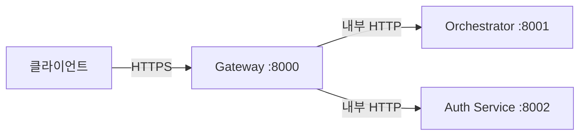
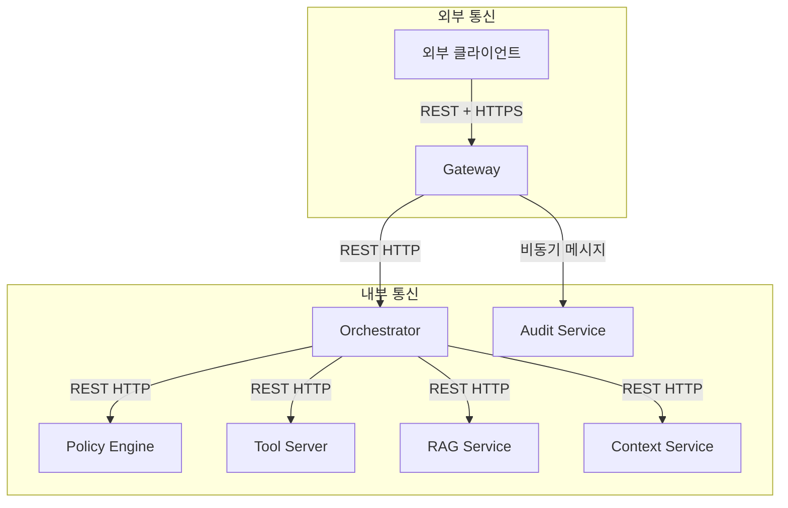

# Chapter 3. API 설계 & 인터페이스

> 컴포넌트를 만들기 전에 인터페이스를 먼저 정한다. API 계약이 먼저고, 구현은 그 다음이다.

## 이 챕터에서 배우는 것

- Gateway, Orchestrator, Tool Server의 REST API 스펙 설계
- 컴포넌트 간 통신 프로토콜 선택 기준 (REST vs gRPC)
- 에러 응답 표준화 및 API 버저닝 전략
- OpenAPI 스펙 기반 계약 우선(Contract-First) 설계

## 사전 지식

> Chapter 1~2의 6개 컴포넌트와 8가지 기능을 먼저 이해하고 오자.  
> REST, HTTP 상태 코드, JWT 개념이 필요하다.

---

## 3-1. API 설계 원칙

코드를 짜기 전에 API 인터페이스를 먼저 확정한다.  
이걸 **계약 우선(Contract-First) 설계**라고 한다.

왜 이게 중요하냐면, 여러 서비스가 동시에 개발될 때 인터페이스가 먼저 정해져야 병렬 개발이 가능하기 때문이다.

이 프로젝트에서 지키는 API 설계 규칙:

| 규칙 | 내용 |
|---|---|
| 버저닝 | URL 경로에 포함 (`/v1/`, `/v2/`) |
| 인증 | 모든 엔드포인트에 JWT Bearer 필수 |
| 에러 응답 | 전 서비스 공통 포맷 사용 |
| 페이지네이션 | cursor 기반 (offset 방식 금지) |
| 요청 ID | 모든 요청에 `X-Request-ID` 헤더 |

### 공통 에러 응답 포맷

```python
# src/shared/schemas/error.py

from pydantic import BaseModel
from typing import Optional

class ErrorDetail(BaseModel):
    code: str           # 기계가 읽는 에러 코드 (예: "RATE_LIMIT_EXCEEDED")
    message: str        # 사람이 읽는 설명
    field: Optional[str] = None   # 검증 에러 시 문제가 된 필드명
    trace_id: str       # 로그 추적용 ID

class ErrorResponse(BaseModel):
    error: ErrorDetail
    request_id: str
    timestamp: str

# 사용 예시
# {
#   "error": {
#     "code": "TOOL_NOT_FOUND",
#     "message": "요청한 도구 'db_query'를 찾을 수 없습니다.",
#     "trace_id": "a1b2c3d4"
#   },
#   "request_id": "req-uuid-1234",
#   "timestamp": "2025-01-15T09:00:00Z"
# }
```

---

## 3-2. Gateway API 스펙

Gateway는 외부에 노출되는 유일한 진입점이다.  
클라이언트(웹, 앱, 외부 서비스)는 오직 Gateway와만 통신한다.



### 핵심 엔드포인트

```yaml
# Gateway API 스펙 (OpenAPI 3.0 요약)

POST /v1/chat
  설명: 사용자 메시지 전송 및 AI 응답 수신
  인증: Bearer JWT
  요청:
    Content-Type: application/json
    body:
      session_id: string (required)
      message: string (required, max 4000자)
      stream: boolean (optional, default: false)
  응답:
    200: 정상 응답
    429: Rate Limit 초과
    403: 정책 위반

GET /v1/sessions/{session_id}/history
  설명: 대화 히스토리 조회
  인증: Bearer JWT
  응답:
    200: 대화 목록 (cursor 기반 페이지네이션)

DELETE /v1/sessions/{session_id}
  설명: 세션 및 대화 히스토리 삭제
  인증: Bearer JWT

POST /v1/auth/token
  설명: JWT 토큰 발급
  인증: 없음 (API Key 방식)
  요청:
    api_key: string
  응답:
    access_token: string (JWT, 1시간 만료)
    refresh_token: string (7일 만료)
```

### Gateway 라우터 구현

```python
# src/gateway/app/routers/chat.py

from fastapi import APIRouter, Depends, Header
from fastapi.responses import StreamingResponse
from app.middleware.auth import verify_token
from app.middleware.rate_limit import RateLimiter
from app.clients.orchestrator import OrchestratorClient
from app.schemas.chat import ChatRequest, ChatResponse
import uuid

router = APIRouter(prefix="/v1/chat", tags=["chat"])
orchestrator = OrchestratorClient()

@router.post("", response_model=ChatResponse)
async def chat(
    request: ChatRequest,
    x_request_id: str = Header(default_factory=lambda: str(uuid.uuid4())),
    token_payload: dict = Depends(verify_token),
    rate_limiter: RateLimiter = Depends(),
):
    await rate_limiter.check(user_id=token_payload["sub"])

    if request.stream:
        return StreamingResponse(
            orchestrator.stream(request, token_payload, x_request_id),
            media_type="text/event-stream",
        )

    response = await orchestrator.invoke(request, token_payload, x_request_id)
    return ChatResponse(
        session_id=request.session_id,
        message=response.message,
        sources=response.sources,
        model_used=response.model_used,
        request_id=x_request_id,
    )
```

---

## 3-3. Orchestrator 내부 API 스펙

Orchestrator는 Gateway에서만 호출된다.  
외부에 직접 노출되지 않으므로 인증은 **서비스 간 공유 시크릿(Service Secret)** 으로 처리한다.

```yaml
# Orchestrator 내부 API

POST /internal/v1/invoke
  설명: 동기식 AI 요청 처리
  인증: X-Service-Secret 헤더
  요청:
    session_id: string
    user_id: string
    role: string
    message: string
    request_id: string

POST /internal/v1/stream
  설명: 스트리밍 AI 요청 처리 (SSE)
  인증: X-Service-Secret 헤더
  응답: text/event-stream

GET /internal/v1/health
  설명: 헬스체크
  응답: { "status": "ok", "model_available": true }
```

```python
# src/orchestrator/app/routers/internal.py

from fastapi import APIRouter, Depends, HTTPException
from app.middleware.service_auth import verify_service_secret
from app.core.flow import OrchestrationFlow
from app.schemas.internal import InvokeRequest, InvokeResponse

router = APIRouter(prefix="/internal/v1")
flow = OrchestrationFlow()

@router.post("/invoke", response_model=InvokeResponse)
async def invoke(
    request: InvokeRequest,
    _: None = Depends(verify_service_secret),
):
    result = await flow.run(
        session_id=request.session_id,
        user_id=request.user_id,
        role=request.role,
        message=request.message,
        request_id=request.request_id,
    )
    return result
```

---

## 3-4. Tool Server API 스펙

Tool Server는 Orchestrator에서만 호출된다.  
각 Tool은 등록(Register) → 조회(Discover) → 실행(Execute) 3단계로 동작한다.

```yaml
# Tool Server API

GET /tools
  설명: 사용 가능한 Tool 목록 조회 (role 기반 필터링)
  인증: X-Service-Secret + X-User-Role 헤더
  응답:
    tools: Tool[] (name, description, parameters 스펙)

POST /tools/{tool_name}/execute
  설명: Tool 실행
  인증: X-Service-Secret
  요청:
    user_id: string
    role: string
    parameters: object  # Tool별 파라미터
    request_id: string
  응답:
    result: any         # Tool 실행 결과
    execution_time_ms: number
    tool_name: string
```

```python
# src/tool-service/app/routers/tools.py

from fastapi import APIRouter, Depends, Path
from app.middleware.service_auth import verify_service_secret
from app.registry import get_tools_for_role
from app.executor import ToolExecutor
from app.schemas import ToolExecuteRequest, ToolExecuteResponse

router = APIRouter(prefix="/tools")
executor = ToolExecutor()

@router.get("")
async def list_tools(
    x_user_role: str = Header(...),
    _: None = Depends(verify_service_secret),
):
    return {"tools": get_tools_for_role(x_user_role)}

@router.post("/{tool_name}/execute", response_model=ToolExecuteResponse)
async def execute_tool(
    tool_name: str = Path(...),
    request: ToolExecuteRequest = Body(...),
    _: None = Depends(verify_service_secret),
):
    return await executor.run(tool_name, request)
```

---

## 3-5. 컴포넌트 간 통신 프로토콜 선택

서비스 간 통신은 **REST(HTTP/1.1)** 와 **gRPC(HTTP/2)** 중 선택해야 한다.



| 구간 | 프로토콜 | 이유 |
|---|---|---|
| 외부 → Gateway | REST + HTTPS | 범용 클라이언트 호환 |
| Gateway → Orchestrator | REST (내부) | 단순 요청/응답, 디버깅 용이 |
| Orchestrator → Tool Server | REST (내부) | Tool별 파라미터가 달라 JSON이 유리 |
| Orchestrator → Audit | 비동기 (Redis Pub/Sub) | 응답 지연 없이 로그 발행 |

### 🔥 핵심 포인트

내부 통신에 gRPC를 쓰면 성능은 좋아지지만 디버깅이 어렵고,  
초기 개발 속도가 느려진다. **이 프로젝트는 REST로 시작하고, 성능 병목 발생 시 gRPC로 전환**한다.  
Chapter 14(운영 설계)에서 병목 구간 식별 방법을 다룬다.

---

## 3-6. API 버저닝 전략

```python
# src/gateway/app/main.py

from fastapi import FastAPI
from app.routers.v1 import chat as chat_v1
from app.routers.v2 import chat as chat_v2  # 미래 확장

app = FastAPI(title="MCP Gateway")

# v1 라우터 등록
app.include_router(chat_v1.router, prefix="/v1")

# v2는 준비되면 추가
# app.include_router(chat_v2.router, prefix="/v2")

@app.get("/healthz")
async def health():
    return {"status": "ok", "version": "1.0.0"}
```

⚠️ **주의사항**: `/v1/` URL을 프론트엔드에 하드코딩하게 두면 안 된다.  
클라이언트는 `/healthz`의 `version` 필드를 보고 호환 가능한 버전을 판단해야 한다.  
버전 협상 로직을 SDK 레이어에 두는 게 장기적으로 유리하다.

---

## 정리

| 항목 | 결정 사항 |
|---|---|
| 외부 API | REST + HTTPS, URL 버저닝 (`/v1/`) |
| 내부 서비스 통신 | REST HTTP (내부망 한정) |
| 감사 로그 전송 | 비동기 (Redis Pub/Sub) |
| 에러 포맷 | 전 서비스 공통 `ErrorResponse` 스키마 |
| 인증 (외부) | JWT Bearer Token |
| 인증 (내부) | X-Service-Secret 헤더 |

---

## 다음 챕터 예고

> Chapter 4에서는 이 API들을 실제로 독립된 서비스로 분리하는 MSA 구조를 설계한다.  
> 서비스 경계를 어떻게 긋는지, 데이터 스토어를 어떻게 분리하는지,  
> 그리고 Docker Compose로 전체를 묶는 방법을 다룬다.
