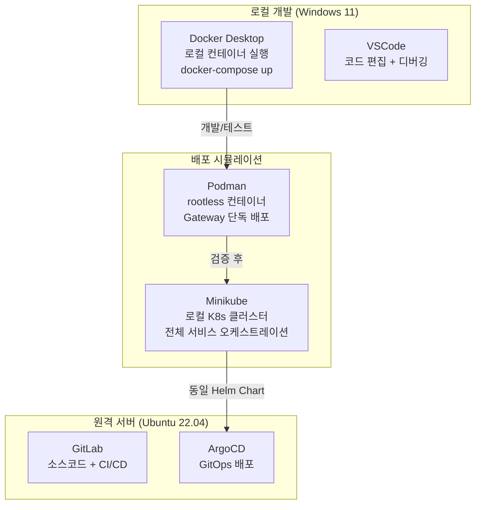
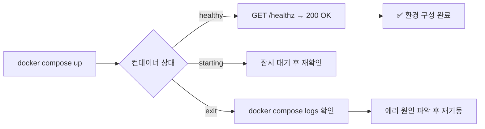

# Chapter 5. 실습 환경 구성

> 코드를 짜기 전에 환경이 먼저다. 환경 세팅이 흔들리면 나중에 "내 로컬에서는 됐는데"가 반복된다.

## 이 챕터에서 배우는 것

- Windows 11 기준 전체 실습 환경 설치 및 설정
- Docker Desktop, Podman, Minikube 설치와 역할 구분
- VSCode 개발 환경 구성 (권장 확장 포함)
- 프로젝트 초기 구조 생성 및 첫 서비스 기동 확인

## 사전 지식

> Chapter 4의 Docker Compose 구조를 먼저 이해하고 오자.  
> Windows 터미널(PowerShell 또는 Git Bash)을 사용할 줄 알아야 한다.

---

## 5-1. 환경 개요 및 도구 역할 분리

설치할 도구가 여러 개라서 "뭐가 뭔지" 헷갈릴 수 있다. 역할부터 명확히 하고 시작한다.



| 도구 | 언제 쓰는가 |
|---|---|
| Docker Desktop | 로컬 개발 중 `docker-compose up`으로 전체 스택 올릴 때 |
| Podman | Gateway 단독 배포, rootless 컨테이너 테스트 |
| Minikube | K8s Helm Chart 검증, 로컬 클러스터 시뮬레이션 |
| VSCode | 모든 코드 편집 |

---

## 5-2. 사전 요구사항 확인

설치 전에 시스템이 요건을 충족하는지 먼저 확인한다.

```powershell
# PowerShell에서 실행

# Windows 버전 확인 (22H2 이상 권장)
winver

# WSL2 활성화 여부 확인
wsl --status

# 가상화 지원 확인 (ENABLED여야 함)
systeminfo | findstr "Hyper-V"
```

⚠️ **주의사항**: WSL2가 비활성화되어 있으면 Docker Desktop이 정상 동작하지 않는다.  
WSL2 미설치 시 아래 명령으로 먼저 설치한다.

```powershell
# PowerShell (관리자 권한)
wsl --install
# 재부팅 후 Ubuntu 배포판 자동 설치됨
```

---

## 5-3. Docker Desktop 설치

### 설치

1. [https://www.docker.com/products/docker-desktop](https://www.docker.com/products/docker-desktop) 에서 **Windows용** 다운로드
2. 설치 옵션: **Use WSL 2 instead of Hyper-V** 선택 (기본값)
3. 설치 완료 후 재부팅

### 설치 확인

```powershell
docker --version
# Docker version 27.x.x 이상

docker compose version
# Docker Compose version v2.x.x 이상
```

### Docker Desktop 메모리 설정

AI 서비스는 메모리를 많이 쓴다. WSL2 리소스 제한을 늘려야 한다.

```ini
# C:\Users\{사용자명}\.wslconfig 파일 생성 또는 수정

[wsl2]
memory=8GB        # 전체 RAM의 50% 수준으로 설정
processors=4
swap=4GB
```

```powershell
# 설정 적용 (WSL2 재시작)
wsl --shutdown
# Docker Desktop 재시작
```

---

## 5-4. Podman 설치

Podman은 Docker와 CLI가 거의 동일하지만 **rootless(root 권한 없이)** 로 동작한다.  
이 프로젝트에서는 Gateway 컨테이너를 Podman으로 배포하는 시나리오에서 사용한다.

```powershell
# winget으로 설치 (Windows 패키지 매니저)
winget install RedHat.Podman

# 설치 확인
podman --version
# podman version 5.x.x 이상

# Podman 머신 초기화 (WSL2 백엔드)
podman machine init
podman machine start

# 동작 확인
podman run --rm hello-world
```

### Docker 명령어와 호환

```powershell
# Podman은 docker CLI와 동일한 명령어를 지원
podman build -t mcp-gateway:latest ./src/gateway
podman run -p 8000:8000 --env-file .env mcp-gateway:latest
```

---

## 5-5. Minikube 설치

Minikube는 로컬에서 단일 노드 K8s 클러스터를 실행한다.  
Chapter 7(인프라 & 배포)에서 Helm Chart를 검증할 때 사용한다.

```powershell
# winget으로 설치
winget install Kubernetes.minikube
winget install Kubernetes.kubectl

# 설치 확인
minikube version
kubectl version --client
```

### Minikube 클러스터 시작

```powershell
# Docker Desktop을 드라이버로 사용 (WSL2 환경)
minikube start --driver=docker --memory=6144 --cpus=4

# 시작 확인
minikube status
kubectl get nodes
# NAME       STATUS   ROLES           AGE   VERSION
# minikube   Ready    control-plane   1m    v1.31.x
```

⚠️ **주의사항**: Minikube와 Docker Desktop이 동시에 많은 메모리를 쓴다.  
로컬 개발 시에는 둘 중 하나만 활성화하고 사용하는 것을 권장한다.  
`minikube stop`으로 클러스터를 내려두고 `docker compose up`으로 개발하자.

---

## 5-6. VSCode 설정

### 필수 확장 설치

```bash
# VSCode 터미널에서 한 번에 설치

code --install-extension ms-python.python
code --install-extension ms-python.black-formatter
code --install-extension ms-azuretools.vscode-docker
code --install-extension ms-kubernetes-tools.vscode-kubernetes-tools
code --install-extension redhat.vscode-yaml
code --install-extension humao.rest-client
code --install-extension eamodio.gitlens
```

### 워크스페이스 설정

```json
// .vscode/settings.json

{
  "python.defaultInterpreterPath": "${workspaceFolder}/.venv/bin/python",
  "editor.formatOnSave": true,
  "[python]": {
    "editor.defaultFormatter": "ms-python.black-formatter"
  },
  "python.linting.enabled": true,
  "python.linting.ruffEnabled": true,
  "files.exclude": {
    "**/__pycache__": true,
    "**/.pytest_cache": true,
    "**/*.pyc": true
  },
  "docker.defaultRegistryPath": "your-registry.com"
}
```

```json
// .vscode/launch.json — 디버깅 설정

{
  "version": "0.2.0",
  "configurations": [
    {
      "name": "Gateway (Debug)",
      "type": "python",
      "request": "launch",
      "module": "uvicorn",
      "args": ["app.main:app", "--reload", "--port", "8000"],
      "cwd": "${workspaceFolder}/src/gateway",
      "env": {
        "PYTHONPATH": "${workspaceFolder}/src/gateway"
      },
      "envFile": "${workspaceFolder}/.env"
    },
    {
      "name": "Orchestrator (Debug)",
      "type": "python",
      "request": "launch",
      "module": "uvicorn",
      "args": ["app.main:app", "--reload", "--port", "8001"],
      "cwd": "${workspaceFolder}/src/orchestrator",
      "envFile": "${workspaceFolder}/.env"
    }
  ]
}
```

---

## 5-7. 프로젝트 초기 구조 생성

Chapter 4에서 설계한 디렉토리 구조를 실제로 생성한다.

```powershell
# 프로젝트 루트에서 실행 (PowerShell)

# 서비스 디렉토리 생성
$services = @("gateway", "orchestrator", "policy-engine", "context-service", "rag-service", "tool-service", "audit-service")

foreach ($svc in $services) {
    New-Item -ItemType Directory -Force -Path "src/$svc/app/routers"
    New-Item -ItemType Directory -Force -Path "src/$svc/app/middleware"
    New-Item -ItemType Directory -Force -Path "src/$svc/app/schemas"
    New-Item -ItemType File -Force -Path "src/$svc/app/__init__.py"
    New-Item -ItemType File -Force -Path "src/$svc/app/main.py"
    New-Item -ItemType File -Force -Path "src/$svc/app/config.py"
    New-Item -ItemType File -Force -Path "src/$svc/Dockerfile"
    New-Item -ItemType File -Force -Path "src/$svc/requirements.txt"
}

# 공통 모듈 생성
New-Item -ItemType Directory -Force -Path "shared/schemas"
New-Item -ItemType File -Force -Path "shared/__init__.py"
New-Item -ItemType File -Force -Path "shared/audit_publisher.py"

# 인프라 디렉토리
New-Item -ItemType Directory -Force -Path "infra/helm"
New-Item -ItemType Directory -Force -Path "infra/k8s"

Write-Host "✅ 프로젝트 구조 생성 완료"
```

### 각 서비스 공통 Dockerfile 템플릿

```dockerfile
# src/gateway/Dockerfile (다른 서비스도 동일 패턴)

FROM python:3.12-slim

WORKDIR /app

# 의존성 먼저 복사 (레이어 캐시 활용)
COPY requirements.txt .
RUN pip install --no-cache-dir -r requirements.txt

# 소스코드 복사
COPY app/ ./app/

# 비root 사용자로 실행 (보안)
RUN adduser --disabled-password --gecos "" appuser
USER appuser

EXPOSE 8000

CMD ["uvicorn", "app.main:app", "--host", "0.0.0.0", "--port", "8000"]
```

### requirements.txt 기본 구성

```txt
# src/gateway/requirements.txt

fastapi==0.115.0
uvicorn[standard]==0.32.0
pydantic==2.9.0
pydantic-settings==2.6.0
python-jose[cryptography]==3.3.0   # JWT
httpx==0.27.0                       # 내부 HTTP 클라이언트
redis[asyncio]==5.2.0
```

---

## 5-8. 환경변수 파일 생성 및 첫 기동

```powershell
# .env.example을 복사해서 .env 생성
Copy-Item .env.example .env

# .env 파일 편집 (VSCode로 열기)
code .env
```

최소한 아래 값은 채워야 한다:

```bash
# .env (최소 설정)
OPENAI_API_KEY=sk-your-key-here
SERVICE_SECRET=dev-secret-1234567890abcdef
JWT_SECRET_KEY=dev-jwt-secret-1234567890
POSTGRES_PASSWORD=devpassword123
```

### 첫 기동 및 확인

```powershell
# 프로젝트 루트에서 실행

# 전체 스택 백그라운드 실행
docker compose -f infra/docker-compose.yml up -d

# 로그 확인
docker compose -f infra/docker-compose.yml logs -f gateway

# 서비스 상태 확인
docker compose -f infra/docker-compose.yml ps
```

```powershell
# Gateway 헬스체크 확인
curl http://localhost:8000/healthz
# {"status": "ok", "version": "1.0.0"}

# Orchestrator 헬스체크
curl http://localhost:8001/internal/v1/health
# {"status": "ok", "model_available": true}
```



---

## 5-9. 자주 발생하는 문제 & 해결

| 증상 | 원인 | 해결 |
|---|---|---|
| `docker compose up` 후 서비스 즉시 종료 | .env 파일 누락 또는 필수 환경변수 미설정 | `.env` 파일 존재 여부 및 값 확인 |
| Redis 연결 실패 | 서비스 시작 순서 문제 | `healthcheck` + `depends_on` 설정 확인 |
| `port is already allocated` 에러 | 동일 포트 사용 중인 프로세스 존재 | `netstat -ano \| findstr :8000` 으로 프로세스 확인 후 종료 |
| Minikube 시작 실패 | Docker Desktop 미실행 | Docker Desktop 먼저 실행 후 `minikube start` |
| WSL2 메모리 부족 | `.wslconfig` 미설정 | 5-3 섹션의 `.wslconfig` 설정 적용 |

---

## 정리

| 항목 | 설치/설정 내용 |
|---|---|
| WSL2 | Windows 기능 활성화 |
| Docker Desktop | WSL2 백엔드, 메모리 8GB 할당 |
| Podman | winget 설치, rootless 컨테이너 |
| Minikube | Docker 드라이버, 6GB 메모리 |
| VSCode | Python, Docker, K8s, YAML 확장 |
| 프로젝트 구조 | 7개 서비스 디렉토리 초기 생성 |
| 첫 기동 | `docker compose up -d` + healthz 확인 |

---

## 다음 챕터 예고

> Chapter 6에서는 이 환경 위에서 실제 코드를 작성한다.  
> Gateway와 Orchestrator를 FastAPI로 구현하고,  
> 실제 LLM 호출부터 Tool 실행까지 End-to-End 흐름을 만들어낸다.
