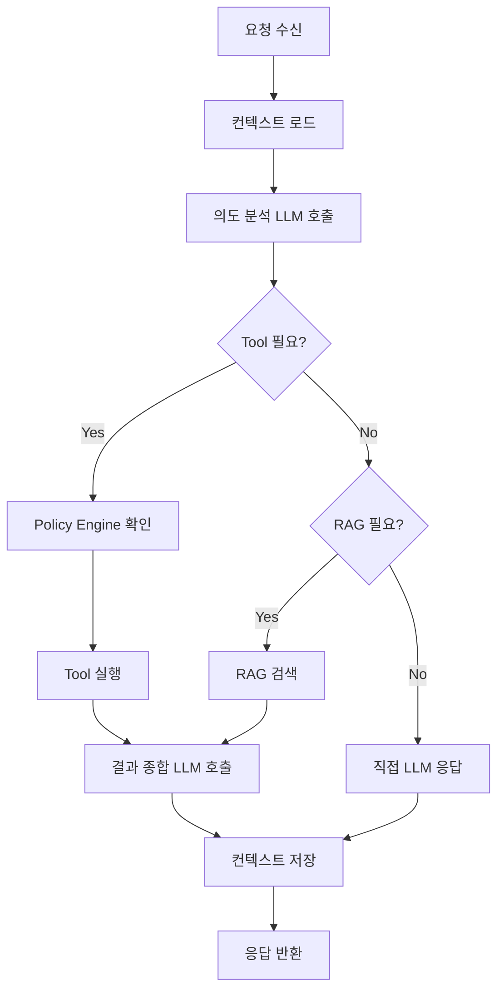

# Chapter 6. 실습 — FastAPI로 구현하기

> 설계는 끝났다. 이제 코드를 짠다. Gateway와 Orchestrator부터 시작해서 실제 LLM 호출까지 End-to-End로 연결한다.

## 이 챕터에서 배우는 것

- Gateway 전체 구현 (인증, Rate Limit, 라우팅)
- Orchestrator 핵심 플로우 구현 (의도 분석 → Tool 선택 → LLM 호출)
- Tool Server 기본 Tool 구현 및 등록
- 전체 흐름 End-to-End 로컬 테스트

## 사전 지식

> Chapter 5에서 `docker compose up -d`로 인프라가 올라가 있어야 한다.  
> FastAPI 기본 개념(라우터, 의존성 주입, Pydantic 모델)을 알고 있어야 한다.

---

## 6-1. Gateway 구현

Gateway는 외부 요청의 단일 진입점이다.  
인증 → Rate Limit → Orchestrator 전달 세 단계를 순서대로 구현한다.

### 설정 및 진입점

```python
# src/gateway/app/config.py

from pydantic_settings import BaseSettings

class Settings(BaseSettings):
    orchestrator_url: str = "http://orchestrator:8001"
    redis_url: str = "redis://redis:6379"
    jwt_secret_key: str
    jwt_algorithm: str = "HS256"
    jwt_expire_minutes: int = 60
    service_secret: str
    rate_limit_per_minute: int = 20

    class Config:
        env_file = ".env"
        case_sensitive = False

settings = Settings()
```

```python
# src/gateway/app/main.py

from fastapi import FastAPI
from contextlib import asynccontextmanager
import redis.asyncio as aioredis
from app.config import settings
from app.routers.v1 import chat, auth

redis_client: aioredis.Redis = None

@asynccontextmanager
async def lifespan(app: FastAPI):
    global redis_client
    redis_client = await aioredis.from_url(settings.redis_url, decode_responses=True)
    app.state.redis = redis_client
    yield
    await redis_client.close()

app = FastAPI(title="MCP Gateway", version="1.0.0", lifespan=lifespan)

app.include_router(chat.router, prefix="/v1")
app.include_router(auth.router, prefix="/v1")

@app.get("/healthz")
async def health():
    return {"status": "ok", "version": "1.0.0"}
```

### JWT 인증 미들웨어

```python
# src/gateway/app/middleware/auth.py

from fastapi import Depends, HTTPException, status
from fastapi.security import HTTPBearer, HTTPAuthorizationCredentials
from jose import jwt, JWTError
from app.config import settings

bearer_scheme = HTTPBearer()

async def verify_token(
    credentials: HTTPAuthorizationCredentials = Depends(bearer_scheme),
) -> dict:
    token = credentials.credentials
    try:
        payload = jwt.decode(
            token,
            settings.jwt_secret_key,
            algorithms=[settings.jwt_algorithm],
        )
        user_id: str = payload.get("sub")
        role: str = payload.get("role")
        if not user_id or not role:
            raise HTTPException(status_code=401, detail="Invalid token payload")
        return {"sub": user_id, "role": role}
    except JWTError:
        raise HTTPException(
            status_code=status.HTTP_401_UNAUTHORIZED,
            detail="Token validation failed",
            headers={"WWW-Authenticate": "Bearer"},
        )
```

### Rate Limiter

```python
# src/gateway/app/middleware/rate_limit.py

import time
from fastapi import Request, HTTPException
import redis.asyncio as aioredis
from app.config import settings

class RateLimiter:
    async def check(self, request: Request, user_id: str):
        redis: aioredis.Redis = request.app.state.redis
        key = f"rate:{user_id}"
        now = time.time()
        window = 60  # 1분 슬라이딩 윈도우

        pipe = redis.pipeline()
        pipe.zremrangebyscore(key, 0, now - window)
        pipe.zadd(key, {str(now): now})
        pipe.zcard(key)
        pipe.expire(key, window)
        results = await pipe.execute()

        count = results[2]
        if count > settings.rate_limit_per_minute:
            raise HTTPException(
                status_code=429,
                detail=f"Rate limit exceeded: max {settings.rate_limit_per_minute} req/min",
            )

def get_rate_limiter() -> RateLimiter:
    return RateLimiter()
```

### Chat 라우터

```python
# src/gateway/app/routers/v1/chat.py

from fastapi import APIRouter, Depends, Request, Header
from app.middleware.auth import verify_token
from app.middleware.rate_limit import RateLimiter, get_rate_limiter
from app.clients.orchestrator import OrchestratorClient
from app.schemas.chat import ChatRequest, ChatResponse
import uuid

router = APIRouter(prefix="/chat", tags=["chat"])
orchestrator = OrchestratorClient()

@router.post("", response_model=ChatResponse)
async def chat(
    request: Request,
    body: ChatRequest,
    x_request_id: str = Header(default=None),
    token: dict = Depends(verify_token),
    limiter: RateLimiter = Depends(get_rate_limiter),
):
    req_id = x_request_id or str(uuid.uuid4())
    await limiter.check(request, user_id=token["sub"])

    result = await orchestrator.invoke(
        session_id=body.session_id,
        message=body.message,
        user_id=token["sub"],
        role=token["role"],
        request_id=req_id,
    )
    return ChatResponse(
        session_id=body.session_id,
        message=result["message"],
        sources=result.get("sources", []),
        model_used=result.get("model_used", "unknown"),
        request_id=req_id,
    )
```

---

## 6-2. Orchestrator 핵심 플로우 구현

Orchestrator는 이 프로젝트에서 가장 복잡한 서비스다.  
사용자 의도 분석 → 도구 선택 → LLM 호출 → 결과 취합 흐름을 담당한다.



### 오케스트레이션 플로우 핵심 로직

```python
# src/orchestrator/app/core/flow.py

from openai import AsyncOpenAI
from app.clients.tool_client import ToolClient
from app.clients.context_client import ContextClient
from app.clients.policy_client import PolicyClient
from app.core.router import route_to_model
from app.config import settings
import json

client = AsyncOpenAI(api_key=settings.openai_api_key)
tool_client = ToolClient()
context_client = ContextClient()
policy_client = PolicyClient()

class OrchestrationFlow:

    async def run(self, session_id: str, user_id: str, role: str,
                  message: str, request_id: str) -> dict:

        # 1. 컨텍스트 로드
        context = await context_client.get(session_id, user_id)

        # 2. 사용 가능한 Tool 목록 조회 (역할 기반 필터링)
        available_tools = await tool_client.list(role=role)

        # 3. 의도 분석 — 경량 모델로 빠르게 판단
        intent = await self._analyze_intent(message, context, available_tools)

        result_message = ""
        sources = []
        model_used = ""

        # 4. 의도에 따른 분기 처리
        if intent.get("tool_name"):
            # Tool 실행 경로
            tool_name = intent["tool_name"]
            params = intent["parameters"]

            # Policy Engine 확인
            allowed = await policy_client.check(
                user_id=user_id, role=role,
                resource=f"tool:{tool_name}", action="execute",
            )
            if not allowed:
                return {"message": "해당 작업에 대한 권한이 없습니다.", "sources": [], "model_used": "none"}

            tool_result = await tool_client.execute(tool_name, params, user_id, role)

            # Tool 결과를 LLM으로 종합
            model = route_to_model(requires_reasoning=True)
            response = await client.chat.completions.create(
                model=model,
                messages=[
                    *context["conversation_history"],
                    {"role": "user", "content": message},
                    {"role": "tool", "content": json.dumps(tool_result, ensure_ascii=False)},
                    {"role": "system", "content": "위 도구 실행 결과를 바탕으로 사용자에게 명확하게 답해줘."},
                ],
            )
            result_message = response.choices[0].message.content
            model_used = model

        else:
            # 일반 LLM 응답 경로
            model = route_to_model(requires_reasoning=False)
            history = context.get("conversation_history", [])
            response = await client.chat.completions.create(
                model=model,
                messages=[
                    {"role": "system", "content": "당신은 기업용 AI 어시스턴트입니다. 정확하고 간결하게 답변하세요."},
                    *history,
                    {"role": "user", "content": message},
                ],
            )
            result_message = response.choices[0].message.content
            model_used = model

        # 5. 컨텍스트 저장
        await context_client.save_turn(session_id, message, result_message)

        return {"message": result_message, "sources": sources, "model_used": model_used}

    async def _analyze_intent(self, message: str, context: dict, tools: list) -> dict:
        """경량 모델로 의도 분석. Tool 호출 여부 및 파라미터 결정."""
        tool_specs = json.dumps(tools, ensure_ascii=False)
        response = await client.chat.completions.create(
            model="gpt-4o-mini",
            response_format={"type": "json_object"},
            messages=[
                {
                    "role": "system",
                    "content": (
                        f"사용 가능한 도구 목록:\n{tool_specs}\n\n"
                        "사용자 메시지를 분석해서 JSON으로 응답하라.\n"
                        "도구가 필요하면: {\"tool_name\": \"도구명\", \"parameters\": {...}}\n"
                        "불필요하면: {\"tool_name\": null, \"parameters\": {}}"
                    ),
                },
                {"role": "user", "content": message},
            ],
        )
        return json.loads(response.choices[0].message.content)
```

### 모델 라우터

```python
# src/orchestrator/app/core/router.py

MODEL_MAP = {
    "fast":     "gpt-4o-mini",
    "balanced": "gpt-4o",
    "power":    "claude-opus-4-6",
}

def route_to_model(requires_reasoning: bool = False, code_gen: bool = False) -> str:
    score = 0
    if requires_reasoning:
        score += 3
    if code_gen:
        score += 2

    if score >= 4:
        return MODEL_MAP["power"]
    elif score >= 2:
        return MODEL_MAP["balanced"]
    return MODEL_MAP["fast"]
```

---

## 6-3. Tool Server 구현

Tool Server는 실제 외부 시스템을 호출하는 실행 서버다.  
여기서는 `db_query`와 `get_weather` 두 가지 Tool을 구현한다.

```python
# src/tool-service/app/main.py

from fastapi import FastAPI
from app.routers.tools import router as tools_router

app = FastAPI(title="MCP Tool Server")
app.include_router(tools_router)

@app.get("/healthz")
async def health():
    return {"status": "ok"}
```

```python
# src/tool-service/app/executor.py

import asyncpg
import httpx
from app.registry import TOOL_REGISTRY
from app.config import settings

class ToolExecutor:

    async def run(self, tool_name: str, parameters: dict) -> dict:
        if tool_name not in TOOL_REGISTRY:
            raise ValueError(f"Tool '{tool_name}' not registered")

        handler = getattr(self, f"_exec_{tool_name}", None)
        if not handler:
            raise NotImplementedError(f"Executor for '{tool_name}' not implemented")

        return await handler(parameters)

    async def _exec_db_query(self, params: dict) -> dict:
        """Sales DB 조회 Tool"""
        query = params["query"]
        db_name = params.get("db_name", "sales")

        # ⚠️ 실제 운영에서는 ORM + 파라미터 바인딩 필수. 여기선 예시용 단순 쿼리.
        conn = await asyncpg.connect(dsn=settings.db_url)
        try:
            rows = await conn.fetch(query)
            return {
                "rows": [dict(r) for r in rows],
                "count": len(rows),
                "db_name": db_name,
            }
        finally:
            await conn.close()

    async def _exec_get_weather(self, params: dict) -> dict:
        """외부 날씨 API 호출 Tool (예시)"""
        city = params["city"]
        async with httpx.AsyncClient(timeout=5.0) as client:
            resp = await client.get(
                f"https://wttr.in/{city}?format=j1"
            )
            data = resp.json()
            current = data["current_condition"][0]
            return {
                "city": city,
                "temp_c": current["temp_C"],
                "desc": current["weatherDesc"][0]["value"],
            }
```

---

## 6-4. Pydantic 스키마 정의

서비스 간 데이터 계약을 명확히 한다.

```python
# src/gateway/app/schemas/chat.py

from pydantic import BaseModel, Field
from typing import Optional, List

class ChatRequest(BaseModel):
    session_id: str = Field(..., description="대화 세션 ID")
    message: str = Field(..., max_length=4000, description="사용자 메시지")
    stream: bool = Field(default=False)

class Source(BaseModel):
    title: str
    url: Optional[str] = None
    content: str

class ChatResponse(BaseModel):
    session_id: str
    message: str
    sources: List[Source] = []
    model_used: str
    request_id: str
```

---

## 6-5. End-to-End 로컬 테스트

모든 서비스가 올라간 상태에서 실제 요청을 보내 전체 흐름을 확인한다.

```powershell
# 1. 전체 스택 기동
docker compose -f infra/docker-compose.yml up -d

# 2. 헬스체크
curl http://localhost:8000/healthz
curl http://localhost:8001/internal/v1/health

# 3. 테스트용 JWT 토큰 발급
curl -X POST http://localhost:8000/v1/auth/token `
  -H "Content-Type: application/json" `
  -d '{"api_key": "dev-api-key-1234"}'

# 응답 예시:
# {"access_token": "eyJ...", "token_type": "bearer"}
```

```powershell
# 4. 실제 채팅 요청
$TOKEN = "eyJ..."  # 위에서 발급받은 토큰

curl -X POST http://localhost:8000/v1/chat `
  -H "Authorization: Bearer $TOKEN" `
  -H "Content-Type: application/json" `
  -d '{
    "session_id": "test-session-001",
    "message": "안녕하세요, 오늘 날씨 어때요?"
  }'
```

```powershell
# 5. VSCode REST Client 파일로 테스트 (더 편리)
# 파일: tests/api.http

### 토큰 발급
POST http://localhost:8000/v1/auth/token
Content-Type: application/json

{"api_key": "dev-api-key-1234"}

### 채팅 요청
POST http://localhost:8000/v1/chat
Authorization: Bearer {{token}}
Content-Type: application/json

{
  "session_id": "test-001",
  "message": "이번 달 매출 합계 알려줘"
}
```

### 전체 흐름 확인 로그

```bash
# Orchestrator 로그에서 플로우 추적
docker compose logs orchestrator | grep -E "intent|tool|model"

# 예상 출력:
# INFO: Intent analyzed: tool_name=db_query, params={...}
# INFO: Policy check passed for tool:db_query
# INFO: Tool executed in 234ms
# INFO: Final response generated with model gpt-4o
```

---

## 정리

| 항목 | 구현 내용 |
|---|---|
| Gateway | JWT 인증 + Sliding Window Rate Limit + Orchestrator 위임 |
| Orchestrator | 의도 분석(gpt-4o-mini) → 분기 → Tool/LLM 실행 → 컨텍스트 저장 |
| Tool Server | Registry 기반 등록 + Executor 패턴으로 확장 가능한 구조 |
| 모델 라우팅 | 복잡도 점수 기반 fast/balanced/power 티어 선택 |
| 테스트 | VSCode REST Client + docker compose logs로 E2E 확인 |

---

## 다음 챕터 예고

> Chapter 7에서는 이 코드를 실제 서버에 배포한다.  
> Podman으로 Gateway를 단독 배포하고, Minikube에서 Helm Chart로 전체 스택을 올린다.
