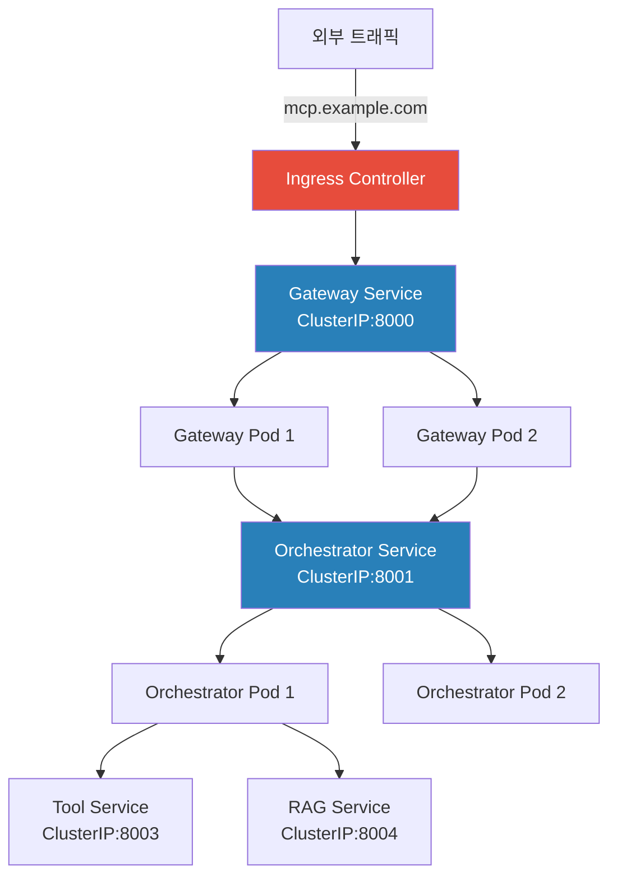

# Chapter 7. 인프라 & 배포

> 로컬에서 돌아가는 것과 서버에서 돌아가는 것은 다르다. 인프라를 코드로 관리해야 그 차이를 없앨 수 있다.

## 이 챕터에서 배우는 것

- Podman으로 Gateway 단독 컨테이너 배포
- Helm Chart 작성 및 Minikube에서 전체 스택 배포
- ConfigMap / Secret으로 K8s 환경변수 관리
- Ingress 설정 및 서비스 간 내부 DNS 통신

## 사전 지식

> Chapter 6에서 구현한 서비스 코드가 준비되어 있어야 한다.  
> Docker 이미지 빌드, K8s Pod/Service/Deployment 개념을 알고 있어야 한다.

---

## 7-1. 컨테이너 이미지 빌드 전략

배포 전에 각 서비스 이미지를 빌드해야 한다.  
이 프로젝트는 **멀티스테이지 빌드**로 이미지 크기를 줄인다.

```dockerfile
# src/gateway/Dockerfile (멀티스테이지 빌드)

# ── 빌드 스테이지 ──────────────────────────────
FROM python:3.12-slim AS builder

WORKDIR /build
COPY requirements.txt .
RUN pip install --no-cache-dir --prefix=/install -r requirements.txt

# ── 실행 스테이지 ──────────────────────────────
FROM python:3.12-slim AS runtime

WORKDIR /app

# 빌드 스테이지에서 설치된 패키지만 복사
COPY --from=builder /install /usr/local

# 소스코드 복사
COPY app/ ./app/

# 보안: 비root 사용자 실행
RUN addgroup --system appgroup && \
    adduser --system --ingroup appgroup appuser
USER appuser

EXPOSE 8000

HEALTHCHECK --interval=10s --timeout=5s --retries=3 \
    CMD python -c "import httpx; httpx.get('http://localhost:8000/healthz').raise_for_status()"

CMD ["uvicorn", "app.main:app", "--host", "0.0.0.0", "--port", "8000", "--workers", "2"]
```

### 전체 서비스 이미지 빌드

```powershell
# 프로젝트 루트에서 실행 (PowerShell)

$services = @("gateway", "orchestrator", "policy-engine", "context-service", "rag-service", "tool-service", "audit-service")
$registry  = "localhost:5000"   # 로컬 레지스트리 (Minikube용)
$version   = "0.1.0"

foreach ($svc in $services) {
    Write-Host "🔨 Building $svc..."
    docker build -t "$registry/mcp-$svc`:$version" "src/$svc"
    docker push "$registry/mcp-$svc`:$version"
}

Write-Host "✅ All images built and pushed"
```

---

## 7-2. Podman으로 Gateway 단독 배포

Podman은 rootless 컨테이너로 Gateway를 단독 배포하는 데 사용한다.  
실제 서버 환경에서 root 권한 없이 컨테이너를 올리는 시나리오다.

```bash
# 서버 (Ubuntu 22.04) 또는 WSL2 환경에서 실행

# 1. Podman으로 이미지 빌드
podman build -t mcp-gateway:0.1.0 src/gateway/

# 2. 환경변수 파일 준비
cat > gateway.env <<EOF
JWT_SECRET_KEY=your-jwt-secret
SERVICE_SECRET=your-service-secret
ORCHESTRATOR_URL=http://host.containers.internal:8001
REDIS_URL=redis://host.containers.internal:6379
RATE_LIMIT_PER_MINUTE=20
EOF

# 3. Gateway 컨테이너 실행
podman run -d \
  --name mcp-gateway \
  --env-file gateway.env \
  -p 8000:8000 \
  --restart unless-stopped \
  mcp-gateway:0.1.0

# 4. 동작 확인
podman ps
podman logs mcp-gateway
curl http://localhost:8000/healthz
```

### Podman Systemd 서비스 등록 (자동 시작)

```bash
# Podman 컨테이너를 systemd 서비스로 등록
podman generate systemd --name mcp-gateway --files --new

# 생성된 서비스 파일 설치 (사용자 레벨)
mkdir -p ~/.config/systemd/user
mv container-mcp-gateway.service ~/.config/systemd/user/

systemctl --user enable container-mcp-gateway
systemctl --user start container-mcp-gateway
systemctl --user status container-mcp-gateway
```

---

## 7-3. Helm Chart 구조 설계

Helm Chart로 전체 7개 서비스를 K8s에 배포한다.

```
infra/helm/
└── mcp-platform/
    ├── Chart.yaml
    ├── values.yaml              ← 기본값
    ├── values-dev.yaml          ← 개발 환경 오버라이드
    ├── values-prod.yaml         ← 운영 환경 오버라이드
    └── templates/
        ├── _helpers.tpl
        ├── gateway/
        │   ├── deployment.yaml
        │   ├── service.yaml
        │   └── hpa.yaml
        ├── orchestrator/
        │   ├── deployment.yaml
        │   └── service.yaml
        ├── configmap.yaml       ← 공통 설정
        ├── secret.yaml          ← 민감 정보
        └── ingress.yaml
```

```yaml
# infra/helm/mcp-platform/Chart.yaml

apiVersion: v2
name: mcp-platform
description: Zero Trust AI MCP Platform
type: application
version: 0.1.0
appVersion: "0.1.0"
```

```yaml
# infra/helm/mcp-platform/values.yaml

global:
  registry: localhost:5000
  imageTag: "0.1.0"
  pullPolicy: IfNotPresent

gateway:
  replicaCount: 2
  port: 8000
  resources:
    requests:
      cpu: "100m"
      memory: "256Mi"
    limits:
      cpu: "500m"
      memory: "512Mi"

orchestrator:
  replicaCount: 2
  port: 8001
  resources:
    requests:
      cpu: "200m"
      memory: "512Mi"
    limits:
      cpu: "1000m"
      memory: "1Gi"

policyEngine:
  replicaCount: 1
  port: 8002

toolService:
  replicaCount: 1
  port: 8003

ragService:
  replicaCount: 1
  port: 8004

contextService:
  replicaCount: 1
  port: 8005

auditService:
  replicaCount: 1
  port: 8006

redis:
  enabled: true
  port: 6379

postgres:
  enabled: true
  port: 5432
  database: mcp_db

qdrant:
  enabled: true
  port: 6333
```

---

## 7-4. K8s Deployment 템플릿

```yaml
# infra/helm/mcp-platform/templates/gateway/deployment.yaml

apiVersion: apps/v1
kind: Deployment
metadata:
  name: {{ include "mcp-platform.fullname" . }}-gateway
  labels:
    app: mcp-gateway
    version: {{ .Values.global.imageTag }}
spec:
  replicas: {{ .Values.gateway.replicaCount }}
  selector:
    matchLabels:
      app: mcp-gateway
  template:
    metadata:
      labels:
        app: mcp-gateway
    spec:
      containers:
        - name: gateway
          image: "{{ .Values.global.registry }}/mcp-gateway:{{ .Values.global.imageTag }}"
          imagePullPolicy: {{ .Values.global.pullPolicy }}
          ports:
            - containerPort: {{ .Values.gateway.port }}
          envFrom:
            - configMapRef:
                name: mcp-common-config
            - secretRef:
                name: mcp-secrets
          env:
            - name: ORCHESTRATOR_URL
              value: "http://{{ include "mcp-platform.fullname" . }}-orchestrator:{{ .Values.orchestrator.port }}"
          resources:
            requests:
              cpu: {{ .Values.gateway.resources.requests.cpu }}
              memory: {{ .Values.gateway.resources.requests.memory }}
            limits:
              cpu: {{ .Values.gateway.resources.limits.cpu }}
              memory: {{ .Values.gateway.resources.limits.memory }}
          livenessProbe:
            httpGet:
              path: /healthz
              port: {{ .Values.gateway.port }}
            initialDelaySeconds: 10
            periodSeconds: 15
          readinessProbe:
            httpGet:
              path: /healthz
              port: {{ .Values.gateway.port }}
            initialDelaySeconds: 5
            periodSeconds: 10
```

### ConfigMap & Secret

```yaml
# infra/helm/mcp-platform/templates/configmap.yaml

apiVersion: v1
kind: ConfigMap
metadata:
  name: mcp-common-config
data:
  RATE_LIMIT_PER_MINUTE: "20"
  MONTHLY_TOKEN_QUOTA: "10000000"
  JWT_ALGORITHM: "HS256"
  JWT_EXPIRE_MINUTES: "60"
  LOG_LEVEL: "INFO"
```

```yaml
# infra/helm/mcp-platform/templates/secret.yaml
# ⚠️ 실제 운영에서는 값을 직접 넣지 말고 Sealed Secrets 또는 Vault를 사용할 것

apiVersion: v1
kind: Secret
metadata:
  name: mcp-secrets
type: Opaque
stringData:
  JWT_SECRET_KEY: {{ .Values.secrets.jwtSecretKey | quote }}
  SERVICE_SECRET: {{ .Values.secrets.serviceSecret | quote }}
  OPENAI_API_KEY: {{ .Values.secrets.openaiApiKey | quote }}
  POSTGRES_PASSWORD: {{ .Values.secrets.postgresPassword | quote }}
```

---

## 7-5. Ingress 설정

외부 트래픽을 Gateway로 라우팅한다.

```yaml
# infra/helm/mcp-platform/templates/ingress.yaml

apiVersion: networking.k8s.io/v1
kind: Ingress
metadata:
  name: mcp-ingress
  annotations:
    nginx.ingress.kubernetes.io/rewrite-target: /
    nginx.ingress.kubernetes.io/ssl-redirect: "true"
    nginx.ingress.kubernetes.io/proxy-body-size: "10m"
    nginx.ingress.kubernetes.io/proxy-read-timeout: "300"  # 스트리밍 응답 대기
spec:
  ingressClassName: nginx
  rules:
    - host: mcp.example.com
      http:
        paths:
          - path: /v1
            pathType: Prefix
            backend:
              service:
                name: mcp-gateway-svc
                port:
                  number: 8000
```

---

## 7-6. Minikube 배포 실습

```powershell
# 1. Minikube 시작
minikube start --driver=docker --memory=6144 --cpus=4

# 2. Ingress 컨트롤러 활성화
minikube addons enable ingress

# 3. 로컬 레지스트리 활성화
minikube addons enable registry

# 4. 이미지를 Minikube 내부로 로드
minikube image load localhost:5000/mcp-gateway:0.1.0
minikube image load localhost:5000/mcp-orchestrator:0.1.0
# ... 나머지 서비스도 동일하게

# 5. values-dev.yaml 준비
```

```yaml
# infra/helm/mcp-platform/values-dev.yaml

global:
  registry: ""         # 로컬 이미지 사용
  imageTag: "0.1.0"
  pullPolicy: Never    # 로컬 이미지 직접 사용

secrets:
  jwtSecretKey: "dev-jwt-secret-1234"
  serviceSecret: "dev-service-secret"
  openaiApiKey: "sk-your-key"
  postgresPassword: "devpassword"
```

```powershell
# 6. Helm으로 배포
helm upgrade --install mcp-platform infra/helm/mcp-platform `
  -f infra/helm/mcp-platform/values-dev.yaml `
  --namespace mcp-dev `
  --create-namespace

# 7. 배포 상태 확인
kubectl get pods -n mcp-dev
kubectl get svc -n mcp-dev
kubectl get ingress -n mcp-dev

# 8. Gateway 포트포워딩으로 로컬 테스트
kubectl port-forward -n mcp-dev svc/mcp-gateway-svc 8080:8000
curl http://localhost:8080/healthz
```



---

## 7-7. HPA (Horizontal Pod Autoscaler) 설정

트래픽 증가 시 Pod을 자동으로 늘린다.

```yaml
# infra/helm/mcp-platform/templates/gateway/hpa.yaml

apiVersion: autoscaling/v2
kind: HorizontalPodAutoscaler
metadata:
  name: mcp-gateway-hpa
spec:
  scaleTargetRef:
    apiVersion: apps/v1
    kind: Deployment
    name: mcp-gateway
  minReplicas: 2
  maxReplicas: 10
  metrics:
    - type: Resource
      resource:
        name: cpu
        target:
          type: Utilization
          averageUtilization: 70
    - type: Resource
      resource:
        name: memory
        target:
          type: Utilization
          averageUtilization: 80
```

⚠️ **주의사항**: HPA가 동작하려면 `metrics-server`가 클러스터에 설치되어 있어야 한다.  
Minikube에서는 `minikube addons enable metrics-server`로 활성화한다.

---

## 정리

| 항목 | 내용 |
|---|---|
| 이미지 빌드 | 멀티스테이지 빌드, 비root 실행, HEALTHCHECK 포함 |
| Podman 배포 | rootless, systemd 서비스 등록 |
| Helm Chart | values.yaml 기반 환경별 오버라이드 |
| K8s 구조 | Deployment + Service + Ingress + HPA |
| Secret 관리 | ConfigMap(일반설정) + Secret(민감정보) 분리 |
| 로컬 검증 | Minikube + port-forward로 E2E 확인 |

---

## 다음 챕터 예고

> Chapter 8에서는 이 배포 과정을 자동화한다.  
> GitLab CI/CD 파이프라인으로 코드 푸시 → 이미지 빌드 → 테스트 → 배포까지 자동으로 이어지게 만든다.
