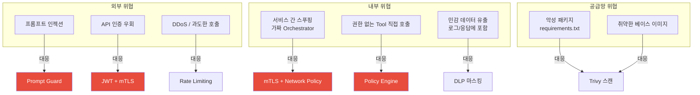
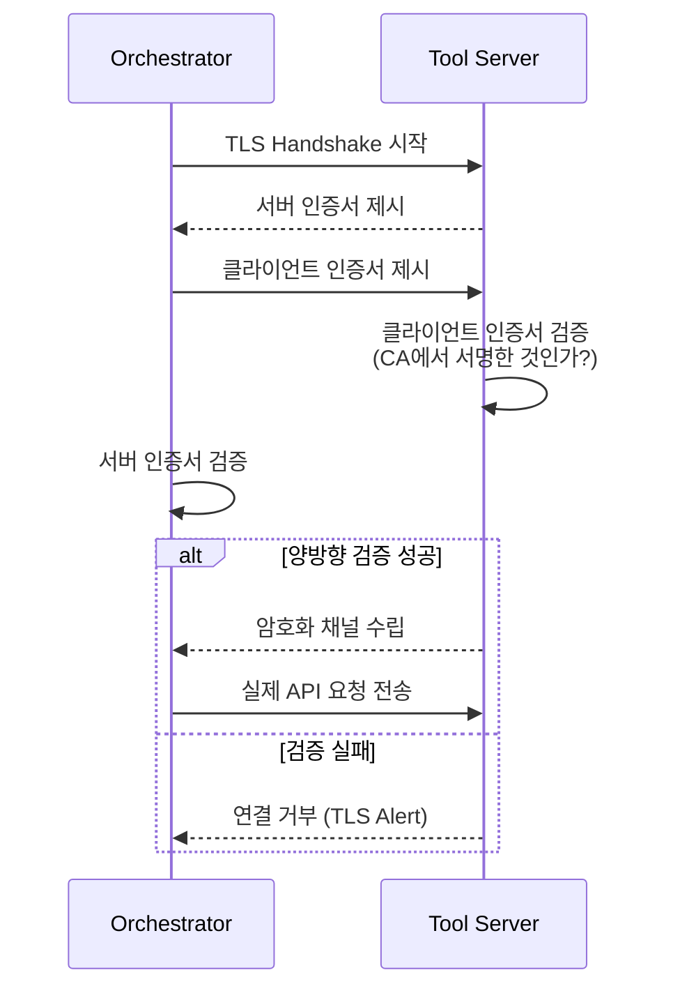

# Chapter 9. 보안 아키텍처

> 보안은 기능이 완성된 후 덧붙이는 게 아니다. 처음부터 구조 안에 내재되어야 한다.

## 이 챕터에서 배우는 것

- mTLS로 서비스 간 통신 암호화
- K8s Network Policy로 서비스 간 통신 격리
- OPA(Open Policy Agent) 정책 엔진 상세 설정
- JWT 보안 강화 (Refresh Token Rotation, 블랙리스트)
- 시크릿 관리 — Sealed Secrets 또는 Vault 연동

## 사전 지식

> Chapter 2의 Access Control 개념과 Chapter 7의 K8s 배포 구조를 알고 있어야 한다.  
> TLS/PKI 기본 개념(인증서, CA, 공개키/개인키)이 있으면 더 빠르게 이해할 수 있다.

---

## 9-1. 보안 위협 모델

보안을 설계하기 전에 무엇을 막으려는지 먼저 정의한다.  
이 플랫폼에서 고려하는 주요 위협은 다음과 같다.



---

## 9-2. mTLS — 서비스 간 통신 암호화

일반 TLS는 서버 인증만 한다. 클라이언트가 "이 서버 맞아?"를 확인한다.  
**mTLS(Mutual TLS)** 는 양방향 인증이다. 서버도 "이 클라이언트 믿어도 돼?"를 확인한다.

이걸 MCP 내부 통신에 적용하면, 가짜 Orchestrator가 Tool Server를 호출하는 시나리오를 막을 수 있다.



### Istio Service Mesh로 mTLS 적용

직접 mTLS를 구현하면 인증서 갱신, 배포 등이 복잡하다.  
**Istio**를 쓰면 애플리케이션 코드 수정 없이 사이드카(Envoy Proxy)가 자동으로 처리한다.

```bash
# Minikube에 Istio 설치
curl -L https://istio.io/downloadIstio | sh -
istioctl install --set profile=demo -y

# mcp-dev 네임스페이스에 Istio 사이드카 자동 주입 활성화
kubectl label namespace mcp-dev istio-injection=enabled
```

```yaml
# infra/k8s/istio-peer-auth.yaml
# 네임스페이스 내 모든 통신에 mTLS 강제

apiVersion: security.istio.io/v1beta1
kind: PeerAuthentication
metadata:
  name: mcp-mtls-strict
  namespace: mcp-dev
spec:
  mtls:
    mode: STRICT    # PERMISSIVE(선택) 대신 STRICT(강제) 사용
```

```yaml
# infra/k8s/istio-authz.yaml
# Orchestrator만 Tool Server를 호출할 수 있도록 제한

apiVersion: security.istio.io/v1beta1
kind: AuthorizationPolicy
metadata:
  name: tool-service-authz
  namespace: mcp-dev
spec:
  selector:
    matchLabels:
      app: mcp-tool-service
  rules:
    - from:
        - source:
            principals:
              - "cluster.local/ns/mcp-dev/sa/mcp-orchestrator"
      to:
        - operation:
            methods: ["POST"]
            paths: ["/tools/*/execute"]
```

⚠️ **주의사항**: Istio 사이드카는 서비스당 Envoy 프록시가 추가되므로 CPU/메모리 오버헤드가 발생한다.  
소규모 환경에서는 `X-Service-Secret` 헤더 방식(Chapter 3)으로 시작하고, 트래픽이 증가하면 Istio로 전환하는 게 현실적이다.

---

## 9-3. K8s Network Policy — 서비스 간 통신 격리

Network Policy는 Pod 레벨의 방화벽이다.  
"이 Pod은 저 Pod에게만 접근할 수 있다"를 선언적으로 정의한다.

```yaml
# infra/k8s/network-policy.yaml

# 기본 정책: 모든 인바운드 차단 (화이트리스트 방식)
apiVersion: networking.k8s.io/v1
kind: NetworkPolicy
metadata:
  name: default-deny-ingress
  namespace: mcp-dev
spec:
  podSelector: {}           # 네임스페이스 내 모든 Pod에 적용
  policyTypes:
    - Ingress

---
# Gateway → Orchestrator 허용
apiVersion: networking.k8s.io/v1
kind: NetworkPolicy
metadata:
  name: allow-gateway-to-orchestrator
  namespace: mcp-dev
spec:
  podSelector:
    matchLabels:
      app: mcp-orchestrator
  policyTypes:
    - Ingress
  ingress:
    - from:
        - podSelector:
            matchLabels:
              app: mcp-gateway
      ports:
        - port: 8001

---
# Orchestrator → Tool Server 허용
apiVersion: networking.k8s.io/v1
kind: NetworkPolicy
metadata:
  name: allow-orchestrator-to-tool
  namespace: mcp-dev
spec:
  podSelector:
    matchLabels:
      app: mcp-tool-service
  policyTypes:
    - Ingress
  ingress:
    - from:
        - podSelector:
            matchLabels:
              app: mcp-orchestrator
      ports:
        - port: 8003

---
# 외부 인바운드: Gateway만 허용
apiVersion: networking.k8s.io/v1
kind: NetworkPolicy
metadata:
  name: allow-ingress-to-gateway
  namespace: mcp-dev
spec:
  podSelector:
    matchLabels:
      app: mcp-gateway
  ingress:
    - from: []              # 모든 소스 허용 (Ingress Controller 경유)
      ports:
        - port: 8000
```

---

## 9-4. OPA 정책 엔진 상세 설정

Chapter 2에서 Policy Engine 개념을 잡았다면, 여기서는 실제 OPA 정책 코드를 작성한다.  
OPA는 **Rego**라는 전용 언어로 정책을 정의한다.

```python
# src/policy-engine/app/main.py
# OPA 서버를 사이드카로 쓰거나, Python에서 직접 rego를 평가

from fastapi import FastAPI
from app.routers.policy import router

app = FastAPI(title="MCP Policy Engine")
app.include_router(router, prefix="/policy")

@app.get("/healthz")
async def health():
    return {"status": "ok"}
```

```python
# src/policy-engine/app/routers/policy.py

from fastapi import APIRouter
from pydantic import BaseModel
import httpx
from app.config import settings

router = APIRouter()

class PolicyCheckRequest(BaseModel):
    user_id: str
    role: str
    resource: str       # 예: "tool:db_query"
    action: str         # 예: "execute"
    context: dict = {}  # 추가 컨텍스트 (파라미터, 시간대 등)

class PolicyCheckResponse(BaseModel):
    allowed: bool
    reason: str

@router.post("/check", response_model=PolicyCheckResponse)
async def check_policy(request: PolicyCheckRequest):
    # OPA 서버에 정책 평가 요청
    async with httpx.AsyncClient() as client:
        response = await client.post(
            f"{settings.opa_url}/v1/data/mcp/authz/allow",
            json={
                "input": {
                    "user_id": request.user_id,
                    "role": request.role,
                    "resource": request.resource,
                    "action": request.action,
                    "context": request.context,
                }
            },
        )
        result = response.json()
        allowed = result.get("result", False)

    return PolicyCheckResponse(
        allowed=allowed,
        reason="allowed" if allowed else "policy_denied",
    )
```

### OPA Rego 정책 파일

```rego
# infra/opa/policies/mcp_authz.rego

package mcp.authz

import future.keywords.in

# 기본값: 거부
default allow = false

# 규칙 1: admin은 모든 리소스 접근 허용
allow if {
    input.role == "admin"
}

# 규칙 2: analyst는 db_query만 허용 (hr DB 제외)
allow if {
    input.role == "analyst"
    input.resource == "tool:db_query"
    input.action == "execute"
    not input.context.parameters.db_name == "hr"
}

# 규칙 3: viewer는 읽기 전용 Tool만 허용
allow if {
    input.role == "viewer"
    input.resource in {"tool:get_weather", "tool:search_docs"}
    input.action == "execute"
}

# 규칙 4: 업무 시간 외 db_query 차단 (UTC 기준 00:00~09:00)
deny_offhours if {
    input.resource == "tool:db_query"
    hour := time.clock(time.now_ns())[0]
    hour < 9
}

allow if {
    input.role == "analyst"
    input.resource == "tool:db_query"
    not deny_offhours
}
```

```bash
# OPA 서버 로컬 실행 (Docker)
docker run -d --name opa \
  -p 8181:8181 \
  -v $(pwd)/infra/opa/policies:/policies \
  openpolicyagent/opa:latest \
  run --server --addr :8181 /policies/

# 정책 테스트
curl -X POST http://localhost:8181/v1/data/mcp/authz/allow \
  -H "Content-Type: application/json" \
  -d '{
    "input": {
      "role": "analyst",
      "resource": "tool:db_query",
      "action": "execute",
      "context": {"parameters": {"db_name": "sales"}}
    }
  }'
# 예상 결과: {"result": true}
```

---

## 9-5. JWT 보안 강화

기본 JWT 구현에서 보안을 높이는 두 가지 방법을 추가한다.

### Refresh Token Rotation

```python
# src/gateway/app/routers/v1/auth.py

from fastapi import APIRouter, HTTPException, Depends
from jose import jwt
from datetime import datetime, timedelta
import uuid
import redis.asyncio as aioredis
from app.config import settings

router = APIRouter(prefix="/auth", tags=["auth"])

def create_access_token(user_id: str, role: str) -> str:
    payload = {
        "sub": user_id,
        "role": role,
        "exp": datetime.utcnow() + timedelta(minutes=settings.jwt_expire_minutes),
        "jti": str(uuid.uuid4()),   # JWT ID — 블랙리스트용
    }
    return jwt.encode(payload, settings.jwt_secret_key, algorithm=settings.jwt_algorithm)

def create_refresh_token() -> str:
    return str(uuid.uuid4())   # 단순 UUID, DB에 저장

@router.post("/token")
async def issue_token(api_key: str, request: Request):
    redis: aioredis.Redis = request.app.state.redis

    # API Key 검증 (실제로는 DB 조회)
    user = validate_api_key(api_key)
    if not user:
        raise HTTPException(status_code=401, detail="Invalid API key")

    access_token = create_access_token(user.id, user.role)
    refresh_token = create_refresh_token()

    # Refresh Token을 Redis에 저장 (7일 TTL)
    await redis.setex(
        f"refresh:{refresh_token}",
        60 * 60 * 24 * 7,
        user.id,
    )

    return {
        "access_token": access_token,
        "refresh_token": refresh_token,
        "token_type": "bearer",
    }

@router.post("/refresh")
async def refresh_token(refresh_token: str, request: Request):
    redis: aioredis.Redis = request.app.state.redis

    user_id = await redis.get(f"refresh:{refresh_token}")
    if not user_id:
        raise HTTPException(status_code=401, detail="Invalid or expired refresh token")

    # Rotation: 기존 Refresh Token 폐기, 새 토큰 발급
    await redis.delete(f"refresh:{refresh_token}")
    new_refresh = create_refresh_token()
    await redis.setex(f"refresh:{new_refresh}", 60 * 60 * 24 * 7, user_id)

    user = get_user_by_id(user_id)
    new_access = create_access_token(user_id, user.role)

    return {"access_token": new_access, "refresh_token": new_refresh}

@router.post("/logout")
async def logout(token: dict = Depends(verify_token), request: Request = None):
    redis: aioredis.Redis = request.app.state.redis
    jti = token.get("jti")
    exp = token.get("exp")
    remaining_ttl = exp - int(datetime.utcnow().timestamp())

    # JTI를 블랙리스트에 추가 (토큰 만료까지만 유지)
    if remaining_ttl > 0:
        await redis.setex(f"blacklist:jti:{jti}", remaining_ttl, "1")

    return {"message": "로그아웃 완료"}
```

```python
# src/gateway/app/middleware/auth.py 수정 — 블랙리스트 확인 추가

async def verify_token(
    credentials: HTTPAuthorizationCredentials = Depends(bearer_scheme),
    request: Request = None,
) -> dict:
    token = credentials.credentials
    try:
        payload = jwt.decode(token, settings.jwt_secret_key, algorithms=[settings.jwt_algorithm])
        jti = payload.get("jti")

        # 블랙리스트 확인 (로그아웃된 토큰 차단)
        if request and jti:
            redis: aioredis.Redis = request.app.state.redis
            if await redis.exists(f"blacklist:jti:{jti}"):
                raise HTTPException(status_code=401, detail="Token has been revoked")

        return {"sub": payload["sub"], "role": payload["role"], "jti": jti}
    except JWTError:
        raise HTTPException(status_code=401, detail="Token validation failed")
```

---

## 9-6. 시크릿 관리 — Sealed Secrets

K8s Secret은 base64 인코딩일 뿐, 암호화가 아니다.  
GitOps 저장소에 Secret을 커밋하면 노출 위험이 있다.  
**Sealed Secrets**는 클러스터 전용 키로 암호화해서 저장소에 안전하게 커밋할 수 있게 한다.

```bash
# Sealed Secrets 컨트롤러 설치
helm repo add sealed-secrets https://bitnami-labs.github.io/sealed-secrets
helm install sealed-secrets sealed-secrets/sealed-secrets -n kube-system

# kubeseal CLI 설치 (Windows)
winget install kubeseal

# 일반 Secret을 SealedSecret으로 변환
kubectl create secret generic mcp-secrets \
  --from-literal=JWT_SECRET_KEY=your-jwt-secret \
  --from-literal=OPENAI_API_KEY=sk-your-key \
  --dry-run=client -o yaml | \
  kubeseal --format yaml > infra/k8s/sealed-secret.yaml

# 생성된 파일은 GitOps 저장소에 안전하게 커밋 가능
cat infra/k8s/sealed-secret.yaml
```

```yaml
# infra/k8s/sealed-secret.yaml (예시 — 실제 암호화된 값)

apiVersion: bitnami.com/v1alpha1
kind: SealedSecret
metadata:
  name: mcp-secrets
  namespace: mcp-dev
spec:
  encryptedData:
    JWT_SECRET_KEY: AgBy3i4OJSWK...   # 암호화된 값
    OPENAI_API_KEY: AgCH7x2LKQP...
  template:
    metadata:
      name: mcp-secrets
      namespace: mcp-dev
```

### 🔥 핵심 포인트

Sealed Secrets의 암호화 키는 클러스터마다 다르다.  
dev 클러스터용 SealedSecret을 prod 클러스터에 적용하면 복호화에 실패한다.  
환경별로 별도 변환 과정이 필요하다.

---

## 정리

| 위협 | 대응 방법 | 구현 위치 |
|---|---|---|
| 서비스 간 스푸핑 | mTLS (Istio PeerAuthentication) | K8s 사이드카 |
| 비인가 서비스 호출 | Network Policy 화이트리스트 | K8s NetworkPolicy |
| 권한 없는 Tool 실행 | OPA Rego 정책 | Policy Engine |
| 토큰 탈취 | Refresh Rotation + JTI 블랙리스트 | Gateway Auth |
| 시크릿 노출 | Sealed Secrets | GitOps 저장소 |

---

## 다음 챕터 예고

> Chapter 10에서는 보안을 한 단계 더 올린다.  
> DLP(Data Loss Prevention)로 응답에서 민감 정보를 탐지하고,  
> 이상 행동 탐지(Anomaly Detection)로 AI 남용 패턴을 실시간으로 감지한다.
