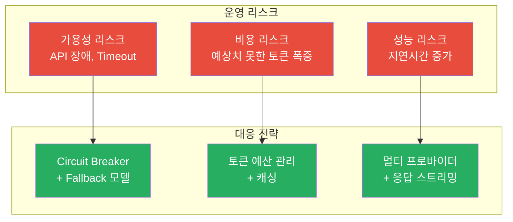
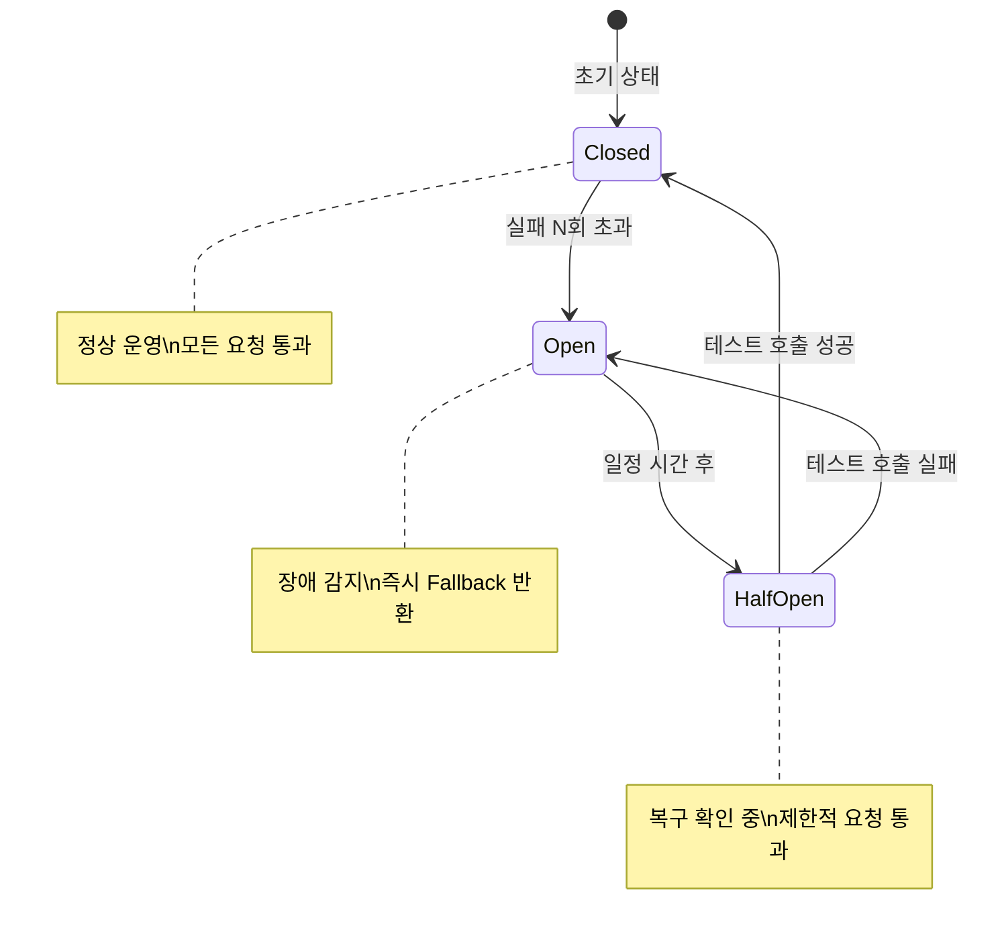

# Chapter 12. LLM 운영 전략

> LLM API는 외부 서비스다. 언제든 느려지거나, 끊기거나, 가격이 오를 수 있다. 그 전제 하에 설계해야 한다.

## 이 챕터에서 배우는 것

- LLM API 장애 시 Fallback 전략 (Circuit Breaker 패턴)
- 토큰 예산 관리 및 비용 최적화 기법
- 응답 캐싱으로 반복 호출 비용 절감
- 멀티 프로바이더 전략 (OpenAI + Anthropic 이중화)
- LLM 호출 비용 실시간 추적 및 알림

## 사전 지식

> Chapter 6의 Orchestrator 플로우와 Chapter 8의 Multi-model Routing을 먼저 보고 오자.  
> asyncio, Redis 기본 개념이 필요하다.

---

## 12-1. LLM 운영의 현실

외부 LLM API에 의존하는 서비스는 세 가지 리스크를 항상 안고 있다.



---

## 12-2. Circuit Breaker + Fallback 전략

Circuit Breaker는 외부 서비스 장애가 전파되지 않도록 차단하는 패턴이다.  
전기 회로 차단기처럼, 일정 횟수 이상 실패하면 "열림(Open)" 상태가 되어 호출 자체를 막는다.



```python
# src/orchestrator/app/llm/circuit_breaker.py

import time
import asyncio
from enum import Enum
from dataclasses import dataclass, field

class CircuitState(str, Enum):
    CLOSED   = "closed"
    OPEN     = "open"
    HALF_OPEN = "half_open"

@dataclass
class CircuitBreaker:
    name: str
    failure_threshold: int = 5       # 이 횟수 이상 실패 시 OPEN
    recovery_timeout: int  = 60      # OPEN → HALF_OPEN 대기 시간(초)
    success_threshold: int = 2       # HALF_OPEN에서 성공 시 CLOSED 복귀

    _state: CircuitState = field(default=CircuitState.CLOSED, init=False)
    _failure_count: int  = field(default=0, init=False)
    _success_count: int  = field(default=0, init=False)
    _last_failure_time: float = field(default=0.0, init=False)

    @property
    def state(self) -> CircuitState:
        if self._state == CircuitState.OPEN:
            if time.monotonic() - self._last_failure_time >= self.recovery_timeout:
                self._state = CircuitState.HALF_OPEN
                self._success_count = 0
        return self._state

    def record_success(self):
        if self._state == CircuitState.HALF_OPEN:
            self._success_count += 1
            if self._success_count >= self.success_threshold:
                self._state  = CircuitState.CLOSED
                self._failure_count = 0
        elif self._state == CircuitState.CLOSED:
            self._failure_count = max(0, self._failure_count - 1)

    def record_failure(self):
        self._failure_count += 1
        self._last_failure_time = time.monotonic()
        if self._failure_count >= self.failure_threshold:
            self._state = CircuitState.OPEN

    def is_open(self) -> bool:
        return self.state == CircuitState.OPEN
```

### LLM 클라이언트에 Circuit Breaker 적용

```python
# src/orchestrator/app/llm/llm_client.py

from openai import AsyncOpenAI
from anthropic import AsyncAnthropic
from app.llm.circuit_breaker import CircuitBreaker, CircuitState
import logging

logger = logging.getLogger(__name__)

# 프로바이더별 Circuit Breaker
breakers = {
    "openai":    CircuitBreaker(name="openai",    failure_threshold=5, recovery_timeout=60),
    "anthropic": CircuitBreaker(name="anthropic", failure_threshold=5, recovery_timeout=60),
}

openai_client    = AsyncOpenAI()
anthropic_client = AsyncAnthropic()

# Fallback 순서 정의
FALLBACK_CHAIN = {
    "gpt-4o":        ["gpt-4o-mini", "claude-haiku-4-5-20251001"],
    "gpt-4o-mini":   ["claude-haiku-4-5-20251001"],
    "claude-opus-4-6":  ["claude-sonnet-4-6", "gpt-4o"],
    "claude-sonnet-4-6": ["gpt-4o", "gpt-4o-mini"],
}

async def chat_with_fallback(model: str, messages: list, **kwargs) -> tuple[str, str]:
    """Circuit Breaker + Fallback 적용 LLM 호출. (content, used_model) 반환"""
    chain = [model] + FALLBACK_CHAIN.get(model, [])

    for candidate in chain:
        provider = "anthropic" if "claude" in candidate else "openai"
        breaker  = breakers[provider]

        if breaker.is_open():
            logger.warning(f"[CircuitBreaker] {provider} OPEN — 스킵: {candidate}")
            continue

        try:
            content = await _call_model(candidate, messages, **kwargs)
            breaker.record_success()
            if candidate != model:
                logger.info(f"[Fallback] {model} → {candidate} 으로 대체 성공")
            return content, candidate

        except Exception as e:
            breaker.record_failure()
            logger.error(f"[LLM Error] {candidate} 실패: {e} (실패 횟수: {breaker._failure_count})")

    raise RuntimeError("모든 LLM 프로바이더 호출 실패")

async def _call_model(model: str, messages: list, **kwargs) -> str:
    if "claude" in model:
        # Anthropic 형식으로 변환
        system = next((m["content"] for m in messages if m["role"] == "system"), None)
        user_msgs = [m for m in messages if m["role"] != "system"]
        resp = await anthropic_client.messages.create(
            model=model,
            max_tokens=kwargs.get("max_tokens", 2048),
            system=system or "",
            messages=user_msgs,
        )
        return resp.content[0].text
    else:
        resp = await openai_client.chat.completions.create(
            model=model, messages=messages, **kwargs
        )
        return resp.choices[0].message.content
```

---

## 12-3. 토큰 예산 관리

```python
# src/orchestrator/app/llm/token_budget.py

import tiktoken
from app.config import settings

# 모델별 컨텍스트 윈도우 상한 (토큰)
MODEL_CONTEXT_LIMITS = {
    "gpt-4o":          128_000,
    "gpt-4o-mini":     128_000,
    "claude-opus-4-6":    200_000,
    "claude-sonnet-4-6":  200_000,
    "claude-haiku-4-5-20251001":  200_000,
}

# 응답에 남겨둘 최소 토큰 (출력용 예비)
RESERVED_OUTPUT_TOKENS = 2_048

class TokenBudgetManager:

    def __init__(self, model: str):
        self.model  = model
        self.limit  = MODEL_CONTEXT_LIMITS.get(model, 8_192)
        self.budget = self.limit - RESERVED_OUTPUT_TOKENS
        self._enc   = tiktoken.get_encoding("cl100k_base")

    def count(self, text: str) -> int:
        return len(self._enc.encode(text))

    def trim_history(self, history: list[dict], system_prompt: str, user_message: str) -> list[dict]:
        """히스토리를 토큰 예산 내로 자른다. 최신 메시지를 우선 유지."""
        base_tokens = self.count(system_prompt) + self.count(user_message) + 100  # 여유분
        remaining   = self.budget - base_tokens

        if remaining <= 0:
            return []   # 여유 없으면 히스토리 전체 생략

        trimmed = []
        # 최신 메시지부터 역순으로 담기
        for msg in reversed(history):
            msg_tokens = self.count(msg.get("content", ""))
            if remaining - msg_tokens < 0:
                break
            trimmed.insert(0, msg)
            remaining -= msg_tokens

        return trimmed

    def estimate_cost(self, input_tokens: int, output_tokens: int) -> float:
        """USD 기준 예상 비용 계산"""
        PRICING = {
            "gpt-4o":          (0.0025, 0.010),   # (input/1K, output/1K)
            "gpt-4o-mini":     (0.00015, 0.0006),
            "claude-opus-4-6":    (0.015, 0.075),
            "claude-sonnet-4-6":  (0.003, 0.015),
            "claude-haiku-4-5-20251001":  (0.00025, 0.00125),
        }
        prices = PRICING.get(self.model, (0.001, 0.001))
        return (input_tokens / 1000 * prices[0]) + (output_tokens / 1000 * prices[1])
```

---

## 12-4. 응답 캐싱

동일하거나 매우 유사한 질문에 LLM을 매번 호출하는 건 낭비다.  
**시맨틱 캐싱(Semantic Cache)** 은 의미가 같은 질문을 벡터 유사도로 감지해 캐시에서 응답한다.

```python
# src/orchestrator/app/llm/semantic_cache.py

import hashlib
import json
import redis.asyncio as aioredis
from sentence_transformers import SentenceTransformer
import numpy as np

class SemanticCache:
    """벡터 유사도 기반 LLM 응답 캐시"""

    SIMILARITY_THRESHOLD = 0.95   # 이 이상이면 캐시 히트로 판단
    TTL_SECONDS = 3600            # 캐시 유효 시간: 1시간

    def __init__(self, redis_client: aioredis.Redis):
        self.redis    = redis_client
        self.embedder = SentenceTransformer("snunlp/KR-SBERT-V40K-klueNLI-augSTS")

    def _embed(self, text: str) -> np.ndarray:
        return self.embedder.encode(text, normalize_embeddings=True)

    async def get(self, message: str, model: str) -> str | None:
        """캐시 히트 시 저장된 응답 반환, 미스 시 None"""
        query_vec = self._embed(message)

        # 같은 모델의 캐시 키 목록 조회
        cache_keys = await self.redis.smembers(f"cache:index:{model}")

        for key in cache_keys:
            entry_raw = await self.redis.get(key)
            if not entry_raw:
                continue
            entry = json.loads(entry_raw)
            stored_vec = np.array(entry["embedding"])

            # 코사인 유사도 계산 (정규화 벡터이므로 내적 = 코사인)
            similarity = float(np.dot(query_vec, stored_vec))

            if similarity >= self.SIMILARITY_THRESHOLD:
                return entry["response"]

        return None

    async def set(self, message: str, model: str, response: str):
        """LLM 응답을 임베딩과 함께 저장"""
        query_vec = self._embed(message)
        key = f"cache:{model}:{hashlib.md5(message.encode()).hexdigest()}"

        entry = {
            "message": message,
            "embedding": query_vec.tolist(),
            "response": response,
        }
        await self.redis.setex(key, self.TTL_SECONDS, json.dumps(entry, ensure_ascii=False))
        await self.redis.sadd(f"cache:index:{model}", key)
        await self.redis.expire(f"cache:index:{model}", self.TTL_SECONDS)
```

### Orchestrator 플로우에 캐시 통합

```python
# src/orchestrator/app/core/flow.py 수정

semantic_cache = SemanticCache(redis_client)

async def run(self, ...):
    # 캐시 조회 먼저
    cached = await semantic_cache.get(message, model)
    if cached:
        logger.info("[Cache] 히트 — LLM 호출 생략")
        await context_client.save_turn(session_id, message, cached)
        return {"message": cached, "model_used": f"{model}(cached)", "sources": []}

    # 캐시 미스 → LLM 호출
    content, used_model = await chat_with_fallback(model, messages)

    # 결과 캐시 저장
    await semantic_cache.set(message, model, content)

    return {"message": content, "model_used": used_model, "sources": []}
```

---

## 12-5. 비용 실시간 추적

```python
# src/orchestrator/app/llm/cost_tracker.py

import redis.asyncio as aioredis
from datetime import datetime
from app.llm.token_budget import TokenBudgetManager

class CostTracker:

    ALERT_THRESHOLD_DAILY_USD   = 50.0    # 일 $50 초과 시 알림
    ALERT_THRESHOLD_MONTHLY_USD = 1000.0  # 월 $1,000 초과 시 알림

    def __init__(self, redis_client: aioredis.Redis, alert_svc):
        self.redis = redis_client
        self.alert = alert_svc

    async def record(self, model: str, input_tokens: int, output_tokens: int, user_id: str):
        budget  = TokenBudgetManager(model)
        cost    = budget.estimate_cost(input_tokens, output_tokens)
        today   = datetime.utcnow().strftime("%Y-%m-%d")
        month   = datetime.utcnow().strftime("%Y-%m")

        pipe = self.redis.pipeline()
        # 일별/월별/모델별/사용자별 누적
        pipe.incrbyfloat(f"cost:daily:{today}",           cost)
        pipe.incrbyfloat(f"cost:monthly:{month}",         cost)
        pipe.incrbyfloat(f"cost:model:{model}:{today}",   cost)
        pipe.incrbyfloat(f"cost:user:{user_id}:{today}",  cost)
        # TTL 설정
        pipe.expire(f"cost:daily:{today}",          86400 * 2)
        pipe.expire(f"cost:monthly:{month}",        86400 * 35)
        pipe.expire(f"cost:model:{model}:{today}",  86400 * 2)
        pipe.expire(f"cost:user:{user_id}:{today}", 86400 * 2)
        results = await pipe.execute()

        daily_total = float(results[0])
        if daily_total >= self.ALERT_THRESHOLD_DAILY_USD:
            await self.alert.send(
                level="MEDIUM",
                event="COST_ALERT_DAILY",
                detail={"daily_usd": round(daily_total, 2), "model": model},
            )
```

---

## 12-6. 비용 현황 조회 API

```python
# src/orchestrator/app/routers/internal.py 에 추가

@router.get("/cost/summary")
async def cost_summary(redis=Depends(get_redis)):
    today  = datetime.utcnow().strftime("%Y-%m-%d")
    month  = datetime.utcnow().strftime("%Y-%m")

    daily   = await redis.get(f"cost:daily:{today}")
    monthly = await redis.get(f"cost:monthly:{month}")

    model_costs = {}
    for model in ["gpt-4o", "gpt-4o-mini", "claude-opus-4-6", "claude-sonnet-4-6"]:
        val = await redis.get(f"cost:model:{model}:{today}")
        if val:
            model_costs[model] = round(float(val), 4)

    return {
        "today_usd":   round(float(daily or 0), 4),
        "month_usd":   round(float(monthly or 0), 4),
        "by_model":    model_costs,
    }
```

---

## 정리

| 항목 | 전략 |
|---|---|
| 장애 대응 | Circuit Breaker + Fallback Chain (OpenAI ↔ Anthropic) |
| 토큰 절감 | 히스토리 Trim + 컨텍스트 윈도우 예산 관리 |
| 비용 절감 | 시맨틱 캐싱 (유사 질문 재사용) |
| 비용 추적 | Redis 누적 + 임계값 초과 시 Slack 알림 |
| 멀티 프로바이더 | OpenAI / Anthropic 이중화, 모델별 Fallback 체인 정의 |

---

## 다음 챕터 예고

> Chapter 13에서는 Observability를 구축한다.  
> Prometheus로 메트릭을 수집하고, Grafana 대시보드로 시각화하며,  
> 분산 추적(Distributed Tracing)으로 요청 흐름 전체를 한눈에 볼 수 있게 만든다.
