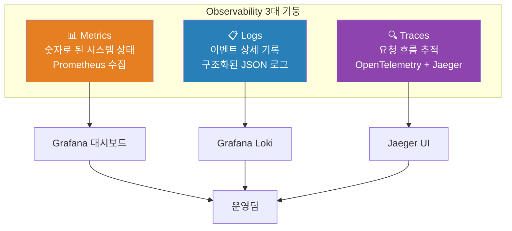
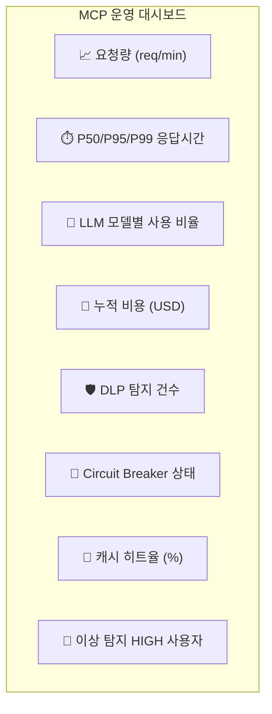

# Chapter 13. Observability

> 모르면 고칠 수 없다. 시스템이 지금 어떤 상태인지 정확히 아는 것이 운영의 시작이다.

## 이 챕터에서 배우는 것

- Prometheus로 MCP 서비스 메트릭 수집
- Grafana 대시보드 구성 (LLM 지연, 비용, 보안 이벤트)
- OpenTelemetry로 분산 추적 (Distributed Tracing) 구현
- 구조화된 로깅 (Structured Logging) 표준화
- 알림 규칙(Alert Rule) 설정

## 사전 지식

> Chapter 7의 K8s 배포 구조, Chapter 12의 비용 추적 개념을 먼저 이해하고 오자.  
> Prometheus, Grafana의 기본 개념(메트릭, 레이블, PromQL)이 있으면 좋다.

---

## 13-1. Observability 3대 기둥



---

## 13-2. 메트릭 설계 — 무엇을 측정할 것인가

MCP 플랫폼에서 수집해야 할 핵심 메트릭을 정의한다.

| 카테고리 | 메트릭 이름 | 타입 | 설명 |
|---|---|:---:|---|
| 요청 | `mcp_requests_total` | Counter | 서비스별 총 요청 수 |
| 요청 | `mcp_request_duration_seconds` | Histogram | 엔드포인트별 응답 시간 |
| LLM | `mcp_llm_calls_total` | Counter | 모델별 LLM 호출 횟수 |
| LLM | `mcp_llm_latency_seconds` | Histogram | 모델별 LLM 응답 지연 |
| LLM | `mcp_llm_tokens_total` | Counter | 입력/출력 토큰 누계 |
| LLM | `mcp_llm_cost_usd_total` | Counter | 누적 비용 (USD) |
| 보안 | `mcp_dlp_detections_total` | Counter | DLP 탐지 건수 (레벨별) |
| 보안 | `mcp_guard_llm_attacks_total` | Counter | Guard LLM 공격 탐지 |
| 캐시 | `mcp_cache_hits_total` | Counter | 시맨틱 캐시 히트 수 |
| 캐시 | `mcp_cache_misses_total` | Counter | 시맨틱 캐시 미스 수 |
| Circuit | `mcp_circuit_breaker_state` | Gauge | Circuit Breaker 상태 (0=closed, 1=open) |
| Tool | `mcp_tool_executions_total` | Counter | Tool별 실행 횟수 |
| Tool | `mcp_tool_errors_total` | Counter | Tool별 에러 수 |

---

## 13-3. Prometheus 메트릭 계측 코드

```python
# src/shared/metrics.py

from prometheus_client import Counter, Histogram, Gauge, start_http_server
import time

# ── 요청 메트릭 ────────────────────────────────
REQUEST_COUNT = Counter(
    "mcp_requests_total",
    "총 요청 수",
    ["service", "endpoint", "status_code"],
)
REQUEST_LATENCY = Histogram(
    "mcp_request_duration_seconds",
    "요청 응답 시간 (초)",
    ["service", "endpoint"],
    buckets=[0.1, 0.25, 0.5, 1.0, 2.5, 5.0, 10.0],
)

# ── LLM 메트릭 ─────────────────────────────────
LLM_CALL_COUNT = Counter(
    "mcp_llm_calls_total",
    "LLM 호출 횟수",
    ["model", "provider", "is_fallback"],
)
LLM_LATENCY = Histogram(
    "mcp_llm_latency_seconds",
    "LLM 응답 지연 시간",
    ["model"],
    buckets=[0.5, 1.0, 2.0, 5.0, 10.0, 30.0, 60.0],
)
LLM_TOKENS = Counter(
    "mcp_llm_tokens_total",
    "LLM 토큰 사용량",
    ["model", "type"],  # type: input | output
)
LLM_COST = Counter(
    "mcp_llm_cost_usd_total",
    "LLM 누적 비용 (USD)",
    ["model"],
)

# ── 보안 메트릭 ────────────────────────────────
DLP_DETECTIONS = Counter(
    "mcp_dlp_detections_total",
    "DLP 탐지 건수",
    ["level", "type"],
)
GUARD_ATTACKS = Counter(
    "mcp_guard_llm_attacks_total",
    "Guard LLM 공격 판정 건수",
    ["threat_type"],
)

# ── 캐시 메트릭 ────────────────────────────────
CACHE_HITS   = Counter("mcp_cache_hits_total",   "시맨틱 캐시 히트", ["model"])
CACHE_MISSES = Counter("mcp_cache_misses_total",  "시맨틱 캐시 미스", ["model"])

# ── Circuit Breaker ─────────────────────────────
CIRCUIT_STATE = Gauge(
    "mcp_circuit_breaker_state",
    "Circuit Breaker 상태 (0=closed, 1=half_open, 2=open)",
    ["provider"],
)
```

### FastAPI 미들웨어로 자동 계측

```python
# src/shared/middleware/metrics_middleware.py

import time
from fastapi import Request
from starlette.middleware.base import BaseHTTPMiddleware
from shared.metrics import REQUEST_COUNT, REQUEST_LATENCY

class MetricsMiddleware(BaseHTTPMiddleware):
    def __init__(self, app, service_name: str):
        super().__init__(app)
        self.service = service_name

    async def dispatch(self, request: Request, call_next):
        start = time.monotonic()
        response = await call_next(request)
        elapsed = time.monotonic() - start

        endpoint = request.url.path
        REQUEST_COUNT.labels(
            service=self.service,
            endpoint=endpoint,
            status_code=response.status_code,
        ).inc()
        REQUEST_LATENCY.labels(
            service=self.service,
            endpoint=endpoint,
        ).observe(elapsed)

        return response

# src/gateway/app/main.py에 추가
from shared.middleware.metrics_middleware import MetricsMiddleware
from prometheus_client import make_asgi_app

app.add_middleware(MetricsMiddleware, service_name="gateway")

# /metrics 엔드포인트 마운트 (Prometheus가 여기서 긁어감)
metrics_app = make_asgi_app()
app.mount("/metrics", metrics_app)
```

---

## 13-4. OpenTelemetry 분산 추적

분산 시스템에서 요청 하나가 여러 서비스를 거칠 때,  
어느 서비스에서 시간이 얼마나 걸렸는지 **한 화면으로** 볼 수 있게 한다.

```python
# src/shared/tracing.py

from opentelemetry import trace
from opentelemetry.sdk.trace import TracerProvider
from opentelemetry.sdk.trace.export import BatchSpanProcessor
from opentelemetry.exporter.otlp.proto.grpc.trace_exporter import OTLPSpanExporter
from opentelemetry.instrumentation.fastapi import FastAPIInstrumentor
from opentelemetry.instrumentation.httpx import HTTPXClientInstrumentor

def setup_tracing(service_name: str, otlp_endpoint: str = "http://jaeger:4317"):
    """OpenTelemetry + Jaeger 설정"""
    provider = TracerProvider()
    exporter = OTLPSpanExporter(endpoint=otlp_endpoint, insecure=True)
    provider.add_span_processor(BatchSpanProcessor(exporter))
    trace.set_tracer_provider(provider)

    # FastAPI, httpx 자동 계측
    FastAPIInstrumentor().instrument()
    HTTPXClientInstrumentor().instrument()

    return trace.get_tracer(service_name)

# 수동 Span 생성 예시 (Orchestrator 플로우)
tracer = trace.get_tracer("orchestrator")

async def run(self, session_id, user_id, role, message, request_id):
    with tracer.start_as_current_span("orchestration.run") as span:
        span.set_attribute("session_id", session_id)
        span.set_attribute("user_id", user_id)
        span.set_attribute("message_length", len(message))

        with tracer.start_as_current_span("intent.analyze"):
            intent = await self._analyze_intent(message, context, tools)
            span.set_attribute("intent.tool_name", intent.get("tool_name", "none"))

        if intent.get("tool_name"):
            with tracer.start_as_current_span("tool.execute") as tool_span:
                tool_span.set_attribute("tool.name", intent["tool_name"])
                result = await tool_client.execute(...)

        with tracer.start_as_current_span("llm.call") as llm_span:
            content, model = await chat_with_fallback(model, messages)
            llm_span.set_attribute("llm.model", model)
```

---

## 13-5. 구조화된 로깅

```python
# src/shared/logging.py

import logging
import json
from datetime import datetime

class JSONFormatter(logging.Formatter):
    """모든 로그를 JSON으로 출력 — Loki/ELK 수집에 최적화"""

    def format(self, record: logging.LogRecord) -> str:
        log_obj = {
            "timestamp":  datetime.utcnow().isoformat() + "Z",
            "level":      record.levelname,
            "service":    getattr(record, "service", "unknown"),
            "message":    record.getMessage(),
            "logger":     record.name,
            "trace_id":   getattr(record, "trace_id", None),
            "user_id":    getattr(record, "user_id", None),
        }
        if record.exc_info:
            log_obj["exception"] = self.formatException(record.exc_info)
        return json.dumps(log_obj, ensure_ascii=False)

def setup_logging(service_name: str, level: str = "INFO"):
    handler = logging.StreamHandler()
    handler.setFormatter(JSONFormatter())

    logger = logging.getLogger()
    logger.setLevel(level)
    logger.addHandler(handler)

    # 모든 로그에 service 필드 자동 추가
    old_factory = logging.getLogRecordFactory()
    def record_factory(*args, **kwargs):
        record = old_factory(*args, **kwargs)
        record.service = service_name
        return record
    logging.setLogRecordFactory(record_factory)
```

---

## 13-6. Prometheus + Grafana Docker Compose

```yaml
# infra/docker-compose.yml에 추가

  prometheus:
    image: prom/prometheus:latest
    ports: ["9090:9090"]
    volumes:
      - ./prometheus.yml:/etc/prometheus/prometheus.yml
    networks: [mcp-net]

  grafana:
    image: grafana/grafana:latest
    ports: ["3000:3000"]
    environment:
      GF_SECURITY_ADMIN_PASSWORD: admin
    volumes:
      - grafana-data:/var/lib/grafana
      - ./grafana/dashboards:/etc/grafana/provisioning/dashboards
      - ./grafana/datasources:/etc/grafana/provisioning/datasources
    networks: [mcp-net]

  jaeger:
    image: jaegertracing/all-in-one:latest
    ports:
      - "16686:16686"   # Jaeger UI
      - "4317:4317"     # OTLP gRPC
    networks: [mcp-net]

  loki:
    image: grafana/loki:latest
    ports: ["3100:3100"]
    networks: [mcp-net]

volumes:
  grafana-data:
```

```yaml
# infra/prometheus.yml

global:
  scrape_interval: 15s

scrape_configs:
  - job_name: mcp-gateway
    static_configs:
      - targets: ["gateway:8000"]
    metrics_path: /metrics

  - job_name: mcp-orchestrator
    static_configs:
      - targets: ["orchestrator:8001"]
    metrics_path: /metrics

  - job_name: mcp-tool-service
    static_configs:
      - targets: ["tool-service:8003"]
    metrics_path: /metrics
```

---

## 13-7. Grafana 알림 규칙

```yaml
# infra/grafana/alert-rules.yaml

groups:
  - name: mcp-platform-alerts
    rules:
      - alert: HighLLMLatency
        expr: histogram_quantile(0.95, rate(mcp_llm_latency_seconds_bucket[5m])) > 10
        for: 2m
        labels:
          severity: warning
        annotations:
          summary: "LLM 응답 지연 95th percentile이 10초 초과"
          description: "모델: {{ $labels.model }}"

      - alert: CircuitBreakerOpen
        expr: mcp_circuit_breaker_state == 2
        for: 1m
        labels:
          severity: critical
        annotations:
          summary: "Circuit Breaker OPEN 상태 — LLM 호출 차단 중"
          description: "프로바이더: {{ $labels.provider }}"

      - alert: HighDLPDetectionRate
        expr: rate(mcp_dlp_detections_total{level="HIGH"}[5m]) > 0.1
        for: 3m
        labels:
          severity: warning
        annotations:
          summary: "DLP HIGH 레벨 탐지 급증"

      - alert: DailyCostThreshold
        expr: mcp_llm_cost_usd_total > 50
        labels:
          severity: warning
        annotations:
          summary: "일일 LLM 비용 $50 초과"
```

---

## 13-8. 핵심 Grafana 대시보드 패널



핵심 PromQL 쿼리:

```promql
# P95 요청 응답시간 (5분 기준)
histogram_quantile(0.95,
  rate(mcp_request_duration_seconds_bucket{service="gateway"}[5m])
)

# LLM 캐시 히트율
rate(mcp_cache_hits_total[5m])
/
(rate(mcp_cache_hits_total[5m]) + rate(mcp_cache_misses_total[5m]))

# 모델별 분당 비용
rate(mcp_llm_cost_usd_total[1m]) * 60
```

---

## 정리

| 기둥 | 도구 | 수집 대상 |
|---|---|---|
| Metrics | Prometheus + Grafana | 요청량, 지연, 비용, 보안, 캐시 |
| Logs | Grafana Loki + JSON 포맷 | 서비스 이벤트, 에러, 감사 |
| Traces | OpenTelemetry + Jaeger | 요청별 서비스 간 흐름 |
| Alerts | Grafana Alert Rules | 지연 초과, CB Open, 비용 초과 |

---

## 다음 챕터 예고

> Chapter 14에서는 운영 설계를 완성한다.  
> DB/Redis 스키마 최적화, 인덱스 전략, 비용 예측 모델,  
> 그리고 장애 대응 런북(Runbook)을 작성한다.
