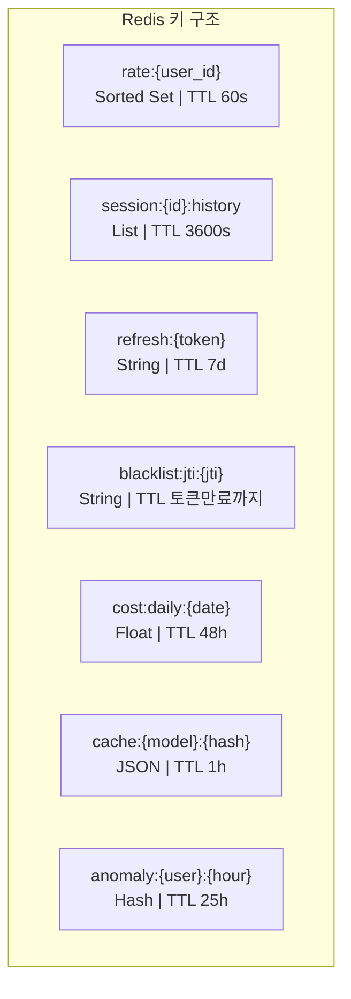
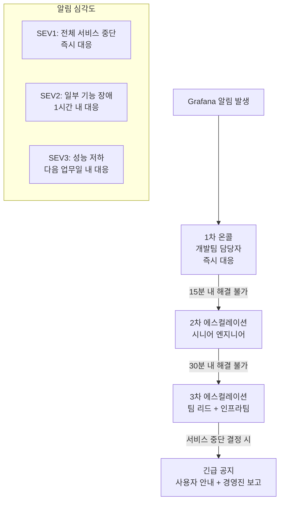

# Chapter 14. 운영 설계

> 시스템은 배포된 순간부터 운영이다. 장애가 나기 전에 대응 방법을 써두는 것이 런북이다.

## 이 챕터에서 배우는 것

- DB/Redis 스키마 인덱스 최적화 및 파티셔닝 전략
- LLM 비용 예측 모델 (월간 예산 계획)
- 장애 대응 런북 (Runbook) — 시나리오별 대응 절차
- 온콜(On-call) 에스컬레이션 구조
- 용량 계획 (Capacity Planning)

## 사전 지식

> Chapter 12(LLM 운영)와 Chapter 13(Observability)의 메트릭 구조를 알고 있어야 한다.  
> PostgreSQL 인덱스, EXPLAIN ANALYZE 기본 개념이 필요하다.

---

## 14-1. DB 스키마 최적화

운영 환경에서 성능 저하가 가장 먼저 발생하는 곳은 DB 조회다.  
감사 로그와 Prompt 버전 테이블은 시간이 지날수록 레코드가 쌓인다.

### 파티셔닝 전략

```sql
-- audit_svc.events 테이블을 월별 파티션으로 분할
-- 오래된 로그 삭제/아카이브가 파티션 DROP으로 O(1) 가능

CREATE TABLE audit_svc.events (
    id           BIGSERIAL,
    event_type   VARCHAR(50) NOT NULL,
    user_id      VARCHAR(100),
    session_id   VARCHAR(100),
    payload      JSONB,
    trace_id     VARCHAR(100),
    recorded_at  TIMESTAMPTZ NOT NULL DEFAULT NOW()
) PARTITION BY RANGE (recorded_at);

-- 월별 파티션 자동 생성 (pg_partman 확장 사용 권장)
CREATE TABLE audit_svc.events_2025_03
    PARTITION OF audit_svc.events
    FOR VALUES FROM ('2025-03-01') TO ('2025-04-01');

CREATE TABLE audit_svc.events_2025_04
    PARTITION OF audit_svc.events
    FOR VALUES FROM ('2025-04-01') TO ('2025-05-01');

-- 파티션별 인덱스 (자동 상속)
CREATE INDEX ON audit_svc.events_2025_03 (user_id, recorded_at DESC);
CREATE INDEX ON audit_svc.events_2025_03 (trace_id);
```

### 핵심 인덱스 설계

```sql
-- Context Service: 세션 조회 최적화
CREATE INDEX idx_context_session_user
    ON context_svc.sessions (session_id, user_id);

-- Prompt Registry: 활성 버전 빠른 조회
CREATE UNIQUE INDEX idx_prompt_active_unique
    ON prompt_svc.prompt_versions (prompt_key)
    WHERE status = 'active';

-- Prompt Registry: 히스토리 조회 최적화
CREATE INDEX idx_prompt_history
    ON prompt_svc.prompt_versions (prompt_key, created_at DESC);

-- Audit: 사용자별 최근 이벤트 조회
CREATE INDEX idx_audit_user_time
    ON audit_svc.events (user_id, recorded_at DESC)
    WHERE recorded_at > NOW() - INTERVAL '30 days';
```

### EXPLAIN ANALYZE 로 쿼리 성능 확인

```sql
-- 감사 로그 사용자별 조회 성능 확인
EXPLAIN (ANALYZE, BUFFERS, FORMAT TEXT)
SELECT event_type, payload, recorded_at
FROM audit_svc.events
WHERE user_id = 'user-001'
  AND recorded_at >= NOW() - INTERVAL '7 days'
ORDER BY recorded_at DESC
LIMIT 50;

-- 목표: Seq Scan 대신 Index Scan 이 사용되어야 함
-- Execution Time < 10ms 목표
```

⚠️ **주의사항**: JSONB 컬럼(`payload`) 내부 필드로 필터링이 잦다면 GIN 인덱스를 추가한다.  
하지만 GIN 인덱스는 쓰기 성능을 저하시키므로 읽기/쓰기 비율을 먼저 측정하고 결정해야 한다.

```sql
-- JSONB 내부 필드 인덱스 (자주 조회하는 필드만)
CREATE INDEX idx_audit_payload_tool
    ON audit_svc.events USING GIN ((payload -> 'tool_name'));
```

---

## 14-2. Redis 운영 전략



### Redis 메모리 관리 설정

```bash
# redis.conf 핵심 운영 설정

# 최대 메모리 설정 (전체 RAM의 60~70%)
maxmemory 4gb

# 메모리 초과 시 만료 기한 있는 키 우선 삭제
maxmemory-policy allkeys-lru

# AOF(Append Only File) 영속성 — 장애 복구용
appendonly yes
appendfsync everysec   # 1초마다 디스크 동기화 (성능/안전 균형)

# Slow Query 로깅 (10ms 이상 걸리는 명령어 기록)
slowlog-log-slower-than 10000
slowlog-max-len 128
```

```python
# src/shared/redis_health.py — Redis 상태 모니터링

async def check_redis_health(redis_client) -> dict:
    info = await redis_client.info("memory")
    used_mb  = info["used_memory"] / 1024 / 1024
    peak_mb  = info["used_memory_peak"] / 1024 / 1024
    max_mb   = info.get("maxmemory", 0) / 1024 / 1024

    return {
        "used_mb":  round(used_mb, 1),
        "peak_mb":  round(peak_mb, 1),
        "max_mb":   round(max_mb, 1),
        "usage_pct": round(used_mb / max_mb * 100, 1) if max_mb else None,
    }
```

---

## 14-3. 비용 예측 모델

운영 전에 예산을 계획해야 한다.

### 월간 비용 예측 공식

```python
# 비용 예측 계산 예시 (실제 사용 패턴 기반)

# 가정값
DAU = 500                      # 일 활성 사용자
REQUESTS_PER_USER_PER_DAY = 15 # 사용자당 일 평균 요청 수
CACHE_HIT_RATE = 0.30          # 캐시 히트율 30%

# 실제 LLM 호출 수
daily_llm_calls = DAU * REQUESTS_PER_USER_PER_DAY * (1 - CACHE_HIT_RATE)
# = 500 * 15 * 0.7 = 5,250 건/일

# 모델 믹스 (비율)
MODEL_MIX = {
    "gpt-4o-mini":    0.60,   # 일반 질문
    "gpt-4o":         0.30,   # 중간 복잡도
    "claude-opus-4-6":   0.10,   # 고복잡도 추론
}

# 평균 토큰 (입력 500 + 출력 300)
AVG_INPUT_TOKENS  = 500
AVG_OUTPUT_TOKENS = 300

# USD/1K 토큰 단가
PRICING = {
    "gpt-4o-mini":    (0.00015, 0.0006),
    "gpt-4o":         (0.0025, 0.010),
    "claude-opus-4-6":   (0.015, 0.075),
}

daily_cost = 0.0
for model, ratio in MODEL_MIX.items():
    calls       = daily_llm_calls * ratio
    in_price, out_price = PRICING[model]
    model_cost  = calls * (
        AVG_INPUT_TOKENS  / 1000 * in_price +
        AVG_OUTPUT_TOKENS / 1000 * out_price
    )
    daily_cost += model_cost
    print(f"{model}: ${model_cost:.2f}/일 ({calls:.0f}건)")

monthly_cost = daily_cost * 30
print(f"\n예상 월간 비용: ${monthly_cost:.0f}")
# 예상 출력:
# gpt-4o-mini:  $1.48/일 (2205건)
# gpt-4o:       $6.30/일 (1575건)
# claude-opus-4-6: $7.09/일 (525건)
# 예상 월간 비용: $443
```

### 비용 시나리오별 비교

| 시나리오 | DAU | 캐시 히트율 | 예상 월비용 |
|:---:|:---:|:---:|---:|
| 소규모 (Pilot) | 100 | 20% | ~$90 |
| 중규모 (사업부 1개) | 500 | 30% | ~$443 |
| 대규모 (전사) | 2,000 | 40% | ~$1,450 |
| 최적화 후 | 2,000 | 60% | ~$870 |

🔥 **핵심 포인트**: 캐시 히트율을 30%→60%로 올리면 비용이 40% 절감된다.  
Prompt 거버넌스로 질문 패턴을 표준화하면 캐시 효과가 높아진다.

---

## 14-4. 장애 대응 런북 (Runbook)

### 시나리오 1: LLM API 응답 없음 (Timeout)

```
증상: mcp_llm_latency_seconds P95 > 30초, Circuit Breaker OPEN 알림
원인: OpenAI/Anthropic API 장애 또는 네트워크 단절

대응 절차:
1. [즉시] Grafana 대시보드 → Circuit Breaker 상태 확인
   - mcp_circuit_breaker_state{provider="openai"} 값 확인

2. [1분 이내] LLM 프로바이더 상태 페이지 확인
   - https://status.openai.com
   - https://status.anthropic.com

3. [1분 이내] Fallback 동작 여부 확인
   - Orchestrator 로그: "[Fallback]" 메시지 확인
   - curl http://orchestrator:8001/internal/v1/health

4. [3분 이내] Fallback이 동작하지 않는 경우
   - Circuit Breaker 수동 리셋:
     POST /internal/v1/admin/circuit-breaker/reset {"provider": "openai"}

5. [5분 이내] 모든 프로바이더 장애 시
   - Gateway에서 503 응답 + 사용자 안내 메시지 활성화
   - 임시 점검 페이지 전환

복구 확인:
- mcp_llm_calls_total 증가 재개 확인
- P95 응답 시간 정상 범위 복귀 (<5초)
```

### 시나리오 2: DB 연결 장애

```
증상: Context Service / Audit Service 헬스체크 실패, 500 에러 급증
원인: PostgreSQL 다운, 커넥션 풀 고갈

대응 절차:
1. [즉시] DB 상태 확인
   kubectl exec -n mcp-dev deployment/postgres -- pg_isready

2. [1분] 커넥션 풀 현황 확인
   SELECT count(*), state
   FROM pg_stat_activity
   WHERE datname = 'mcp_db'
   GROUP BY state;

3. 커넥션 풀 고갈 시
   - 유휴 커넥션 강제 종료:
     SELECT pg_terminate_backend(pid)
     FROM pg_stat_activity
     WHERE state = 'idle'
       AND query_start < NOW() - INTERVAL '10 minutes';

4. DB 재시작 필요 시
   kubectl rollout restart deployment/postgres -n mcp-dev

5. 서비스 재시작
   kubectl rollout restart deployment/mcp-context-service -n mcp-dev
   kubectl rollout restart deployment/mcp-audit-service   -n mcp-dev
```

### 시나리오 3: 메모리 사용량 급증

```
증상: Pod OOMKilled, 재시작 반복
원인: 요청 급증, 메모리 누수, 대형 컨텍스트 처리

대응 절차:
1. [즉시] 문제 Pod 확인
   kubectl top pods -n mcp-dev --sort-by=memory

2. OOMKill 기록 확인
   kubectl describe pod <pod-name> -n mcp-dev | grep -A5 "OOMKilled"

3. HPA 스케일아웃 동작 확인
   kubectl get hpa -n mcp-dev

4. 수동 스케일아웃 (HPA 미동작 시)
   kubectl scale deployment mcp-orchestrator --replicas=5 -n mcp-dev

5. 근본 원인 분석
   - 요청 급증 → Rate Limit 임계값 조정 검토
   - 메모리 누수 → 코드 리뷰 및 패치 배포
```

---

## 14-5. 온콜 에스컬레이션 구조



| 심각도 | 조건 | 대응 시간 | 알림 채널 |
|:---:|---|:---:|---|
| SEV1 | 전체 요청 에러율 > 10% | 즉시 | Slack + 전화 |
| SEV2 | 특정 서비스 다운 | 30분 | Slack |
| SEV3 | P95 응답 > 5초 지속 | 2시간 | Slack |
| INFO | 비용 임계값 초과 | 다음 근무일 | Slack |

---

## 14-6. 용량 계획 (Capacity Planning)

```python
# 리소스 요구량 계산 공식

# 가정: DAU 500, 사용자당 15 req/day
PEAK_RPS = 500 * 15 / (8 * 3600) * 5   # 피크 시간대 5x 부하 = ~1.3 RPS

# Gateway: 경량 라우팅 → 낮은 자원
# 처리 능력: Pod당 ~50 RPS (uvicorn 2 workers)
GATEWAY_PODS = max(2, int(PEAK_RPS / 50) + 1)  # = 2 pods

# Orchestrator: LLM 호출 대기 → I/O 바운드
# 처리 능력: Pod당 ~10 동시 요청 (asyncio)
ORCH_PODS = max(2, int(PEAK_RPS / 10) + 1)     # = 2 pods

print(f"Gateway Pod 수: {GATEWAY_PODS}")
print(f"Orchestrator Pod 수: {ORCH_PODS}")
```

| 서비스 | CPU Request | Memory Request | 초기 Pod 수 | 최대 Pod 수(HPA) |
|---|:---:|:---:|:---:|:---:|
| Gateway | 100m | 256Mi | 2 | 10 |
| Orchestrator | 200m | 512Mi | 2 | 8 |
| Policy Engine | 100m | 256Mi | 1 | 3 |
| Tool Service | 100m | 256Mi | 1 | 5 |
| RAG Service | 500m | 1Gi | 1 | 4 |
| Context Service | 100m | 256Mi | 1 | 3 |
| Audit Service | 100m | 256Mi | 1 | 2 |

### 노드 사이즈 추천

```
개발 환경 (Minikube):
  - 1 Node: 4 CPU, 8GB RAM

스테이징 환경:
  - 3 Nodes: 4 CPU, 16GB RAM each

운영 환경 (초기):
  - 3 Nodes: 8 CPU, 32GB RAM each
  - DB Node (PostgreSQL): 4 CPU, 16GB RAM, 100GB SSD
  - Redis Node: 2 CPU, 8GB RAM
```

---

## 14-7. 정기 운영 체크리스트

```markdown
## 일간 체크 (매일 오전 9시)
- [ ] Grafana 대시보드 — 전날 에러율, P95 응답시간 이상 없음
- [ ] 전날 LLM 비용 확인 — 예산 대비 초과 없음
- [ ] Circuit Breaker 상태 — 모두 CLOSED 확인

## 주간 체크 (매주 월요일)
- [ ] DB slow query 로그 검토 (>100ms 쿼리)
- [ ] Redis 메모리 사용률 — 70% 이하 확인
- [ ] 보안 알림 이력 검토 — DLP, Guard LLM, 이상탐지
- [ ] Prompt 버전 — deprecated 버전 30일 이상 경과 시 삭제

## 월간 체크 (매월 1일)
- [ ] 감사 로그 파티션 — 다음 달 파티션 사전 생성
- [ ] LLM 비용 정산 — 팀/부서별 사용량 리포트
- [ ] 용량 리뷰 — Pod 자원 사용률 검토 후 request/limit 조정
- [ ] 보안 인증서 만료 확인 — 30일 이내 만료 시 갱신
- [ ] 의존성 취약점 스캔 — Trivy로 베이스 이미지 재검사
```

---

## 정리

| 항목 | 내용 |
|---|---|
| DB 최적화 | 월별 파티셔닝 + 복합 인덱스 + GIN 선택적 적용 |
| Redis | maxmemory-policy + AOF 영속성 + 슬로우로그 |
| 비용 예측 | 캐시 히트율이 가장 큰 절감 변수 (30%→60% = 40% 절감) |
| 런북 | LLM 장애, DB 장애, OOM 3대 시나리오 절차 문서화 |
| 온콜 | SEV1~3 기준 + 에스컬레이션 체계 |
| 용량 계획 | RPS 기반 Pod 수 계산 + 노드 사이즈 가이드 |

---

## 다음 챕터 예고

> Chapter 15에서는 지금까지 만든 모든 것을 실제 시나리오에 적용한다.  
> ERP 시스템과 연동하는 End-to-End PoC를 구현하고,  
> 실제 운영에서 마주치는 트러블슈팅 사례를 함께 다룬다.
