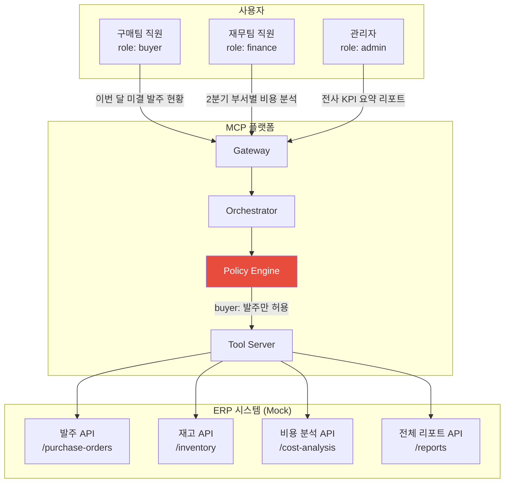
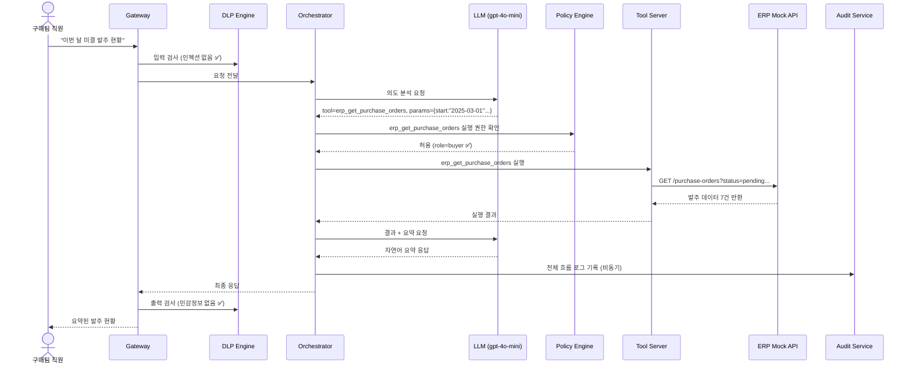

# Chapter 15. 실전 PoC — ERP 연동 End-to-End

> 이 챕터는 교과서가 아니다. 실제로 이 코드를 실행하면 동작한다.

## 이 챕터에서 배우는 것

- ERP 연동 시나리오 전체 설계 (요구사항 → 아키텍처 → 구현)
- MCP Tool로 ERP API 래핑 및 권한 제어 적용
- End-to-End 흐름 실행 및 결과 확인
- 실전 트러블슈팅 — 실제 발생하는 문제와 해결 방법
- 이 책 전체 내용 종합 정리

## 사전 지식

> Chapter 1~14의 내용을 모두 적용한다. 특히 Chapter 6(구현), 7(배포), 9(보안)가 핵심이다.

---

## 15-1. PoC 시나리오 정의

**가상 고객사**: 제조업 K사 (직원 800명)  
**요청**: "ERP 시스템에 연결된 AI 어시스턴트를 만들어 달라. 구매팀은 발주 현황, 재무팀은 비용 분석, 관리자는 전체 조회가 가능해야 한다."



---

## 15-2. ERP Tool 등록

```python
# src/tool-service/app/registry.py 에 ERP Tool 추가

ERP_TOOLS = {
    "erp_get_purchase_orders": {
        "name": "erp_get_purchase_orders",
        "description": "ERP 시스템에서 발주 현황을 조회한다. 기간, 상태, 부서별 필터 가능.",
        "parameters": {
            "type": "object",
            "properties": {
                "start_date": {"type": "string", "description": "조회 시작일 (YYYY-MM-DD)"},
                "end_date":   {"type": "string", "description": "조회 종료일 (YYYY-MM-DD)"},
                "status":     {"type": "string", "enum": ["pending", "approved", "completed", "all"],
                               "default": "all"},
                "department": {"type": "string", "description": "부서 코드 (생략 시 전체)"},
            },
            "required": ["start_date", "end_date"],
        },
        "required_role": ["buyer", "admin"],
    },
    "erp_get_cost_analysis": {
        "name": "erp_get_cost_analysis",
        "description": "부서별, 기간별 비용 분석 데이터를 조회한다.",
        "parameters": {
            "type": "object",
            "properties": {
                "year":       {"type": "integer", "description": "분석 연도"},
                "quarter":    {"type": "integer", "enum": [1, 2, 3, 4],
                               "description": "분기 (생략 시 연간 전체)"},
                "department": {"type": "string", "description": "부서 코드 (생략 시 전체)"},
                "breakdown":  {"type": "string", "enum": ["department", "category", "monthly"],
                               "default": "department"},
            },
            "required": ["year"],
        },
        "required_role": ["finance", "admin"],
    },
    "erp_get_kpi_report": {
        "name": "erp_get_kpi_report",
        "description": "전사 KPI 종합 리포트를 생성한다.",
        "parameters": {
            "type": "object",
            "properties": {
                "period":  {"type": "string", "description": "리포트 기간 (예: '2025-Q1')"},
                "include": {"type": "array", "items": {"type": "string"},
                            "description": "포함할 섹션 (finance, hr, operations, quality)"},
            },
            "required": ["period"],
        },
        "required_role": ["admin"],
    },
    "erp_get_inventory": {
        "name": "erp_get_inventory",
        "description": "재고 현황 및 안전재고 미달 품목을 조회한다.",
        "parameters": {
            "type": "object",
            "properties": {
                "category":       {"type": "string", "description": "품목 카테고리"},
                "below_safety":   {"type": "boolean", "default": False,
                                   "description": "안전재고 미달 품목만 조회"},
            },
        },
        "required_role": ["buyer", "admin"],
    },
}

TOOL_REGISTRY.update(ERP_TOOLS)
```

---

## 15-3. ERP Mock API 서버

실제 ERP 대신 테스트용 Mock 서버를 만든다.

```python
# src/tool-service/app/mock_erp/server.py

from fastapi import FastAPI
from datetime import date, timedelta
import random

mock_app = FastAPI(title="ERP Mock Server")

@mock_app.get("/purchase-orders")
async def get_purchase_orders(
    start_date: str,
    end_date: str,
    status: str = "all",
    department: str = None,
):
    """발주 현황 Mock 데이터"""
    orders = [
        {
            "po_number":   f"PO-2025-{1000 + i}",
            "vendor":      random.choice(["A공급사", "B공급사", "C공급사"]),
            "amount":      round(random.uniform(500_000, 50_000_000), 0),
            "status":      random.choice(["pending", "approved", "completed"]),
            "department":  random.choice(["구매1팀", "구매2팀", "생산팀"]),
            "order_date":  (date(2025, 3, 1) + timedelta(days=i * 3)).isoformat(),
        }
        for i in range(20)
    ]

    if status != "all":
        orders = [o for o in orders if o["status"] == status]
    if department:
        orders = [o for o in orders if o["department"] == department]

    return {
        "total_count": len(orders),
        "total_amount": sum(o["amount"] for o in orders),
        "orders": orders[:10],   # 최대 10건
    }

@mock_app.get("/cost-analysis")
async def get_cost_analysis(year: int, quarter: int = None, department: str = None):
    """비용 분석 Mock 데이터"""
    departments = ["개발팀", "영업팀", "구매팀", "재무팀", "HR팀"]
    data = []
    for dept in departments:
        budget   = random.randint(50_000_000, 200_000_000)
        actual   = int(budget * random.uniform(0.7, 1.1))
        data.append({
            "department":      dept,
            "budget":          budget,
            "actual":          actual,
            "variance":        actual - budget,
            "variance_pct":    round((actual - budget) / budget * 100, 1),
        })

    return {
        "year": year, "quarter": quarter or "연간",
        "currency": "KRW",
        "summary": {
            "total_budget": sum(d["budget"] for d in data),
            "total_actual": sum(d["actual"] for d in data),
        },
        "by_department": data,
    }

@mock_app.get("/reports/kpi")
async def get_kpi_report(period: str, include: str = None):
    """KPI 리포트 Mock 데이터"""
    return {
        "period": period,
        "generated_at": date.today().isoformat(),
        "finance": {
            "revenue":        4_820_000_000,
            "operating_profit": 720_000_000,
            "op_margin_pct":  14.9,
        },
        "hr": {
            "headcount":      823,
            "turnover_rate":  3.2,
            "avg_tenure_yrs": 4.7,
        },
        "operations": {
            "production_achievement_pct": 98.3,
            "defect_rate_ppm":            120,
            "otd_rate_pct":               96.8,
        },
    }
```

---

## 15-4. ERP Tool Executor 구현

```python
# src/tool-service/app/executors/erp_executor.py

import httpx
from app.config import settings

class ERPExecutor:
    """ERP Mock API 호출 Executor"""

    BASE_URL = settings.erp_api_url   # 환경변수: http://mock-erp:9000

    async def execute(self, tool_name: str, parameters: dict) -> dict:
        handler = {
            "erp_get_purchase_orders": self._get_purchase_orders,
            "erp_get_cost_analysis":   self._get_cost_analysis,
            "erp_get_kpi_report":      self._get_kpi_report,
            "erp_get_inventory":       self._get_inventory,
        }.get(tool_name)

        if not handler:
            raise ValueError(f"Unknown ERP tool: {tool_name}")
        return await handler(parameters)

    async def _get_purchase_orders(self, params: dict) -> dict:
        async with httpx.AsyncClient(timeout=10.0) as client:
            resp = await client.get(
                f"{self.BASE_URL}/purchase-orders",
                params=params,
            )
            resp.raise_for_status()
            return resp.json()

    async def _get_cost_analysis(self, params: dict) -> dict:
        async with httpx.AsyncClient(timeout=10.0) as client:
            resp = await client.get(
                f"{self.BASE_URL}/cost-analysis",
                params=params,
            )
            resp.raise_for_status()
            return resp.json()

    async def _get_kpi_report(self, params: dict) -> dict:
        async with httpx.AsyncClient(timeout=15.0) as client:
            resp = await client.get(
                f"{self.BASE_URL}/reports/kpi",
                params=params,
            )
            resp.raise_for_status()
            return resp.json()

    async def _get_inventory(self, params: dict) -> dict:
        async with httpx.AsyncClient(timeout=10.0) as client:
            resp = await client.get(
                f"{self.BASE_URL}/inventory",
                params=params,
            )
            resp.raise_for_status()
            return resp.json()
```

---

## 15-5. OPA 정책 — ERP 접근 제어

```rego
# infra/opa/policies/erp_authz.rego

package mcp.authz

# ERP 발주 Tool — buyer, admin만 허용
allow if {
    input.role in {"buyer", "admin"}
    input.resource in {"tool:erp_get_purchase_orders", "tool:erp_get_inventory"}
    input.action == "execute"
}

# ERP 비용 분석 — finance, admin만 허용
allow if {
    input.role in {"finance", "admin"}
    input.resource == "tool:erp_get_cost_analysis"
    input.action == "execute"
}

# KPI 리포트 — admin만 허용
allow if {
    input.role == "admin"
    input.resource == "tool:erp_get_kpi_report"
    input.action == "execute"
}

# buyer가 전사 비용 분석 시도 → 차단 (명시적 deny)
deny if {
    input.role == "buyer"
    input.resource == "tool:erp_get_cost_analysis"
}
```

---

## 15-6. End-to-End 실행 및 결과

### 환경 기동

```powershell
# ERP Mock 서버 포함 전체 스택 기동
docker compose -f infra/docker-compose.yml `
               -f infra/docker-compose.erp-poc.yml up -d

# 헬스체크 전체 확인
$services = @(8000, 8001, 8002, 8003, 8004, 8005, 8006, 9000)
foreach ($port in $services) {
    $resp = Invoke-RestMethod "http://localhost:$port/healthz" -ErrorAction SilentlyContinue
    Write-Host "Port $port`: $($resp.status ?? 'ERROR')"
}
```

### 시나리오 1: 구매팀 직원 — 미결 발주 조회

```bash
# 1. buyer 역할 토큰 발급
TOKEN=$(curl -s -X POST http://localhost:8000/v1/auth/token \
  -H "Content-Type: application/json" \
  -d '{"api_key": "buyer-api-key-001"}' | jq -r '.access_token')

# 2. 채팅 요청
curl -X POST http://localhost:8000/v1/chat \
  -H "Authorization: Bearer $TOKEN" \
  -H "Content-Type: application/json" \
  -d '{
    "session_id": "poc-buyer-001",
    "message": "이번 달 아직 처리 안 된 발주 건 알려줘"
  }'
```

```json
// 예상 응답
{
  "session_id": "poc-buyer-001",
  "message": "이번 달(2025년 3월) 미결 발주 현황입니다.\n\n**총 7건, 합계 124,500,000원**\n\n| 발주번호 | 공급사 | 금액 | 부서 | 발주일 |\n|---|---|---|---|---|\n| PO-2025-1000 | A공급사 | 35,200,000원 | 구매1팀 | 3/2 |\n| PO-2025-1003 | C공급사 | 18,700,000원 | 구매2팀 | 3/11 |\n...\n\n가장 금액이 큰 건은 A공급사 PO-2025-1000 (3,520만원)입니다. 승인 처리가 필요하신가요?",
  "model_used": "gpt-4o-mini",
  "request_id": "req-abc-123"
}
```

### 시나리오 2: 구매팀 직원 — 비용 분석 시도 (권한 없음)

```bash
curl -X POST http://localhost:8000/v1/chat \
  -H "Authorization: Bearer $TOKEN" \
  -d '{
    "session_id": "poc-buyer-001",
    "message": "2분기 전사 비용 분석 해줘"
  }'
```

```json
// 예상 응답 (Policy Engine이 차단)
{
  "message": "죄송합니다. 비용 분석 조회는 재무팀 또는 관리자 권한이 필요합니다. 발주 현황이나 재고 조회는 도와드릴 수 있습니다.",
  "model_used": "none"
}
```

### 시나리오 3: 관리자 — KPI 리포트 요청

```bash
# admin 토큰으로 전환
ADMIN_TOKEN=$(curl -s -X POST http://localhost:8000/v1/auth/token \
  -d '{"api_key": "admin-api-key-001"}' | jq -r '.access_token')

curl -X POST http://localhost:8000/v1/chat \
  -H "Authorization: Bearer $ADMIN_TOKEN" \
  -d '{
    "session_id": "poc-admin-001",
    "message": "2025년 1분기 전사 KPI 요약해줘"
  }'
```

---

## 15-7. End-to-End 흐름 추적

Jaeger UI (http://localhost:16686) 에서 전체 요청 흐름을 확인한다.



---

## 15-8. 실전 트러블슈팅

운영 중 실제로 마주치는 문제들과 해결 방법이다.

### 문제 1: 의도 분석이 틀리는 경우

```
증상: "발주 현황 알려줘" → tool_name=erp_get_inventory 로 잘못 분류
원인: 의도 분석 프롬프트가 Tool 설명을 잘못 해석

해결:
1. Tool description을 더 명확하게 수정
   변경 전: "발주 정보를 조회한다"
   변경 후: "구매 발주서(PO) 현황을 조회한다. 재고와 다른 개념."

2. 의도 분석 프롬프트에 예시 추가 (Few-shot)
   "발주 현황 → erp_get_purchase_orders"
   "재고 확인 → erp_get_inventory"

3. Prompt Registry를 통해 새 버전 배포 후 Eval 점수 확인
```

### 문제 2: ERP API 응답 지연으로 Timeout 발생

```
증상: tool-service 로그에 "httpx.TimeoutException"
원인: ERP API 응답 시간이 10초 초과

해결:
1. Tool Server의 timeout 설정 검토 및 상향 (10s → 30s)
2. 재시도(Retry) 로직 추가:

from tenacity import retry, stop_after_attempt, wait_exponential

@retry(
    stop=stop_after_attempt(3),
    wait=wait_exponential(multiplier=1, min=1, max=8),
)
async def _call_erp_with_retry(self, url, params):
    async with httpx.AsyncClient(timeout=30.0) as client:
        return await client.get(url, params=params)

3. Circuit Breaker로 ERP API 자체도 보호
```

### 문제 3: 같은 질문인데 매번 다른 응답

```
증상: "미결 발주 현황" 질문에 어떤 때는 표 형식, 어떤 때는 문장 형식
원인: LLM 온도(temperature) 설정이 높음, 출력 형식 미지정

해결:
1. Orchestrator의 LLM 호출에 temperature=0.1 설정 (낮은 무작위성)
2. 시스템 프롬프트에 출력 형식 명시:
   "발주 데이터는 반드시 마크다운 테이블 형식으로 출력하라."
3. Prompt Registry로 버전 관리 후 배포
```

### 문제 4: 감사 로그 누락

```
증상: Audit Service DB에 일부 이벤트가 기록되지 않음
원인: Redis Pub/Sub 메시지 유실 (subscriber 재시작 중 발행된 메시지)

해결:
Redis Pub/Sub → Redis Stream으로 전환 (메시지 영속성 보장)

# 기존: Pub/Sub (소비하지 않으면 유실)
await redis.publish("mcp:audit:events", event_json)

# 변경: Redis Stream (소비하지 않아도 보관)
await redis.xadd("mcp:audit:stream", {"data": event_json})

# Subscriber에서 Consumer Group으로 읽기
await redis.xreadgroup(
    groupname="audit-consumers",
    consumername="audit-service-1",
    streams={"mcp:audit:stream": ">"},
    count=100,
    block=1000,
)
```

---

## 15-9. 이 책 전체 내용 종합 정리

```mermaid
graph LR
    subgraph "기초 (Ch.0~2)"
        C0[왜 MCP인가]
        C1[아키텍처]
        C2[8가지 기능]
    end

    subgraph "설계 (Ch.3~4)"
        C3[API 설계]
        C4[MSA 구조]
    end

    subgraph "구현 (Ch.5~6)"
        C5[환경 구성]
        C6[FastAPI 구현]
    end

    subgraph "배포 (Ch.7~8)"
        C7[인프라]
        C8[CI/CD]
    end

    subgraph "보안 (Ch.9~11)"
        C9[보안 아키텍처]
        C10[DLP & 이상탐지]
        C11[Prompt 거버넌스]
    end

    subgraph "운영 (Ch.12~14)"
        C12[LLM 운영]
        C13[Observability]
        C14[운영 설계]
    end

    subgraph "실전 (Ch.15)"
        C15[ERP PoC]
    end

    C0 --> C1 --> C2 --> C3 --> C4 --> C5 --> C6
    C6 --> C7 --> C8 --> C9 --> C10 --> C11
    C11 --> C12 --> C13 --> C14 --> C15
```



| 챕터 | 핵심 산출물 |
|:---:|---|
| 0~2 | MCP 아키텍처 이해, 6개 컴포넌트, 8가지 기능 |
| 3~4 | API 스펙 계약서, Docker Compose 전체 구성 |
| 5~6 | 동작하는 Gateway + Orchestrator 코드 |
| 7~8 | Helm Chart + GitLab CI/CD 파이프라인 |
| 9~11 | mTLS, OPA 정책, DLP 엔진, Prompt Registry |
| 12~14 | Circuit Breaker, 비용 추적, Grafana 대시보드, 런북 |
| 15 | ERP 연동 End-to-End PoC |

---

## 마치며

이 책을 끝까지 따라왔다면 단순한 LLM 래퍼가 아니라,  
**권한이 제어되고, 감사가 가능하고, 장애에도 살아남는 엔터프라이즈 AI 플랫폼**을 직접 만든 것이다.

다음 단계로 고려할 수 있는 확장 방향:

- **멀티테넌시**: 여러 고객사를 하나의 MCP 인프라로 서비스
- **자체 LLM 호스팅**: Ollama + Llama3로 on-premise 모델 운영
- **에이전트 루프**: 단순 Tool 호출을 넘어 자율 계획-실행-평가 에이전트
- **MCP 표준 프로토콜 연동**: Anthropic의 공식 MCP SDK 통합

Zero Trust는 목적지가 아니라 방향이다.  
완벽한 보안은 없다. 하지만 더 나은 구조는 있다.
