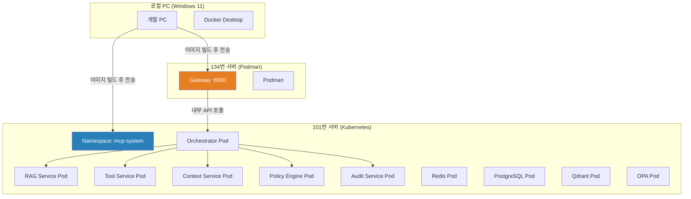

# 🚀 서버 배포 가이드 — 실서버 기준

> 작성자: 정상혁 (Sanghyuk Jung)

---

## 📐 서버 구성 전체 그림



---

## 📋 전체 배포 순서

```
STEP 1 → 로컬에서 전체 빌드 & 테스트 (Docker Desktop)
STEP 2 → 101번 서버에 MCP 스택 배포 (K8s namespace 분리)
STEP 3 → 134번 서버에 Gateway 배포 (Podman)
STEP 4 → 134번에서 접속 테스트
```

---

## STEP 1 — 로컬 빌드 & 테스트

### 1-1. 전체 빌드

```powershell
cd Q:\MY-LL_project\AirMcp\zero-trust-ai-mcp

# .env 파일 준비 (없으면 생성)
copy infra\.env.example infra\.env
# → CHANGE_ME 값 전부 채우기

# 전체 빌드
docker compose -f infra/docker-compose.yml up -d --build

# 상태 확인
docker compose -f infra/docker-compose.yml ps
```

### 1-2. 헬스체크

```powershell
curl http://localhost:8000/healthz
# 응답: {"status": "ok"}
```

### 1-3. 이상 없으면 이미지 저장 (서버 전송용)

```powershell
# 7개 서비스 이미지 tar로 저장
docker save mcp-gateway:latest        -o mcp-gateway.tar
docker save mcp-orchestrator:latest   -o mcp-orchestrator.tar
docker save mcp-rag-service:latest    -o mcp-rag-service.tar
docker save mcp-tool-service:latest   -o mcp-tool-service.tar
docker save mcp-context-service:latest -o mcp-context-service.tar
docker save mcp-policy-engine:latest  -o mcp-policy-engine.tar
docker save mcp-audit-service:latest  -o mcp-audit-service.tar
```

---

## STEP 2 — 101번 서버 배포 (K8s, MCP 전체 스택)

> 101번 서버에는 이미 다른 서비스가 돌고 있음.  
> **namespace: mcp-system** 으로 완전 분리해서 배포.

### 2-1. 이미지 101번 서버로 전송

```powershell
# 로컬 PC에서 실행 (PowerShell)
# Gateway 제외 6개 서비스 전송

scp mcp-orchestrator.tar   user@101번서버IP:/opt/mcp/images/
scp mcp-rag-service.tar    user@101번서버IP:/opt/mcp/images/
scp mcp-tool-service.tar   user@101번서버IP:/opt/mcp/images/
scp mcp-context-service.tar user@101번서버IP:/opt/mcp/images/
scp mcp-policy-engine.tar  user@101번서버IP:/opt/mcp/images/
scp mcp-audit-service.tar  user@101번서버IP:/opt/mcp/images/

# infra 설정 파일도 전송
scp -r infra/  user@101번서버IP:/opt/mcp/infra/
scp -r infra/k8s/ user@101번서버IP:/opt/mcp/k8s/
scp -r infra/helm/ user@101번서버IP:/opt/mcp/helm/
```

### 2-2. 101번 서버 — 이미지 로드

```bash
# 101번 서버 SSH 접속
ssh user@101번서버IP

# 이미지 로드
cd /opt/mcp/images
for f in *.tar; do
  echo "로드 중: $f"
  docker load -i $f
done

# 로드 확인
docker images | grep mcp
```

### 2-3. Namespace 생성

```bash
# mcp-system namespace 생성 (기존 서비스와 완전 분리)
kubectl apply -f /opt/mcp/k8s/namespace.yaml

# 확인 — 기존 namespace와 분리됨
kubectl get namespaces
```

```yaml
# infra/k8s/namespace.yaml 내용 확인용
# apiVersion: v1
# kind: Namespace
# metadata:
#   name: mcp-system
```

### 2-4. Secret 생성

```bash
# secrets.example.yaml 복사 후 실값 입력
cp /opt/mcp/k8s/secrets.example.yaml /opt/mcp/k8s/secrets.yaml
vi /opt/mcp/k8s/secrets.yaml
# → CHANGE_ME 전부 실값으로 교체

# Secret 적용
kubectl apply -f /opt/mcp/k8s/secrets.yaml -n mcp-system

# 확인
kubectl get secrets -n mcp-system
```

### 2-5. Helm으로 MCP 스택 배포

```bash
# Helm 설치 확인
helm version

# 없으면 설치
curl https://raw.githubusercontent.com/helm/helm/main/scripts/get-helm-3 | bash

# MCP 플랫폼 배포 (Gateway 제외)
helm upgrade --install mcp-platform /opt/mcp/helm/mcp-platform \
  --namespace mcp-system \
  --values /opt/mcp/helm/mcp-platform/values.yaml \
  --set gateway.enabled=false \
  --create-namespace

# 배포 상태 확인
kubectl get pods -n mcp-system
kubectl get svc -n mcp-system
```

### 2-6. 서비스 상태 확인

```bash
# 모든 Pod이 Running 상태인지 확인
kubectl get pods -n mcp-system -w

# 예상 출력:
# NAME                              READY   STATUS    RESTARTS
# mcp-orchestrator-xxx              1/1     Running   0
# mcp-rag-service-xxx               1/1     Running   0
# mcp-tool-service-xxx              1/1     Running   0
# mcp-context-service-xxx           1/1     Running   0
# mcp-policy-engine-xxx             1/1     Running   0
# mcp-audit-service-xxx             1/1     Running   0

# Orchestrator 서비스 IP 확인 (134번 Gateway에서 연결할 주소)
kubectl get svc mcp-orchestrator -n mcp-system
# → CLUSTER-IP 또는 NodePort 확인
```

### 2-7. Orchestrator 외부 접근 설정

> 134번 Gateway에서 101번 Orchestrator를 호출해야 하므로  
> NodePort 또는 LoadBalancer로 외부 노출 필요.

```bash
# Orchestrator NodePort로 외부 노출
kubectl patch svc mcp-orchestrator -n mcp-system \
  -p '{"spec": {"type": "NodePort"}}'

# 할당된 포트 확인
kubectl get svc mcp-orchestrator -n mcp-system
# → PORT(S): 8001:3xxxx/TCP  ← 3xxxx 포트 메모해두기
```

---

## STEP 3 — 134번 서버 배포 (Podman, Gateway만)

### 3-1. 이미지 134번 서버로 전송

```powershell
# 로컬 PC에서 실행
scp mcp-gateway.tar user@134번서버IP:/opt/mcp/
scp src/gateway/.env user@134번서버IP:/opt/mcp/gateway.env
```

### 3-2. 134번 서버 — 이미지 로드

```bash
# 134번 서버 SSH 접속
ssh user@134번서버IP

# 이미지 로드
podman load -i /opt/mcp/mcp-gateway.tar

# 확인
podman images | grep mcp-gateway
```

### 3-3. Gateway .env 설정

```bash
vi /opt/mcp/gateway.env
```

```env
# /opt/mcp/gateway.env

# JWT 설정
JWT_SECRET_KEY=101번서버와_동일한_값_사용
JWT_ALGORITHM=HS256
JWT_EXPIRE_MINUTES=60

# 핵심: Orchestrator 주소 → 101번 서버 NodePort
ORCHESTRATOR_URL=http://101번서버IP:3xxxx

# Redis (101번 서버 K8s 내부 Redis)
REDIS_URL=redis://:패스워드@101번서버IP:Redis_NodePort

# 기타
APP_NAME=MCP Gateway
DEBUG=false
LOG_LEVEL=INFO
```

### 3-4. Podman으로 Gateway 실행

```bash
# Gateway 컨테이너 실행
podman run -d \
  --name mcp-gateway \
  -p 8000:8000 \
  --env-file /opt/mcp/gateway.env \
  --restart=always \
  mcp-gateway:latest

# 실행 확인
podman ps
podman logs mcp-gateway

# 헬스체크
curl http://localhost:8000/healthz
```

### 3-5. systemd 등록 (서버 재시작 시 자동 실행)

```bash
# systemd 서비스 파일 생성
podman generate systemd --name mcp-gateway --files --new

# 서비스 등록
mkdir -p ~/.config/systemd/user/
mv container-mcp-gateway.service ~/.config/systemd/user/

systemctl --user daemon-reload
systemctl --user enable container-mcp-gateway.service
systemctl --user start container-mcp-gateway.service

# 상태 확인
systemctl --user status container-mcp-gateway.service
```

---

## STEP 4 — 접속 테스트

### 4-1. 134번 서버에서 직접 테스트

```bash
# 134번 서버 SSH 접속
ssh user@134번서버IP

# 1. Gateway 헬스체크
curl http://localhost:8000/healthz
# 예상: {"status": "ok"}

# 2. JWT 토큰 발급
curl -X POST http://localhost:8000/v1/auth/token \
  -H "Content-Type: application/json" \
  -d '{"api_key": "dev-api-key-1234"}'
# 예상: {"access_token": "eyJ...", "token_type": "bearer"}

# 3. 채팅 요청
TOKEN="eyJ..."

curl -X POST http://localhost:8000/v1/chat \
  -H "Authorization: Bearer $TOKEN" \
  -H "Content-Type: application/json" \
  -d '{"session_id": "test-001", "message": "안녕하세요"}'
```

### 4-2. 로컬 PC에서 134번으로 접속 테스트

```powershell
# 로컬 PC PowerShell

# 1. 헬스체크
curl http://134번서버IP:8000/healthz

# 2. 토큰 발급
curl -X POST http://134번서버IP:8000/v1/auth/token `
  -H "Content-Type: application/json" `
  -d '{"api_key": "dev-api-key-1234"}'

# 3. 채팅 테스트
$TOKEN = "eyJ..."
curl -X POST http://134번서버IP:8000/v1/chat `
  -H "Authorization: Bearer $TOKEN" `
  -H "Content-Type: application/json" `
  -d '{"session_id": "test-001", "message": "안녕하세요"}'
```

---

## 🔧 트러블슈팅

### Gateway → Orchestrator 연결 안 될 때

```bash
# 134번 서버에서 101번 Orchestrator 연결 확인
curl http://101번서버IP:NodePort/healthz

# 방화벽 확인 (101번 서버)
sudo ufw status
sudo ufw allow NodePort번호/tcp
```

### Pod이 Pending 상태일 때

```bash
# 101번 서버
kubectl describe pod [pod명] -n mcp-system
# → Events 섹션에서 원인 확인

# 주요 원인: 리소스 부족
kubectl top nodes
```

### Gateway 로그 확인

```bash
# 134번 서버
podman logs -f mcp-gateway
```

### Orchestrator 로그 확인

```bash
# 101번 서버
kubectl logs -f deploy/mcp-orchestrator -n mcp-system
```

---

## 📋 배포 체크리스트

### 101번 서버 배포 전

- [ ] mcp-system namespace 생성 확인
- [ ] 기존 서비스와 namespace 분리 확인
- [ ] secrets.yaml CHANGE_ME 없음
- [ ] 모든 Pod Running 상태
- [ ] Orchestrator NodePort 확인 (포트 번호 메모)
- [ ] Redis NodePort 확인 (포트 번호 메모)

### 134번 서버 배포 전

- [ ] gateway.env 의 ORCHESTRATOR_URL → 101번 서버 NodePort 주소
- [ ] gateway.env 의 REDIS_URL → 101번 서버 Redis NodePort 주소
- [ ] JWT_SECRET_KEY → 101번 서버와 동일한 값
- [ ] podman ps 로 Gateway Running 확인
- [ ] curl localhost:8000/healthz 응답 확인

### 최종 E2E 테스트

- [ ] 로컬 PC → 134번:8000 헬스체크 OK
- [ ] 토큰 발급 OK
- [ ] 채팅 요청 → 134번 → 101번 → 응답 OK
- [ ] 101번 Orchestrator 로그에서 요청 수신 확인

---

## 🗺️ 포트 정리 (메모용)

| 서버 | 서비스 | 포트 | 비고 |
|------|--------|------|------|
| 134번 | Gateway | 8000 | 외부 노출 |
| 101번 | Orchestrator | NodePort 확인 | Gateway → 연결 |
| 101번 | Redis | NodePort 확인 | Gateway → 연결 |
| 101번 | Grafana | 3000 | 모니터링 |
| 101번 | Jaeger | 16686 | 트레이싱 |

---

*© 2025 정상혁 (Sanghyuk Jung). All Rights Reserved.*
