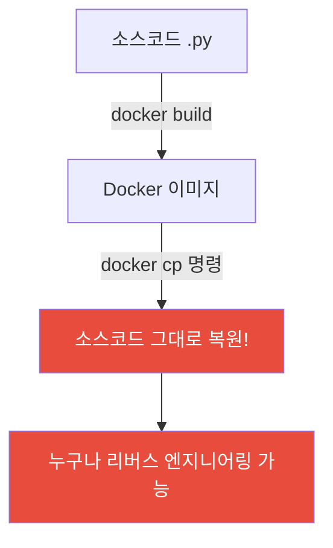
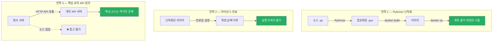
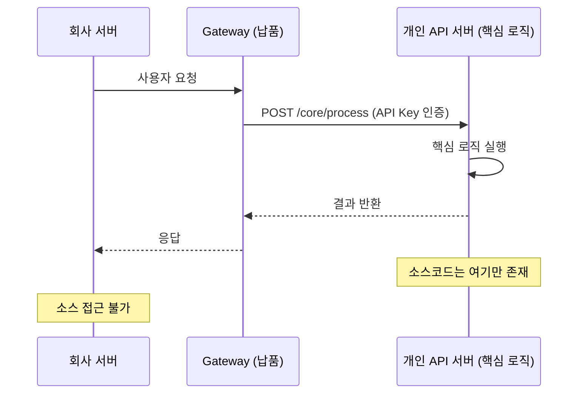
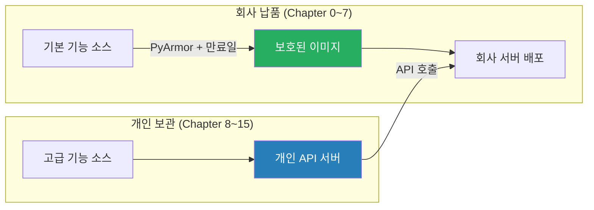

# 🔒 소스코드 보호 전략 가이드

> 작성자: 정상혁 (Sanghyuk Jung)  
> 목적: 회사 납품 시 소스코드 보호 + IP 리스크 최소화

---

## 📌 왜 보호가 필요한가?

### 지금 상태 — 위험



**핵심 문제:** Python은 컴파일 언어가 아니라서  
Docker 이미지 안에 `.py` 원본 파일이 그대로 들어가 있음.

```bash
# 이 명령 한 줄이면 소스코드 전부 나옴
docker create --name temp mcp-gateway:0.1.0
docker cp temp:/app .
docker rm temp
```

---

## 🛡️ 보호 전략 3가지



---

## 전략 1 — PyArmor 난독화

### 개념

| 항목 | 내용 |
|------|------|
| 원리 | .py 파일을 암호화된 바이트코드로 변환 |
| 결과 | 파일 열어도 해독 불가 |
| 실행 | 정상 동작 (사용자 입장에서 차이 없음) |
| 한계 | 완벽하지 않음 — 고급 해커는 뚫을 수 있음 |
| 적합한 상황 | 일반 기업 납품, 내부 직원 열람 차단 |

### 설치

```powershell
# Windows PowerShell
pip install pyarmor
pyarmor --version
```

### 단일 파일 난독화

```powershell
# 특정 파일 하나 난독화
pyarmor gen src/gateway/app/main.py

# 결과: dist/ 폴더에 난독화된 파일 생성
```

### 전체 서비스 난독화

```powershell
# gateway 서비스 전체 난독화
pyarmor gen -r src/gateway/app

# 결과 구조:
# dist/
# └── app/
#     ├── main.py        ← 암호화된 버전
#     ├── routes/
#     └── ...
```

### 라이선스 만료일 설정 (전략 2 포함)

```powershell
# 2025년 12월 31일까지만 실행 가능하도록 설정
pyarmor gen -r --expired 2025-12-31 src/gateway/app

# 만료 후 실행 시:
# RuntimeError: This license is expired
```

### 난독화된 파일로 Docker 이미지 빌드

```dockerfile
# src/gateway/Dockerfile.protected
FROM python:3.11-slim

WORKDIR /app

# requirements는 원본 사용
COPY requirements.txt .
RUN pip install --no-cache-dir -r requirements.txt

# 소스는 난독화된 dist/ 폴더 사용
COPY dist/app ./app

EXPOSE 8000
CMD ["uvicorn", "app.main:app", "--host", "0.0.0.0", "--port", "8000"]
```

```powershell
# 난독화 후 이미지 빌드
pyarmor gen -r --expired 2025-12-31 src/gateway/app
docker build -f src/gateway/Dockerfile.protected -t mcp-gateway:protected .

# 검증 — docker cp 해도 해독 불가 확인
docker create --name test mcp-gateway:protected
docker cp test:/app ./test-extract
docker rm test
# → test-extract 안의 파일이 암호화되어 있음
```

---

## 전략 2 — 라이선스 만료 단독 적용

> 전략 1(PyArmor)과 함께 쓰는 게 기본.  
> 만료일만 따로 관리하고 싶을 때 사용.

### 만료일 포함 빌드 스크립트

```powershell
# scripts/build-protected.ps1

param(
    [string]$ExpireDate = "2025-12-31",
    [string]$Version = "0.1.0"
)

Write-Host "🔒 보호된 이미지 빌드 시작..."
Write-Host "만료일: $ExpireDate"

$services = @("gateway", "orchestrator", "rag-service", "tool-service", "context-service", "policy-engine", "audit-service")

foreach ($svc in $services) {
    Write-Host "📦 $svc 난독화 중..."
    pyarmor gen -r --expired $ExpireDate src/$svc/app
    
    Write-Host "🐳 $svc 이미지 빌드 중..."
    docker build `
        -f src/$svc/Dockerfile.protected `
        -t mcp-$svc`:$Version-protected .
    
    Write-Host "✅ $svc 완료"
}

Write-Host ""
Write-Host "🎉 전체 빌드 완료!"
Write-Host "만료일: $ExpireDate"
Write-Host "이미지 목록:"
docker images | findstr "protected"
```

```powershell
# 실행 방법
.\scripts\build-protected.ps1 -ExpireDate "2025-12-31" -Version "0.1.0"
```

---

## 전략 3 — 핵심 로직 API 서버 분리

### 개념도



### 적용 방법

납품하는 Gateway/Orchestrator에서 핵심 로직 부분을  
외부 API 호출로 대체하는 방식이야.

```python
# src/orchestrator/app/core/flow.py (납품 버전)
# 핵심 로직은 개인 API 서버에서 실행

import httpx
from app.config.settings import settings

class OrchestrationFlow:

    async def run(self, session_id: str, user_id: str,
                  role: str, message: str, request_id: str) -> dict:

        # 핵심 로직은 개인 API 서버로 위임
        async with httpx.AsyncClient(timeout=30.0) as client:
            response = await client.post(
                f"{settings.core_api_url}/v1/process",
                headers={
                    "X-API-Key": settings.core_api_key,
                    "X-Request-Id": request_id,
                },
                json={
                    "session_id": session_id,
                    "user_id": user_id,
                    "role": role,
                    "message": message,
                }
            )
            response.raise_for_status()
            return response.json()
```

```env
# src/orchestrator/.env (납품 버전)
CORE_API_URL=https://api.my-personal-server.com
CORE_API_KEY=your-secret-api-key
```

---

## 📊 전략 비교 & 추천 조합

| 전략 | 보호 수준 | 구현 난이도 | 추천 상황 |
|------|-----------|------------|-----------|
| PyArmor 난독화 | ⭐⭐⭐ | ⭐⭐ | 기본 납품 |
| 만료일 설정 | ⭐⭐ | ⭐ | 계약 기간 관리 |
| API 서버 분리 | ⭐⭐⭐⭐⭐ | ⭐⭐⭐ | 핵심 로직 보호 |

### 🎯 이 프로젝트 추천 조합



---

## 🚀 실행 순서 (전체)

### STEP 1 — PyArmor 설치 확인

```powershell
pip install pyarmor
pyarmor --version
```

### STEP 2 — 보호 빌드 스크립트 실행

```powershell
# 프로젝트 루트에서
cd Q:\MY-LL_project\AirMcp\zero-trust-ai-mcp

# 만료일 설정해서 전체 빌드
.\scripts\build-protected.ps1 -ExpireDate "2025-12-31"
```

### STEP 3 — 검증

```powershell
# 이미지 실행 확인
docker run --rm --env-file src/gateway/.env mcp-gateway:0.1.0-protected

# docker cp 해서 소스 복원 안 되는지 확인
docker create --name verify mcp-gateway:0.1.0-protected
docker cp verify:/app ./verify-extract
docker rm verify
# → verify-extract 안 파일들이 암호화되어 있으면 성공
```

### STEP 4 — 이미지만 회사 서버로 전달

```bash
# 이미지를 tar로 내보내기
docker save mcp-gateway:0.1.0-protected -o mcp-gateway-protected.tar

# 서버로 전송
scp mcp-gateway-protected.tar user@회사서버IP:/opt/mcp/

# 서버에서 로드
ssh user@회사서버IP
docker load -i /opt/mcp/mcp-gateway-protected.tar
docker run -d --name mcp-gateway -p 8000:8000 --env-file .env mcp-gateway:0.1.0-protected
```

---

## ⚠️ 주의사항

| 항목 | 내용 |
|------|------|
| PyArmor 완벽하지 않음 | 고급 해커는 뚫을 수 있음. 일반적인 내부 직원 열람 차단 목적으로 사용 |
| .env 파일 별도 관리 | 이미지에 절대 포함시키지 말 것 |
| 만료일 갱신 계획 | 만료 전에 새 이미지 배포 일정 미리 잡을 것 |
| 핵심 로직 분리가 최선 | 완전한 보호는 소스를 아예 안 넘기는 것 |

---

*© 2025 정상혁 (Sanghyuk Jung). All Rights Reserved.*  
*이 문서 자체도 개인 저작물입니다.*
