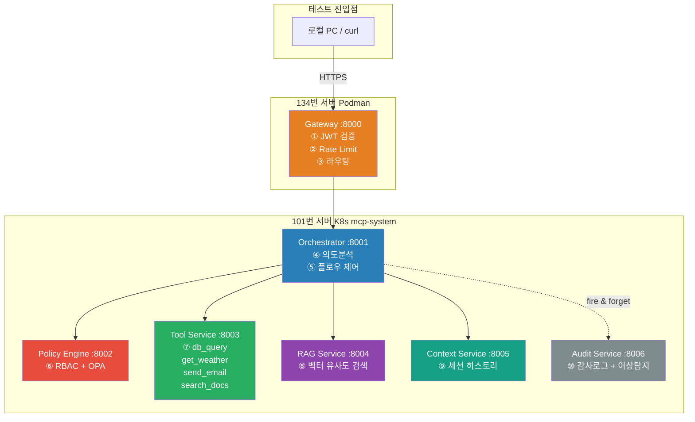
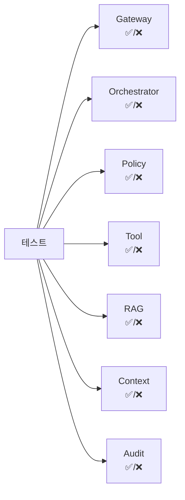
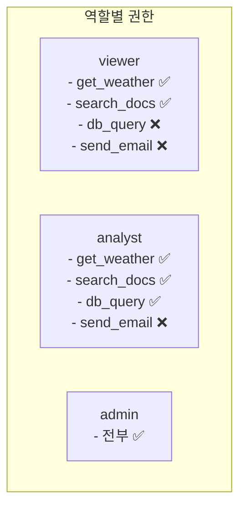
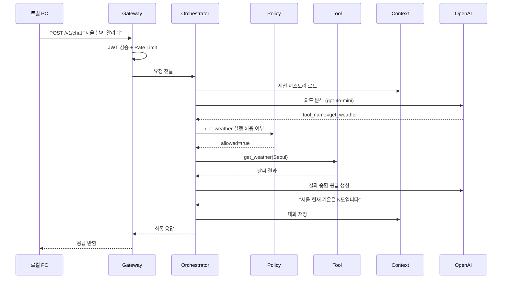

# 🧪 전체 서비스 테스트 가이드

> 환경: 134번(Gateway/Podman) + 101번(전체스택/K8s)  
> 작성자: 정상혁 (Sanghyuk Jung)

---

## 📐 테스트 대상 전체 구조



---

## 📋 테스트 순서

```
STEP 1  → 전체 헬스체크
STEP 2  → JWT 인증 (토큰 발급 / 검증 / 만료)
STEP 3  → Policy Engine (역할별 허용/거부)
STEP 4  → Tool Service (4가지 Tool 전부)
STEP 5  → RAG Service (문서 검색)
STEP 6  → Context Service (세션 저장/조회/삭제)
STEP 7  → Audit Service (감사로그 + 이상탐지)
STEP 8  → E2E 채팅 (전체 플로우 통합)
STEP 9  → Rate Limit
STEP 10 → 모니터링 (Grafana / Jaeger)
```

---

## 🔧 사전 준비

```bash
# 편의를 위해 변수 세팅 (로컬 PC 또는 134번 서버에서)
export GW="http://134번서버IP:8000"
export ORCH="http://101번서버IP:NodePort"   # Orchestrator NodePort
export TOOL="http://101번서버IP:NodePort"   # Tool Service NodePort
export RAG="http://101번서버IP:NodePort"    # RAG Service NodePort
export CTX="http://101번서버IP:NodePort"    # Context Service NodePort
export POLICY="http://101번서버IP:NodePort" # Policy Engine NodePort
export AUDIT="http://101번서버IP:NodePort"  # Audit Service NodePort
export SVC_SECRET="서비스간_시크릿값"        # .env의 SERVICE_SECRET
```

---

## STEP 1 — 전체 헬스체크



```bash
# Gateway (134번)
curl $GW/healthz
# 예상: {"status": "ok"}

# 101번 서버 내부 서비스 (kubectl로)
ssh user@101번서버IP

kubectl exec -n mcp-system deploy/mcp-orchestrator   -- curl -s localhost:8001/healthz
kubectl exec -n mcp-system deploy/mcp-policy-engine  -- curl -s localhost:8002/healthz
kubectl exec -n mcp-system deploy/mcp-tool-service   -- curl -s localhost:8003/healthz
kubectl exec -n mcp-system deploy/mcp-rag-service    -- curl -s localhost:8004/healthz
kubectl exec -n mcp-system deploy/mcp-context-service -- curl -s localhost:8005/healthz
kubectl exec -n mcp-system deploy/mcp-audit-service  -- curl -s localhost:8006/healthz

# 전부 {"status": "ok"} 나오면 PASS ✅
```

---

## STEP 2 — JWT 인증 테스트

### 2-1. 토큰 발급 (정상)

```bash
curl -X POST $GW/v1/auth/token \
  -H "Content-Type: application/json" \
  -d '{"api_key": "dev-api-key-1234"}'

# 예상:
# {
#   "access_token": "eyJhbGci...",
#   "token_type": "bearer",
#   "expires_in": 3600
# }

# 토큰 저장
export TOKEN=$(curl -s -X POST $GW/v1/auth/token \
  -H "Content-Type: application/json" \
  -d '{"api_key": "dev-api-key-1234"}' | jq -r .access_token)

echo "TOKEN: $TOKEN"
```

### 2-2. 역할별 토큰 발급

```bash
# analyst 역할 토큰
export TOKEN_ANALYST=$(curl -s -X POST $GW/v1/auth/token \
  -H "Content-Type: application/json" \
  -d '{"api_key": "analyst-api-key"}' | jq -r .access_token)

# viewer 역할 토큰
export TOKEN_VIEWER=$(curl -s -X POST $GW/v1/auth/token \
  -H "Content-Type: application/json" \
  -d '{"api_key": "viewer-api-key"}' | jq -r .access_token)

# admin 역할 토큰
export TOKEN_ADMIN=$(curl -s -X POST $GW/v1/auth/token \
  -H "Content-Type: application/json" \
  -d '{"api_key": "admin-api-key"}' | jq -r .access_token)
```

### 2-3. 인증 실패 케이스

```bash
# 잘못된 API Key
curl -X POST $GW/v1/auth/token \
  -H "Content-Type: application/json" \
  -d '{"api_key": "wrong-key"}'
# 예상: HTTP 401

# 토큰 없이 요청
curl -X POST $GW/v1/chat \
  -H "Content-Type: application/json" \
  -d '{"session_id": "test", "message": "안녕"}'
# 예상: HTTP 403

# 변조된 토큰
curl -X POST $GW/v1/chat \
  -H "Authorization: Bearer 변조된토큰값" \
  -H "Content-Type: application/json" \
  -d '{"session_id": "test", "message": "안녕"}'
# 예상: HTTP 401
```

---

## STEP 3 — Policy Engine 테스트

> Tool 실행 전에 OPA Rego 규칙으로 RBAC 체크



```bash
# 3-1. analyst → db_query 허용 확인
curl -X POST $POLICY/policy/check \
  -H "Content-Type: application/json" \
  -H "X-Service-Secret: $SVC_SECRET" \
  -d '{
    "user_id": "user-001",
    "role": "analyst",
    "resource": "tool:db_query",
    "action": "execute",
    "context": {"parameters": {"db_name": "sales"}}
  }'
# 예상: {"allowed": true, "reason": "allowed"}

# 3-2. viewer → db_query 거부 확인
curl -X POST $POLICY/policy/check \
  -H "Content-Type: application/json" \
  -H "X-Service-Secret: $SVC_SECRET" \
  -d '{
    "user_id": "user-002",
    "role": "viewer",
    "resource": "tool:db_query",
    "action": "execute",
    "context": {}
  }'
# 예상: {"allowed": false, "reason": "policy_denied"}

# 3-3. analyst → hr DB 접근 거부 확인 (OPA 규칙)
curl -X POST $POLICY/policy/check \
  -H "Content-Type: application/json" \
  -H "X-Service-Secret: $SVC_SECRET" \
  -d '{
    "user_id": "user-001",
    "role": "analyst",
    "resource": "tool:db_query",
    "action": "execute",
    "context": {"parameters": {"db_name": "hr"}}
  }'
# 예상: {"allowed": false, "reason": "policy_denied"}

# 3-4. viewer → get_weather 허용 확인
curl -X POST $POLICY/policy/check \
  -H "Content-Type: application/json" \
  -H "X-Service-Secret: $SVC_SECRET" \
  -d '{
    "user_id": "user-002",
    "role": "viewer",
    "resource": "tool:get_weather",
    "action": "execute",
    "context": {}
  }'
# 예상: {"allowed": true, "reason": "allowed"}

# 3-5. admin → send_email 허용 확인
curl -X POST $POLICY/policy/check \
  -H "Content-Type: application/json" \
  -H "X-Service-Secret: $SVC_SECRET" \
  -d '{
    "user_id": "admin-001",
    "role": "admin",
    "resource": "tool:send_email",
    "action": "execute",
    "context": {}
  }'
# 예상: {"allowed": true, "reason": "allowed"}
```

---

## STEP 4 — Tool Service 테스트 (4가지 Tool)

### 4-1. Tool 목록 조회 (역할별 필터링)

```bash
# viewer 역할 → get_weather, search_docs 만 보여야 함
curl $TOOL/tools \
  -H "X-User-Role: viewer" \
  -H "X-Service-Secret: $SVC_SECRET"
# 예상: tools 배열에 get_weather, search_docs 만 포함

# analyst 역할 → db_query 추가됨
curl $TOOL/tools \
  -H "X-User-Role: analyst" \
  -H "X-Service-Secret: $SVC_SECRET"
# 예상: tools 배열에 get_weather, search_docs, db_query 포함

# admin 역할 → 전부 포함
curl $TOOL/tools \
  -H "X-User-Role: admin" \
  -H "X-Service-Secret: $SVC_SECRET"
# 예상: 4개 전부 포함
```

### 4-2. get_weather Tool 실행

```bash
curl -X POST $TOOL/tools/get_weather/execute \
  -H "Content-Type: application/json" \
  -H "X-Service-Secret: $SVC_SECRET" \
  -d '{
    "user_id": "user-001",
    "role": "viewer",
    "parameters": {"city": "Seoul"}
  }'
# 예상:
# {
#   "tool_name": "get_weather",
#   "result": {"city": "Seoul", "temp_c": "N", "desc": "..."},
#   "execution_time_ms": 숫자
# }
```

### 4-3. db_query Tool 실행

```bash
curl -X POST $TOOL/tools/db_query/execute \
  -H "Content-Type: application/json" \
  -H "X-Service-Secret: $SVC_SECRET" \
  -d '{
    "user_id": "user-001",
    "role": "analyst",
    "parameters": {
      "query": "SELECT 1 as test",
      "db_name": "sales"
    }
  }'
# 예상:
# {
#   "tool_name": "db_query",
#   "result": {"rows": [{"test": 1}], "count": 1, "db_name": "sales"},
#   "execution_time_ms": 숫자
# }
```

### 4-4. search_docs Tool 실행

```bash
curl -X POST $TOOL/tools/search_docs/execute \
  -H "Content-Type: application/json" \
  -H "X-Service-Secret: $SVC_SECRET" \
  -d '{
    "user_id": "user-001",
    "role": "viewer",
    "parameters": {"keyword": "MCP 플랫폼"}
  }'
# 예상:
# {
#   "tool_name": "search_docs",
#   "result": {"keyword": "MCP 플랫폼", "results": []},
#   "execution_time_ms": 숫자
# }
```

### 4-5. send_email Tool 실행 (admin만)

```bash
curl -X POST $TOOL/tools/send_email/execute \
  -H "Content-Type: application/json" \
  -H "X-Service-Secret: $SVC_SECRET" \
  -d '{
    "user_id": "admin-001",
    "role": "admin",
    "parameters": {
      "to": "test@example.com",
      "subject": "테스트 메일",
      "body": "MCP 플랫폼 테스트"
    }
  }'
# 예상:
# {
#   "tool_name": "send_email",
#   "result": {"status": "sent", "to": "test@example.com"},
#   "execution_time_ms": 숫자
# }
```

### 4-6. 없는 Tool 실행 (에러 케이스)

```bash
curl -X POST $TOOL/tools/nonexistent_tool/execute \
  -H "Content-Type: application/json" \
  -H "X-Service-Secret: $SVC_SECRET" \
  -d '{"user_id": "user-001", "role": "admin", "parameters": {}}'
# 예상: HTTP 404
```

---

## STEP 5 — RAG Service 테스트

### 5-1. 기본 검색

```bash
curl -X POST $RAG/rag/search \
  -H "Content-Type: application/json" \
  -d '{
    "query": "MCP 플랫폼 보안 정책",
    "top_k": 3
  }'
# 예상:
# {"results": [...], "count": N}
# (문서 없으면 빈 배열 — 연결 자체 OK면 PASS)
```

### 5-2. 문서 인덱싱 후 검색 (문서가 있다면)

```bash
# 문서 인덱싱
curl -X POST $RAG/rag/index \
  -H "Content-Type: application/json" \
  -d '{
    "documents": [
      {
        "id": "doc-001",
        "content": "MCP 플랫폼은 Zero Trust 보안 아키텍처를 기반으로 합니다",
        "metadata": {"source": "docs", "chapter": 1}
      }
    ]
  }'

# 인덱싱 후 검색
curl -X POST $RAG/rag/search \
  -H "Content-Type: application/json" \
  -d '{"query": "Zero Trust 보안", "top_k": 3}'
# 예상: 방금 인덱싱한 문서가 결과에 포함
```

---

## STEP 6 — Context Service 테스트

### 6-1. 세션 저장

```bash
curl -X POST $CTX/context/test-session-001/turn \
  -H "Content-Type: application/json" \
  -d '{
    "user": "MCP란 무엇인가요?",
    "assistant": "MCP는 Model Context Protocol의 약자입니다."
  }'
# 예상: HTTP 204 (No Content)
```

### 6-2. 세션 조회

```bash
curl "$CTX/context/test-session-001?user_id=user-001"
# 예상:
# {
#   "session_id": "test-session-001",
#   "conversation_history": [
#     {"role": "user", "content": "MCP란 무엇인가요?"},
#     {"role": "assistant", "content": "MCP는 ..."}
#   ],
#   "turn_count": 1
# }
```

### 6-3. 멀티턴 누적 확인

```bash
# 2번째 턴 추가
curl -X POST $CTX/context/test-session-001/turn \
  -H "Content-Type: application/json" \
  -d '{
    "user": "Gateway는 뭐하는 건가요?",
    "assistant": "Gateway는 외부 요청의 단일 진입점입니다."
  }'

# 조회 → turn_count: 2, history에 2개 대화 포함 확인
curl "$CTX/context/test-session-001?user_id=user-001"
```

### 6-4. 세션 삭제

```bash
curl -X DELETE $CTX/context/test-session-001
# 예상: HTTP 204

# 삭제 확인 → 빈 히스토리
curl "$CTX/context/test-session-001?user_id=user-001"
# 예상: {"conversation_history": [], "turn_count": 0}
```

---

## STEP 7 — Audit Service 테스트

### 7-1. 이상탐지 상태 조회

```bash
curl $AUDIT/audit/anomaly/user-001 \
  -H "X-Service-Secret: $SVC_SECRET"
# 예상:
# {
#   "user_id": "user-001",
#   "req_per_hour": N,
#   "denied_ratio": 0.0~1.0,
#   "total_requests": N
# }
```

### 7-2. 이상 패턴 시뮬레이션

```bash
# 같은 유저로 반복 요청 → req_per_hour 증가 확인
for i in $(seq 1 10); do
  curl -s -X POST $GW/v1/chat \
    -H "Authorization: Bearer $TOKEN" \
    -H "Content-Type: application/json" \
    -d '{"session_id": "anomaly-test", "message": "테스트"}' > /dev/null
  echo "요청 $i 완료"
done

# 이상탐지 수치 변화 확인
curl $AUDIT/audit/anomaly/user-001 \
  -H "X-Service-Secret: $SVC_SECRET"
# → req_per_hour, total_requests 증가 확인
```

---

## STEP 8 — E2E 채팅 통합 테스트 (전체 플로우)



```bash
# 8-1. Tool 사용 유발 채팅 (날씨 → get_weather Tool 호출)
curl -X POST $GW/v1/chat \
  -H "Authorization: Bearer $TOKEN" \
  -H "Content-Type: application/json" \
  -d '{
    "session_id": "e2e-test-001",
    "message": "서울 날씨 알려줘"
  }'
# 예상:
# {
#   "session_id": "e2e-test-001",
#   "message": "서울 현재 날씨는 ...",
#   "model_used": "gpt-4o" 또는 "gpt-4o-mini",
#   "request_id": "xxx"
# }

# 8-2. 멀티턴 대화 (이전 context 유지 확인)
curl -X POST $GW/v1/chat \
  -H "Authorization: Bearer $TOKEN" \
  -H "Content-Type: application/json" \
  -d '{
    "session_id": "e2e-test-001",
    "message": "방금 알려준 날씨 다시 말해줘"
  }'
# 예상: 이전 대화 기억해서 날씨 재답변

# 8-3. DB 조회 유발 채팅 (analyst 권한 필요)
curl -X POST $GW/v1/chat \
  -H "Authorization: Bearer $TOKEN_ANALYST" \
  -H "Content-Type: application/json" \
  -d '{
    "session_id": "e2e-test-002",
    "message": "이번 달 매출 합계 알려줘"
  }'
# 예상: db_query Tool 호출 후 DB 조회 결과 응답

# 8-4. 권한 없는 Tool 시도 (viewer가 db_query)
curl -X POST $GW/v1/chat \
  -H "Authorization: Bearer $TOKEN_VIEWER" \
  -H "Content-Type: application/json" \
  -d '{
    "session_id": "e2e-test-003",
    "message": "매출 데이터 조회해줘"
  }'
# 예상: "해당 작업에 대한 권한이 없습니다" 또는 권한 거부 메시지

# 8-5. 일반 대화 (Tool 없이 LLM 직접 응답)
curl -X POST $GW/v1/chat \
  -H "Authorization: Bearer $TOKEN" \
  -H "Content-Type: application/json" \
  -d '{
    "session_id": "e2e-test-004",
    "message": "MCP 플랫폼이 뭐야?"
  }'
# 예상: Tool 없이 LLM이 직접 답변
```

---

## STEP 9 — Rate Limit 테스트

> 기본 설정: 분당 20회 초과 시 429 반환

```bash
# 21번 연속 요청 → 21번째에서 429 확인
for i in $(seq 1 22); do
  STATUS=$(curl -s -o /dev/null -w "%{http_code}" \
    -X POST $GW/v1/chat \
    -H "Authorization: Bearer $TOKEN" \
    -H "Content-Type: application/json" \
    -d '{"session_id": "rate-test", "message": "테스트"}')
  echo "요청 $i: HTTP $STATUS"
done

# 예상:
# 요청 1~20: HTTP 200
# 요청 21~: HTTP 429
```

---

## STEP 10 — 모니터링 확인

### Grafana 대시보드

```
접속: http://101번서버IP:3000
ID: admin / PW: .env에 설정한 값

확인 항목:
  ✅ mcp_requests_total        → 요청 수 증가 확인
  ✅ mcp_request_duration_seconds → 응답 시간 분포
  ✅ mcp_llm_calls_total       → LLM 호출 횟수
  ✅ mcp_llm_cost_usd_total    → 비용 누적
  ✅ mcp_tool_executions_total → Tool별 실행 횟수
  ✅ mcp_cache_hits_total      → 캐시 히트율
```

### Jaeger 트레이싱

```
접속: http://101번서버IP:16686

확인 방법:
  1. Service: mcp-gateway 선택
  2. Find Traces 클릭
  3. 트레이스 클릭 → 서비스별 소요시간 확인

확인 항목:
  ✅ Gateway → Orchestrator 호출 시간
  ✅ Orchestrator → Policy 체크 시간
  ✅ Orchestrator → Tool 실행 시간
  ✅ Orchestrator → LLM 응답 시간 (제일 김)
```

---

## 📋 전체 테스트 체크리스트

### STEP 1 — 헬스체크
- [ ] Gateway /healthz ✅
- [ ] Orchestrator /healthz ✅
- [ ] Policy Engine /healthz ✅
- [ ] Tool Service /healthz ✅
- [ ] RAG Service /healthz ✅
- [ ] Context Service /healthz ✅
- [ ] Audit Service /healthz ✅

### STEP 2 — 인증
- [ ] 정상 토큰 발급 ✅
- [ ] 역할별 토큰 발급 (viewer/analyst/admin) ✅
- [ ] 잘못된 API Key → 401 ✅
- [ ] 토큰 없이 요청 → 403 ✅

### STEP 3 — Policy Engine
- [ ] analyst → db_query(sales) → allowed ✅
- [ ] analyst → db_query(hr) → denied ✅
- [ ] viewer → db_query → denied ✅
- [ ] viewer → get_weather → allowed ✅
- [ ] admin → send_email → allowed ✅

### STEP 4 — Tool Service
- [ ] 역할별 Tool 목록 필터링 ✅
- [ ] get_weather(Seoul) 실행 ✅
- [ ] db_query(SELECT 1) 실행 ✅
- [ ] search_docs 실행 ✅
- [ ] send_email 실행 (admin) ✅
- [ ] 없는 Tool → 404 ✅

### STEP 5 — RAG
- [ ] 검색 요청 → 정상 응답 ✅
- [ ] 문서 인덱싱 후 검색 결과 포함 ✅

### STEP 6 — Context
- [ ] 턴 저장 → 204 ✅
- [ ] 조회 → 히스토리 포함 ✅
- [ ] 멀티턴 누적 ✅
- [ ] 삭제 후 빈 히스토리 ✅

### STEP 7 — Audit
- [ ] 이상탐지 수치 조회 ✅
- [ ] 반복 요청 후 수치 증가 ✅

### STEP 8 — E2E 채팅
- [ ] 날씨 질문 → get_weather Tool 호출 ✅
- [ ] 멀티턴 context 유지 ✅
- [ ] analyst → DB 조회 성공 ✅
- [ ] viewer → DB 조회 거부 ✅
- [ ] 일반 질문 → LLM 직접 응답 ✅

### STEP 9 — Rate Limit
- [ ] 20회 이하 → 200 ✅
- [ ] 21회 이상 → 429 ✅

### STEP 10 — 모니터링
- [ ] Grafana 메트릭 수집 확인 ✅
- [ ] Jaeger 트레이싱 확인 ✅

---

## 🚨 에러 & 해결

| 에러 | 원인 | 해결 |
|------|------|------|
| Policy 항상 denied | OPA 서버 미연결 | OPA Pod 상태 확인 |
| Tool 404 | tool_name 오타 | registry.py Tool 이름 확인 |
| Tool 403 | Service Secret 불일치 | X-Service-Secret 헤더값 확인 |
| RAG 500 | Qdrant 미연결 | Qdrant Pod 상태 확인 |
| Context 500 | Redis 미연결 | Redis Pod 상태 확인 |
| E2E 502 | Orchestrator 연결 실패 | ORCHESTRATOR_URL NodePort 확인 |
| Jaeger 데이터 없음 | OTLP 설정 미적용 | OTLP_ENDPOINT 환경변수 확인 |

---

*© 2025 정상혁 (Sanghyuk Jung). All Rights Reserved.*
